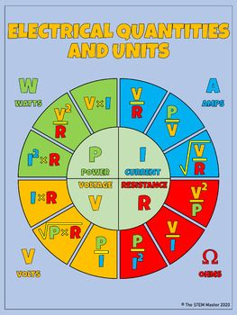
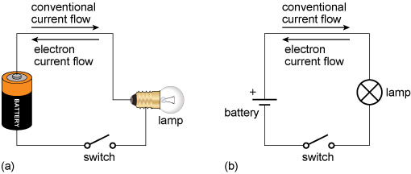
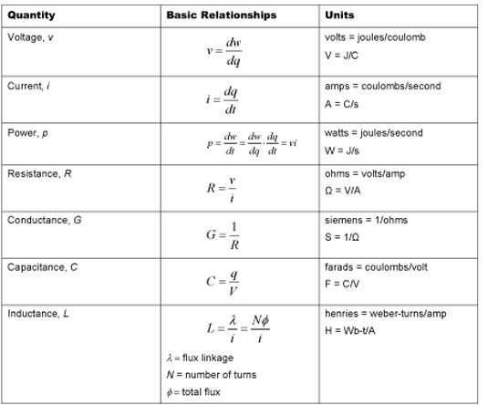
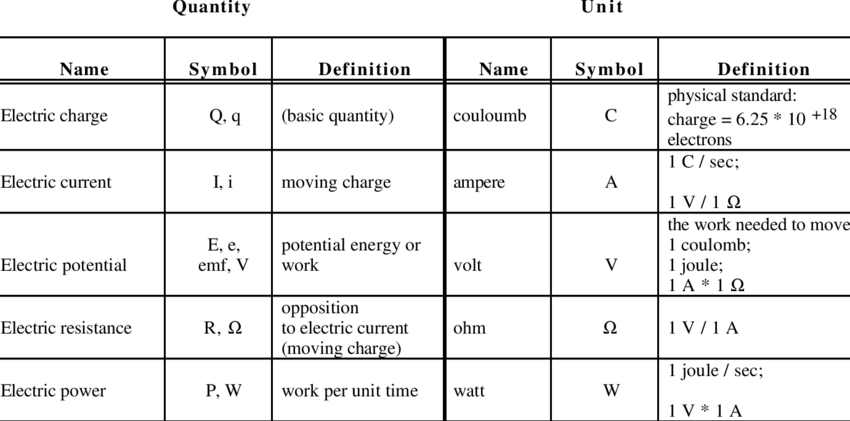

The basic electrical quantities in circuits are voltage, current, power, and energy. 

- **Electric Charge**

Electric charge is the fundamental property that causes particles to attract or repel each other. There are two types of charge:

- Positive charge (+)
- Negative charge (-)

Opposite charges attract, while like charges repel. The smallest unit of charge is the electron, which carries a negative charge.

Positive and negative charges

- **Electric Current**

Electric current is the flow of electric charge through a conductor, such as a wire. It is measured in amperes (A) and represents the rate at which charge crosses a given point.

Electric current in a wire

- **Voltage**: Voltage, also known as potential difference, is the electric pressure that drives electric charges. It is measured in volts (V) and represents the energy per unit charge. One volt is the energy consumed by one joule per coulomb of charge.

- **Current**: Current is the flow of electric charge in a circuit, measured in amperes (A). It represents the rate at which charge crosses a point in the circuit. Current is the movement of charge, and it is reported as the number of charges passing through a boundary per unit time.

- **Power**: Power is the rate at which energy is transferred in a circuit, measured in watts (W). It is the product of voltage and current, indicating how much energy is transferred per unit time. Power is essential for understanding how much work can be done in an electric circuit.

$$\mathrm{P = IV}$$

- **Energy**: Electrical energy is the total amount of work done or energy expended over a certain period in a circuit. It is measured in watt-seconds (W-s) or joules (J). Energy is obtained by integrating power over time, reflecting the total work done in the circuit.

$$\mathrm{w(t) = \int_{t_{1}}^{t_{2}} p(\tau) d\tau}$$

These quantities are fundamental in understanding and analyzing electrical circuits, providing insights into the behavior and interactions of electric charges. Understanding voltage, current, power, and energy is crucial for practical calculations and designing efficient electrical systems.

## References:

[1] https://www.open.edu/openlearn/science-maths-technology/an-introduction-electronics/content-section-2.1

[2] https://www.tutorialspoint.com/basic-electrical-quantities-charge-current-voltage-power-and-energy

[3] https://www.vedantu.com/question-answer/
are-the-basic-three-electrical-quantities-class-10-physics-cbse-608a6aa5f4e14b3491aa2773

[4] https://www.youtube.com/watch?v=cQYyLt8pPf0

[5] https://www.khanacademy.org/science/physics/circuits-topic/circuits-resistance/a/ee-voltage-and-current

[6] https://www.tutorialspoint.com/basic-electrical-quantities-charge-current-voltage-power-and-energy

[7] https://www.slideshare.net/MissCivil/basic-electrical-quantities

[8] https://www.eolss.net/sample-chapters/c05/E6-08-29.pdf