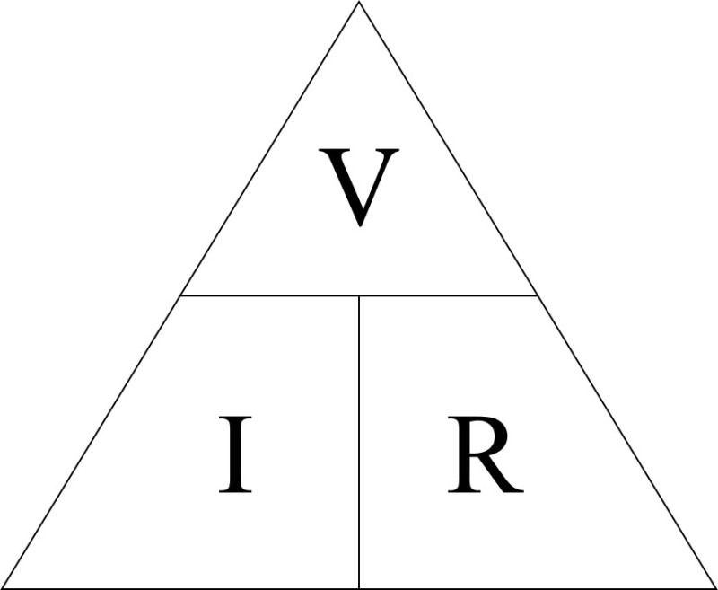

Ohm's Law is a fundamental principle in electrical engineering that describes the relationship between voltage, current, and resistance in an electrical circuit. It states that the current flowing through a conductor is directly proportional to the voltage applied across it, provided that the physical conditions and temperature remain constant.

Mathematically, Ohm's Law can be expressed as:

V = I × R

Where:
- V is the voltage across the conductor, measured in volts (V)
- I is the current flowing through the conductor, measured in amperes (A)
- R is the resistance of the conductor, measured in ohms (Ω)

This equation can be rearranged to solve for any of the three variables if the other two are known:

I = V / R
R = V / I

The constant of proportionality, R, is called the resistance of the conductor. It represents the opposition to the flow of electric current and is measured in ohms (Ω).

Ohm's Law can be verified experimentally by setting up a circuit with a resistor, ammeter, voltmeter, battery, plug key, and rheostat. By gradually increasing the current and recording the corresponding voltage, the ratio of V/I is found to be constant for each set of values, which is equal to the resistance R.

The main applications of Ohm's Law include determining the voltage, current, or resistance in an electric circuit, maintaining the desired voltage drop across a component, and calculating the power dissipated in a resistor.

**Heated Temperatures:** When a metal conductor is heated, the ions within it exhibit heightened vibrations, leading to an increase in the frequency of collisions between the ions and free electrons. This results in an increase in the electrical resistance of the metal conductor
. For example, in a filament lamp, as the current flowing through it intensifies, the filament heats up, causing the bulb's resistance to escalate. This temperature surge can be instigated by an intensified current flow.

**Cooled Temperatures:** Conversely, when a conductor is cooled, the ions' vibrations decrease, reducing the frequency of collisions and resulting in a decrease in electrical resistance. This is evident in certain components like NTC (Negative Temperature Coefficient) thermistors, whose resistance diminishes with a rise in temperature.

**Limitations of Ohm's Law:** It is essential to note that Ohm's Law only holds true if the provided temperature and other physical factors remain constant. In certain components, such as the filament of a light bulb, increasing the current raises the temperature, and Ohm's Law cannot be directly applied in such cases

References:

[1] https://byjus.com/physics/ohms-law/

[2] https://www.electronics-notes.com/articles/basic_concepts/resistance/what-is-ohms-law-formula-equation.php

[3] https://study.com/academy/lesson/ohms-law-formula-circuit-calculation-practice.html

[4] https://www.geeksforgeeks.org/ohms-law/

[5] https://www.youtube.com/watch?v=lf0lMDZVwTI

[6] https://byjus.com/physics/relationship-between-temperature-of-hot-body-and-time-by-plotting-cooling-curve/