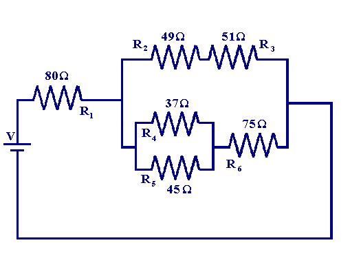

## Series Circuits

In a series circuit, components are connected end-to-end in a single loop, forming only one path for current to flow. The key properties of series circuits are:

- The same current flows through each component
- The voltage drops across each component add up to equal the total voltage
- Resistors in series add their resistance values together

The equivalent resistance of resistors in series is simply the sum of their individual resistances:

$$R_{eq} = R_1 + R_2 + ... + R_n$$

For example, if three resistors of 10Ω, 20Ω and 30Ω are connected in series, the equivalent resistance is:

$$R_{eq} = 10\Omega + 20\Omega + 30\Omega = 60\Omega$$

## Parallel Circuits

In a parallel circuit, components are connected to the same set of terminals, providing multiple paths for current to flow. The key properties of parallel circuits are:

- The voltage is the same across each parallel branch
- The total current divides up among the parallel branches
- Resistors in parallel diminish the total resistance

The reciprocal of the equivalent resistance of resistors in parallel is the sum of the reciprocals of their individual resistances:

$$\frac{1}{R_{eq}} = \frac{1}{R_1} + \frac{1}{R_2} + ... + \frac{1}{R_n}$$

For example, if three resistors of 10Ω, 20Ω and 30Ω are connected in parallel, the equivalent resistance is:

$$\frac{1}{R_{eq}} = \frac{1}{10\Omega} + \frac{1}{20\Omega} + \frac{1}{30\Omega} = \frac{3 + 1.5 + 1}{60} = \frac{5.5}{60} = 0.0917$$

$$R_{eq} = \frac{1}{0.0917} = 10.9\Omega$$

## Series-Parallel Circuits

Sometimes circuits contain both series and parallel connections. To analyze these, first identify the parallel branches and calculate their equivalent resistances. Then treat the parallel branches as single resistors in a series circuit.

For example, in the circuit:

1. Calculate the equivalent resistance of the 49Ω and 51Ω resistors in series:

$$R_{eq} = 49\Omega + 51\Omega = 100\Omega$$

2. Now, calculate parallel of 100 Ω and 95.33Ω i.e 48.78 Ω

3. Series of 80 and 48.78Ω

$$R_{eq} = 80\Omega + 48.78\Omega = 128.78\Omega$$

## Limitations and Challenges

- Resistors in parallel must have the same voltage across them
- Resistors in series must have the same current through them
- Calculating equivalent resistance gets more complex with more resistors
- Voltage and current measurements can be tricky and must be done properly

## Tricks and Tips

- Use conductance (G=1/R) when working with parallel circuits

- Sketch out the circuit and identify series and parallel sections

- Use the reciprocal formula for parallel resistance when more than two resistors

- Simplify the circuit step-by-step, calculating equivalent resistances

In summary, series and parallel circuits have very different properties that must be understood to analyze and design circuits effectively. Combination circuits require a systematic approach to break them down into series and parallel sections. With practice, analyzing these circuits becomes easier.

References:

[1] https://www.tutorialspoint.com/how-to-calculate-equivalent-resistance-series-and-parallel-circuit-examples

[2] https://www.physicsclassroom.com/class/circuits/Lesson-4/Combination-Circuits

[3] https://www.allaboutcircuits.com/worksheets/parallel-dc-circuits/

[4] https://www.siyavula.com/read/za/natural-sciences/grade-8/series-and-parallel-circuits/11-series-and-parallel-circuits

[5] https://www.allaboutcircuits.com/textbook/direct-current/chpt-5/simple-parallel-circuits/