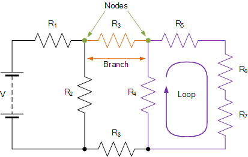

## Kirchhoff's Laws

Kirchhoff's laws are two fundamental principles that describe the flow of electric current in electrical circuits. They were formulated by the German physicist Gustav Kirchhoff in 1845.

### Kirchhoff's Current Law (KCL)

Kirchhoff's Current Law states that "The sum of all currents entering a node (junction) is equal to the sum of all currents leaving that node." Mathematically, this can be expressed as:

$$\sum_{i=1}^{n} I_i = 0$$

where $I_i$ represents the current in the $i^{th}$ branch connected to the node, and the sum is taken over all $n$ branches.

$$I_1 + I_2 - I_3 = 0$$

### Kirchhoff's Voltage Law (KVL)

Kirchhoff's Voltage Law states that "The algebraic sum of all voltages around a closed loop is zero." Mathematically, this can be expressed as:

$$\sum_{i=1}^{n} V_i = 0$$

where $V_i$ represents the voltage drop in the $i^{th}$ branch, and the sum is taken over all $n$ branches in a closed loop.

$$V_1 + V_2 + V_3 = 0$$

A daily life example related to Kirchhoff's laws can be found in the operation of a simple household circuit with multiple appliances connected. Consider a scenario where a circuit consists of a battery connected to various electrical devices like light bulbs, fans, and a television. 

### Example Scenario:
- **Components:** 
  - Two light bulbs (5W each)
  - A fan (50W)
  - A television (100W)
- **Battery Voltage:** 120V

### Application of Kirchhoff's Laws:
1. **Kirchhoff's Current Law (KCL):**
   - At any point in the circuit, the total current entering a junction is equal to the total current leaving the junction.
   - In this scenario, the total current supplied by the battery must be equal to the sum of the currents consumed by each appliance.

2. **Kirchhoff's Voltage Law (KVL):**
   - The algebraic sum of voltages around a closed loop in a circuit must be zero.
   - When the battery supplies a voltage of 120V, the sum of voltage drops across all appliances must equal the supplied voltage.

### Calculation:
- **Current Calculation:**
  - Total Power Consumption: 5W + 5W + 50W + 100W = 160W
  - Total Current: Power / Voltage = 160W / 120V = 1.33A

- **Voltage Drop Calculation:**
  - Voltage Drop across Light Bulbs: 5W * 2 bulbs = 10W
  - Voltage Drop across Fan: 50W
  - Voltage Drop across Television: 100W
  - Total Voltage Drop: 10W + 50W + 100W = 160W 

Kirchhoff's laws, comprising Kirchhoff's Current Law (KCL) and Kirchhoff's Voltage Law (KVL), are fundamental principles in electrical circuit analysis. They are used to analyze and solve complex circuits by applying the conservation of charge and energy. Here are the limitations and applications of Kirchhoff's laws:

### Limitations of Kirchhoff's Laws:

1. **High-Frequency AC Circuits:** Kirchhoff's laws are not suitable for high-frequency AC circuits where the lumped element model does not apply. In such cases, the laws may not accurately predict circuit behavior due to the presence of time-varying magnetic fields.

2. **Non-Lumped Element Circuits:** The laws are derived from the lumped-element model and may not be applicable in circuits where the lumped element model is not valid. For instance, in circuits with significant electric field interactions between components, such as capacitive coupling, the laws may not hold.

### Where to Use Kirchhoff's Laws:

1. **Complex Circuits:** Kirchhoff's laws are essential for analyzing and solving complex circuits with multiple components, loops, and nodes. They provide a systematic approach to determine currents and voltages in various parts of the circuit.

2. **Closed-Loop Circuits:** Kirchhoff's laws are particularly useful in closed-loop circuits where the conservation of charge and energy principles apply. They help in calculating currents, voltages, and power distribution within the circuit.

3. **Series and Parallel Circuits:** The laws are commonly used to analyze series and parallel circuits, determining the current distribution in branches and the voltage drops across components.

In summary, while Kirchhoff's laws are powerful tools for circuit analysis, they have limitations in specific scenarios, such as high-frequency AC circuits. However, they are widely applicable in various circuit configurations, providing a systematic method to analyze and solve electrical circuits.

In a real-world setting, consider a complex electrical network in a manufacturing plant where Kirchhoff's laws are applied to optimize energy distribution and ensure system stability. Here's a practical example with numerical data:

### Real-World Example: Electrical Network Optimization in a Manufacturing Plant

**Scenario:** A manufacturing plant has a complex electrical network with multiple machines, lighting systems, and power distribution units. The goal is to optimize energy distribution, minimize power losses, and ensure efficient operation of the electrical system.

**Numerical Data:**
- **Power Supply:** 480V, 3-phase AC
- **Loads:** 
  - Machine 1: 20kW
  - Machine 2: 15kW
  - Lighting System: 5kW
- **Resistances:** 
  - Machine 1: 10Ω
  - Machine 2: 8Ω
  - Lighting System: 15Ω

**Application of Kirchhoff's Laws:**
1. **Kirchhoff's Current Law (KCL):**
   - Apply KCL at key nodes to ensure that the total current entering a junction equals the total current leaving the junction.
   - Calculate the current distribution in the network to ensure balanced loads and prevent overloading.

2. **Kirchhoff's Voltage Law (KVL):**
   - Apply KVL in closed loops to analyze voltage drops and ensure energy conservation.
   - Determine the voltage distribution across different components to optimize power delivery.

**Numerical Calculation:**
- **Total Power Consumption:** 20kW + 15kW + 5kW = 40kW
- **Total Resistance:** 10Ω + 8Ω + 15Ω = 33Ω
- **Total Current:** $$I = \frac{P}{V} = \frac{40kW}{480V} = 83.33A$$

**Outcome:**
By applying Kirchhoff's laws in this real-world scenario, the manufacturing plant can ensure efficient energy distribution, prevent power imbalances, and optimize the performance of its electrical network. The numerical calculations help in determining the current flow, voltage drops, and power consumption, leading to a more reliable and cost-effective operation of the electrical system.

This example demonstrates how Kirchhoff's laws can be practically applied in industrial settings to optimize energy usage and ensure the smooth operation of complex electrical networks.

References:

[1] http://www.math.utah.edu/~cherk/teach/5740MathModeling/12mathmodel/sources/Mathematical%20Modelling,%20Classroom%20Notes%20in%20Applied%20Mathematics%20%28Murray%20S.%20Klamkin%29%200898712041.pdf

[2] https://www.youtube.com/watch?v=XppCuW-khb8

[3] https://byjus.com/jee/temperature-coefficient-of-resistance/

[4] https://www.geeksforgeeks.org/kirchhoffs-laws/

[5] https://www.qeios.com/read/L9QQSH.3

[6] https://collegedunia.com/exams/kirchhoffs-second-law-physics-articleid-6871

[7] https://www.vedantu.com/physics/kirchhoffs-second-law

