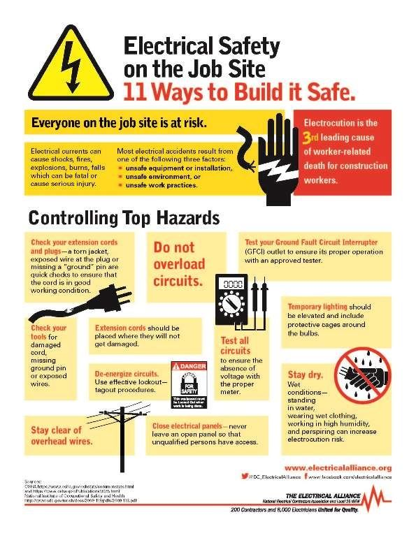
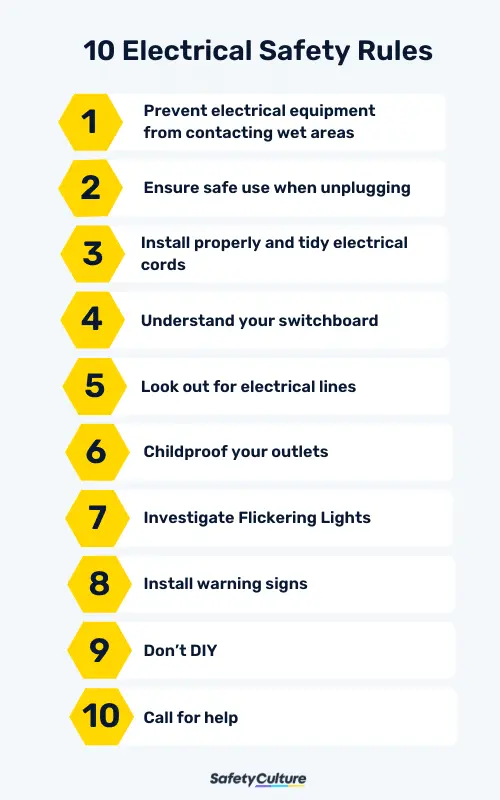
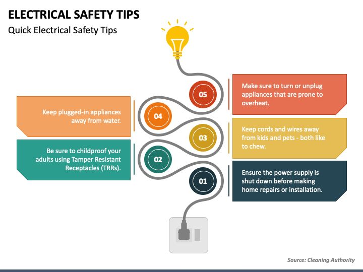
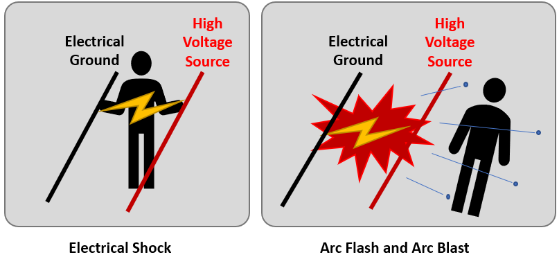

Electrical safety practices are crucial in industries to prevent electrical accidents, ensure a safe working environment, and maintain the reliability of electrical systems. This article provides a comprehensive guide to electrical safety practices in industries, including the importance of electrical safety, key safety practices, and the use of protective equipment.

### Importance of Electrical Safety
Electrical safety is essential in industries to prevent electrical accidents, which can result in injuries, fatalities, and damage to equipment and property. Electrical accidents can occur due to various reasons, including human error, equipment failure, and inadequate safety measures. Therefore, it is vital to implement and follow strict electrical safety practices to minimize the risk of accidents and ensure a safe working environment.

### Key Electrical Safety Practices
Electrical safety practices involve a combination of procedures, protocols, and guidelines that are designed to prevent electrical accidents and ensure the safe operation of electrical systems. Some key electrical safety practices include:

1. **De-energization:** De-energizing electrical equipment before performing maintenance or repairs is a critical safety practice. This involves disconnecting the power supply to the equipment to prevent electrical shock or other hazards.
2. **Lockout/Tagout:** Lockout/tagout procedures are used to ensure that electrical equipment is safely de-energized and cannot be accidentally started while maintenance or repairs are being performed.
3. **Personal Protective Equipment (PPE):** PPE, such as hard hats, safety glasses, and insulated gloves, is essential for protecting workers from electrical hazards.
4. **Electrical Room Safety:** Electrical rooms should be designed and maintained to ensure safe access, adequate lighting, and proper ventilation. Warning signs and safety notices should be prominently displayed to alert workers of potential electrical hazards.
5. **Single Line Diagrams:** Single line diagrams are used to illustrate the electrical distribution system and identify potential hazards and safety risks.
6. **Emergency Procedures:** Emergency procedures, such as first aid and fire extinguishing, should be established and regularly practiced to ensure that workers are prepared in case of an electrical accident.

### Use of Protective Equipment
Protective equipment is a critical component of electrical safety practices. The type and level of protection required depend on the voltage level and the nature of the work being performed. Some common protective equipment used in electrical safety includes:

1. **Insulated Tools:** Insulated tools, such as pliers and screwdrivers, are used to prevent electrical shock when working with energized electrical equipment.
2. **Safety Glasses:** Safety glasses protect workers' eyes from electrical arcs and other hazards.
3. **Hard Hats:** Hard hats protect workers' heads from falling objects and electrical arcs.
4. **Insulated Gloves:** Insulated gloves protect workers' hands from electrical shock when working with energized electrical equipment.
5. **Flame-Resistant Clothing:** Flame-resistant clothing, such as FR pants and shirts, protects workers from electrical arcs and other thermal hazards.

### Conclusion
Electrical safety practices are essential in industries to prevent electrical accidents, ensure a safe working environment, and maintain the reliability of electrical systems. By following key safety practices, such as de-energization, lockout/tagout, and the use of protective equipment, industries can minimize the risk of electrical accidents and ensure the safety of their workers.

References:

[1] https://steel.gov.in/sites/default/files/SG-15%20Safety%20Guideline%20for%20Electrical%20safety.pdf

[2] https://electrical-engineering-portal.com/21-safety-rules-for-working-with-electrical-equipment

[3] https://iastate.pressbooks.pub/electriccircuits/chapter/chapter-1/

[4] https://www2.lbl.gov/ehs/pub3000/CH08/LBNL%20Electrical%20Safety%20Manual.pdf

[5] https://jbvnl.co.in/upload/JR8T6G.SACHET.pdf