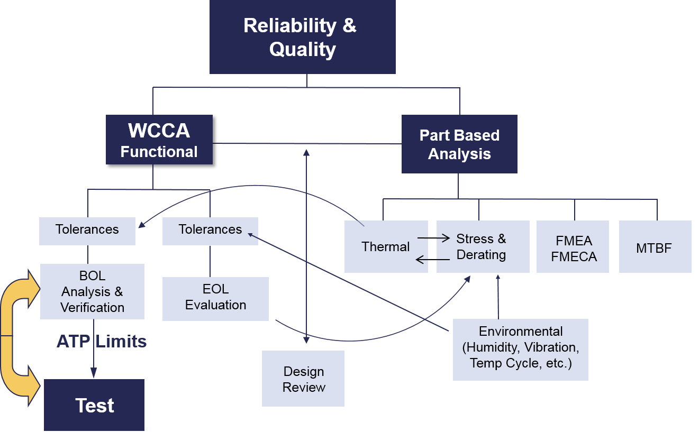
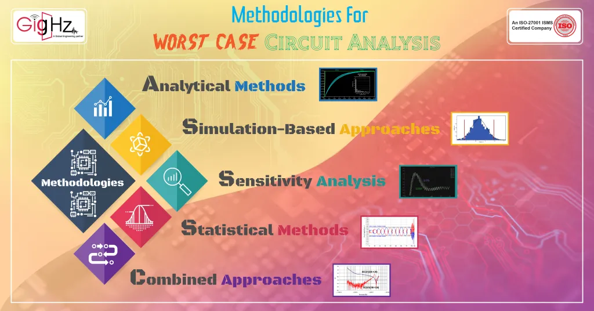
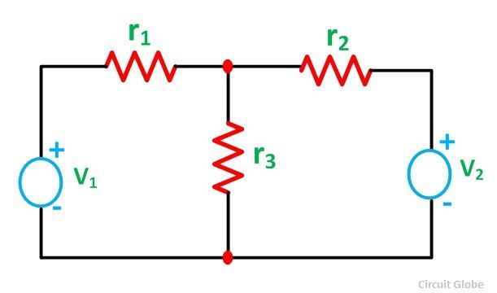
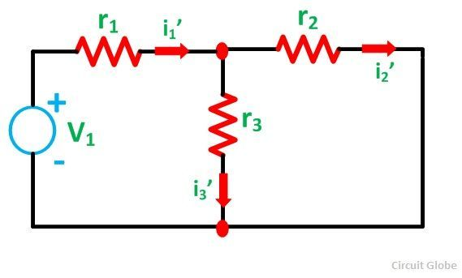
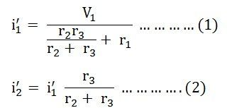
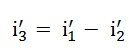
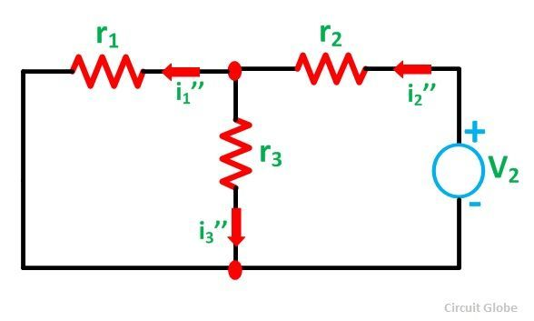
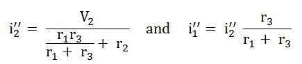
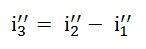

## Basic Circuit Elements and Analysis Techniques

The fundamental circuit elements are resistors, capacitors, inductors, voltage sources, and current sources. Circuit analysis involves applying Ohm's law, Kirchhoff's voltage law (KVL), and Kirchhoff's current law (KCL) to determine voltages, currents, and power in a circuit.

## Superposition Theorem

The superposition theorem states that the voltage across or current through a circuit element is the algebraic sum of the voltages or currents due to each independent source acting alone, with all other independent sources replaced by their internal resistances.

If two or more voltage or current sources are acting simultaneously in a linear network, the resultant current in any branch is the algebraic sum of the currents that would be produced in it, when each source acts alone and all other independent sources are replaced by their internal resistances

> Assumptions & Limitations

1. The circuit must be linear, meaning the components exhibit a linear relationship between voltage and current

2. The circuit must be bilateral, meaning the current can flow in either direction

3. The theorem is not applicable to circuits with non-linear components like diodes or varistors

4. The theorem is not useful for analyzing unbalanced bridge circuits

> Steps to apply superposition theorem

1. Identify the number of independent sources in the circuit.

2. For each source, replace all other sources with their internal resistances (short circuit voltage sources, open circuit current sources)

3. Analyze the modified circuit for each source acting alone using series/parallel analysis techniques.

4. Determine the response (voltage or current) at the desired point for each source.

5. Algebraically add the individual responses to obtain the final result

> Examples

1. Consider the circuit shown in Figure with two voltage sources, 28V and 7V. R1, R2 and R3 be 1,1, 1 ohm.

To find the current in resistor R3 using superposition:

2. Replace 28V source with short circuit, analyze 7V source alone. Calculate I3'

I1' = 14 A
I2' = 7 A
I3' = 7 A

3. Replace 7V source with short circuit, analyze 28V source alone Calculate I3''

>> I3'' = 3.5 - 1.75 A = 1.25 A

4. Algebraically add the individual currents: I3 = I3' + I3'' = 7 A + 1.25 A = 8.25 A

The superposition theorem provides a systematic approach to analyze linear circuits with multiple sources by breaking down the problem into simpler parts. It is a powerful tool for circuit analysis and design.

## Thevenin and Norton Equivalents

Thevenin's theorem states that any two-terminal network composed of voltage sources, current sources, and resistors can be replaced by an equivalent network consisting of a voltage source V_th in series with a resistor R_th.

Norton's theorem states that any two-terminal network composed of voltage sources, current sources, and resistors can be replaced by an equivalent network consisting of a current source I_n in parallel with a resistor R_n.

#### Numerical example

Suppose we have a circuit with a 30V battery, a 10ohm resistor, and a 5ohm resistor connected in series. We want to find the Thevenin equivalent circuit for this circuit.

First, we remove the load resistor (the 5ohm resistor) and find the open-circuit voltage (Voc) across the terminals. This is equal to the Thevenin voltage (VTh):

VTh = 30V

Next, we find the Thevenin resistance (RTh) by short-circuiting all voltage sources and finding the total resistance between the terminals. This is equal to the parallel combination of the two resistors:

RTh = (10ohm || 5ohm) = 3.33ohm

Now, we can represent the circuit as a Thevenin equivalent circuit:

VTh = 30V RTh = 3.33ohm

To convert this to a Norton equivalent circuit, we can use the following formula:

R_N = R_Th I_N = V_Th / R_Th

R_N = 3.33ohm I_N = 30V / 3.33ohm = 9A

So, the Norton equivalent circuit is:

I_N = 9A R_N = 3.33ohm

Note that the Thevenin and Norton equivalent circuits produce the same voltage across the load terminals with no load resistor attached.

## Practical Use Case: Short Circuit Analysis in Power Systems

Short circuit analysis is used to determine the magnitude of short circuit current a power system is capable of producing and compare it to the interrupting rating of overcurrent protective devices (OCPDs). This ensures the OCPDs can safely interrupt the fault current without damage.

For a three-phase bolted fault, the short circuit current is given by:

I_sc = V_L / Z_th

Where V_L is the line-to-neutral voltage and Z_th is the Thevenin equivalent impedance seen from the fault location.

For example, consider a 480V, 3-phase system with a Thevenin impedance of 0.1 + j0.2 ohms. The short circuit current is:

I_sc = 480 / √3 / (0.1 + j0.2) = 2,773 A

The OCPD must have an interrupting rating greater than 2,773A to safely clear the fault. Short circuit analysis ensures proper OCPD selection and coordination to maintain power system reliability and safety.

In summary, basic circuit analysis techniques like Ohm's law, KVL, KCL, series/parallel circuits, and Thevenin/Norton equivalents are essential for understanding and designing electrical circuits. Short circuit analysis is a critical application in power systems to ensure overcurrent protection adequacy.

References:

[1] https://www.slideshare.net/MariaRominaAngustia/circuit-elements

[2] https://www.linkedin.com/pulse/benefits-circuit-simulators-design

[3] https://control.com/technical-articles/understanding-parallel-circuits-for-industry/

[4] https://carelabz.com/what-short-circuit-analysis-done-why/

[5] https://www.allaboutcircuits.com/textbook/direct-current/chpt-10/thevenins-theorem/

[6] https://testbook.com/physics/superposition-theorem

[7] https://circuitglobe.com/what-is-superposition-theorem.html