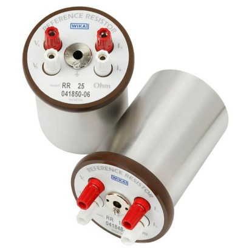
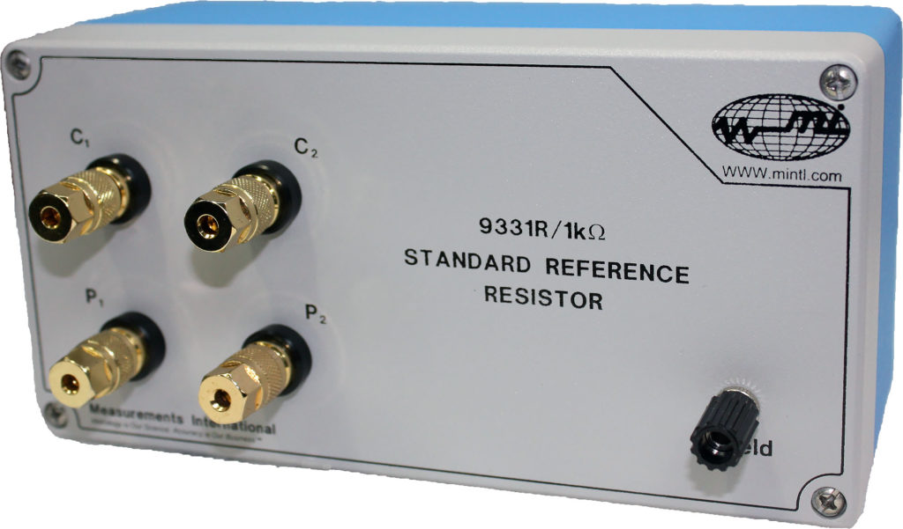
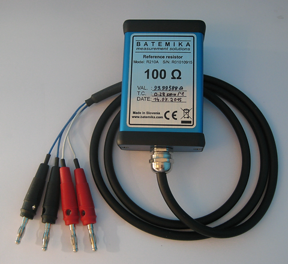
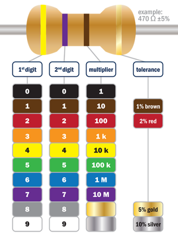

Resistors are passive electronic components that are used to control or limit the flow of electric current in a circuit. 

## Intuitive Explanation

Imagine you're trying to walk through a crowded room. The room represents the path electricity takes in a circuit. Now, think of the people in the room as electrons flowing through the circuit.

Picture a narrow doorway or a corridor within that room. This doorway restricts the flow of people (electrons) through it. In a circuit, a resistor does the same thing to the flow of electricity—it restricts it. The narrower the doorway, the harder it is for people to pass through it; similarly, the higher the resistance, the harder it is for electricity to flow through the resistor.

They come in various types and sizes, each with its own unique properties and applications. Here is a detailed explanation of resistors, their properties, types, and how to calculate their values based on color bands:

## Properties of Resistors
The main properties of resistors include:

- **Resistance value**: The resistance value is measured in ohms (Ω) and determines how much the resistor opposes the flow of current. Common values range from a few ohms to several megohms.

- **Power rating**: The power rating indicates the maximum amount of power the resistor can safely dissipate without overheating. Common power ratings are 1/8W, 1/4W, 1/2W, 1W, and 2W.

- **Temperature coefficient**: The temperature coefficient (TC) measures how the resistance changes with temperature. Resistors with a low TC are preferred for precision applications.

- **Voltage rating**: The voltage rating specifies the maximum voltage that can be applied across the resistor without causing damage.

## Types of Resistors
There are several types of resistors, each with its own characteristics:

1. **Carbon film resistors**: These are the most common type of resistors. They have a carbon film deposited on a ceramic core and are inexpensive and widely available.

2. **Metal film resistors**: These resistors have a thin metal film deposited on a ceramic core. They offer better precision and stability compared to carbon film resistors.

3. **Wire-wound resistors**: These resistors consist of a resistance wire wound around a ceramic or metal core. They can handle high power and have low noise, but are larger in size.

4. **Thin-film resistors**: These resistors are made by depositing a thin metal film on a substrate. They offer high precision and stability, but are more expensive than other types.

5. **Thick-film resistors**: These resistors are made by printing a thick film of resistive material on a ceramic substrate. They are less precise than thin-film resistors but are cheaper and can handle higher power.

## Calculating Resistor Values Using Color Bands

Resistors are often marked with color bands that indicate their resistance value, tolerance, and sometimes the power rating. The color bands are read from left to right:

1. The first two bands indicate the first two digits of the resistance value.
2. The third band indicates the multiplier (number of zeros to add).
3. The fourth band indicates the tolerance (how much the actual value may differ from the marked value).

For example, a resistor with color bands of brown, black, orange, and gold would have a resistance value of 10,000 ohms (10 kΩ) with a tolerance of ±5%.

In conclusion, resistors are essential components in electronic circuits, and understanding their properties, types, and how to calculate their values is crucial for designing and troubleshooting circuits.

References:

[1] https://www.semanticscholar.org/paper/414ae6e320adcfb602a3dcc06bacffcf3e673195

[2] https://www.semanticscholar.org/paper/30ca357f66554013772560269fadefd6fff12ca1

[3] https://www.semanticscholar.org/paper/b43dbb1bfcfdc75aa692b5e4b0b31966f94521e9

[4] https://www.semanticscholar.org/paper/4007872d3a63f4348a5bb6da4aa24d6b37289936

[5] https://www.semanticscholar.org/paper/4d375ebd47fa5816cbd556380c82ac1076b17864