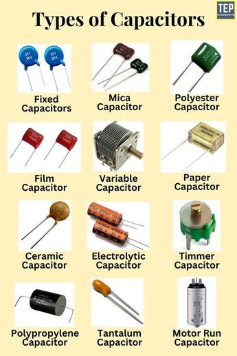

A **Capacitor** is an electronic component that stores electric charge and energy. It consists of two conductors separated by a small distance, where charge is transferred between the conductors when connected to a charging device. The amount of charge stored is directly proportional to the voltage, with capacitance (C) representing this relationship (Q = CΔV). Capacitors are used in various applications like filters in DC power supplies and energy storage in pulsed lasers, passing AC current while blocking DC current.

## Intuitive Explanation

Think of the sponge as a capacitor. Just like a sponge can soak up and store water, a capacitor can store electrical energy. When you charge a capacitor, it's like soaking the sponge in water. The capacitor collects and holds onto electric charge.

The ability of the sponge to soak up water depends on its size and material. Similarly, the ability of a capacitor to store charge depends on its capacitance. A larger capacitor or one made of certain materials can store more charge, just like a bigger sponge can soak up more water.

Now, imagine you dip the sponge into the bucket of water and then lift it out. The sponge is now filled with water. This is similar to charging a capacitor by connecting it to a power source. When you remove the sponge from the bucket, it still holds water, but it's not connected to the source anymore. Similarly, when you disconnect a charged capacitor from a power source, it still holds the electric charge.

The amount of water the sponge holds determines its weight. Similarly, the amount of charge a capacitor holds determines its voltage. The more charge it stores, the higher its voltage. Additionally, just like squeezing a sponge releases water, discharging a capacitor releases stored energy in the form of electrical current.

If you have multiple sponges, you can connect them in different ways. Placing them side by side increases the overall capacity to hold water, similar to connecting capacitors in parallel. However, stacking them on top of each other increases the height, similar to connecting capacitors in series, which increases the voltage rating but not the overall capacitance.

### Charging and Discharging Cycle:
- **Charging**: In a simple RC circuit with a resistor and capacitor connected to a battery, charge builds up exponentially on the capacitor during the charging process until it reaches a final value (Q = Qf(1 - e^(-t/RC))). The time constant (τ = RC) is the time for the charge to reach 63% of its final value.
- **Discharging**: When the capacitor discharges, the charge decays exponentially (Q = Q0e^(-t/RC)), taking an infinite time to fully discharge. The time constant determines the rate of discharge, with 63% of the charge decaying in one time constant.

### Significance in a Circuit:
- **Types of Capacitors**: Capacitors come in various types like ceramic, electrolytic, and tantalum, each with specific characteristics suited for different applications.
- **Mathematics and Numerical Methods**: Calculating the value of a capacitor involves equations like Q = CV and understanding the time constant (τ = RC) for charging and discharging processes.
- **In a Circuit**: Capacitors store energy, filter signals, and can be used for timing circuits, coupling AC signals, and smoothing voltage fluctuations.

1. **Paper Capacitor**: These capacitors have paper as the dielectric material. They are not commonly used nowadays due to their relatively low reliability and performance compared to modern alternatives. Common values: Picofarads (pF) to a few microfarads (μF).

2. **Polystyrene Capacitor**: Known for their stability and low dielectric loss, polystyrene capacitors are used in precision applications such as oscillators, filters, and timing circuits. Common values: Picofarads (pF) to low microfarads (μF).

3. **Bipolar Capacitor**: These capacitors can be connected with either polarity and are often used in AC circuits or where the polarity may reverse. They are commonly found in audio circuits and crossover networks. Common values: Microfarads (μF) to tens of microfarads.

4. **Electrolytic Capacitor**: These capacitors use an electrolyte as the dielectric and are polarized, meaning they must be connected with the correct polarity. They offer high capacitance values and are used in power supply filtering, audio amplifiers, and decoupling applications. Common values: Microfarads (μF) to several thousand microfarads.

5. **Polycarbonate Capacitor**: Capacitors with polycarbonate dielectric offer stability and low dielectric absorption. They find applications in timing circuits, filters, and high-frequency coupling. Common values: Picofarads (pF) to low microfarads (μF).

6. **Polyester Capacitor**: Also known as Mylar capacitors, these have polyester film as the dielectric. They are used in timing circuits, audio applications, and bypass capacitors. Common values: Picofarads (pF) to low microfarads (μF).

7. **Mylar Capacitor**: See Polyester Capacitor.

8. **Silver Mica Capacitor**: Silver mica capacitors offer stability and low loss at high frequencies, making them suitable for RF and precision timing applications. Common values: Picofarads (pF) to nanofarads (nF).

9. **Ceramic Capacitor**: These capacitors use ceramic as the dielectric material and are widely used due to their small size and low cost. They find applications in decoupling, filtering, tuning circuits, and bypassing. Common values: Picofarads (pF) to microfarads (μF).

10. **Tantalum Electrolytic Capacitor**: Tantalum capacitors offer high capacitance values in a small form factor. They are used in portable electronics, power supplies, and decoupling applications. Common values: Microfarads (μF) to several hundred microfarads.

11. **Feed Through Capacitor**: These are designed to provide a low impedance path for high-frequency signals while blocking DC and low-frequency signals. They are used in RF circuits and noise filtering applications.

12. **Trimmer Capacitor**: These are variable capacitors with adjustable capacitance. They are used in tuning circuits and for calibration purposes.

13. **Variable Capacitor**: Similar to trimmer capacitors, variable capacitors have adjustable capacitance and are used in tuning circuits, oscillators, and variable-frequency circuits.

14. **Fixed Capacitor**: A capacitor with a fixed capacitance value, which can't be adjusted.

15. **Mica Capacitor**: These capacitors use mica as the dielectric material, offering stability and low loss at high frequencies. They are used in RF and high-frequency applications. Common values: Picofarads (pF) to nanofarads (nF).

16. **Film Capacitor**: A general term encompassing capacitors with a film dielectric, including polyester, polycarbonate, and others. They are used in various applications depending on the specific film material.

17. **Motor Run Capacitor**: These capacitors are used in single-phase AC induction motors to improve starting and running efficiency by providing a phase shift in the motor windings.

18. **Polypropylene Capacitor**: These capacitors have polypropylene film as the dielectric, offering stability and low loss. They are used in applications requiring high reliability and precision, such as audio circuits and filters.

Common capacitance values vary widely depending on the specific type of capacitor and its application, ranging from picofarads (pF) to thousands of microfarads (μF). The actual values used depend on the requirements of the circuit in which the capacitor is employed.

Understanding capacitors and their charging and discharging cycles is crucial in electronics, as they play a vital role in regulating voltage, storing energy, and controlling the flow of current in circuits.

References:

[1] https://www.electronics-tutorials.ws/rc/rc_2.html

[2] https://www.gamry.com/application-notes/battery-research/electrochemical-capacitors-cyclic-charge-discharge-and-stacks/

[3] https://www.webassign.net/question_assets/ncsulcpem2/lab_4/manual.html

[4] https://www.youtube.com/watch?v=b_S-Ni5n-2s

[5] https://knowledgecycle.in/charging-and-discharging-of-capacitor-investigatory-project-pdf/