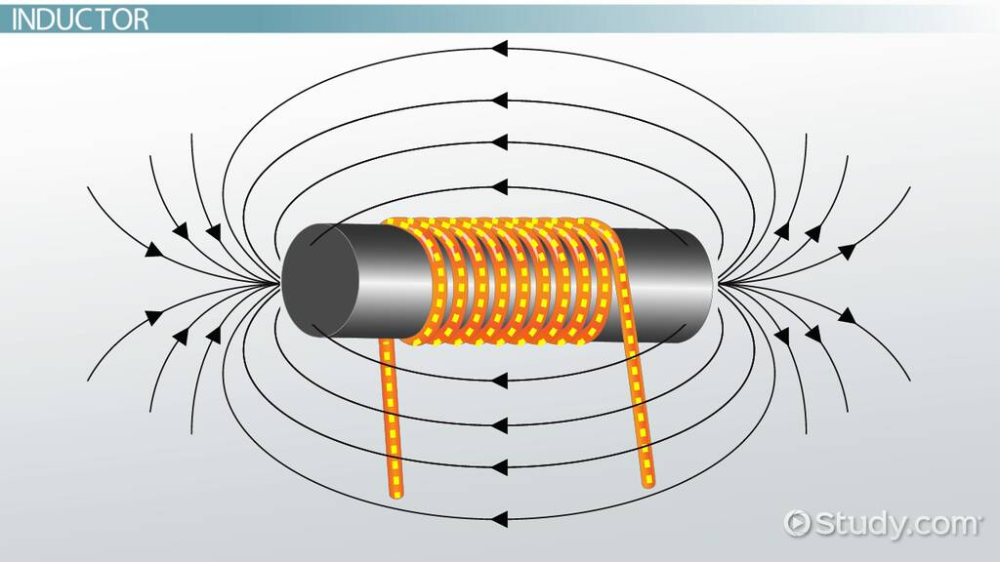

An **Inductor** is a passive electronic component that stores energy in the form of a magnetic field when an electric current flows through it. 

## Intuitive Explanation

Imagine you have a spinning bicycle wheel with a rope wound around its axle.

Picture the spinning bicycle wheel as an inductor. Just as the rotating wheel stores kinetic energy, an inductor stores energy in the form of a magnetic field. When current flows through the inductor, the magnetic field builds up around it, storing energy.

The ability of the bicycle wheel to store kinetic energy depends on factors like its size and speed of rotation. Similarly, the ability of an inductor to store magnetic energy depends on its inductance. A larger inductor or one with more coils can store more energy in its magnetic field.

Imagine you're spinning the bicycle wheel rapidly. As you do so, the rope winds around the axle, storing energy in the spinning wheel. Similarly, when current flows through an inductor, it builds up a magnetic field, storing energy. When the current stops or changes, the magnetic field collapses, releasing the stored energy back into the circuit.

Just as the speed at which you spin the bicycle wheel affects how much energy it stores, the frequency of the alternating current passing through an inductor affects how much magnetic energy it stores and releases. This relationship between frequency and the ability of an inductor to impede the flow of alternating current is called inductive reactance.

If you have multiple bicycle wheels spinning together, you can connect them in different ways. If you connect them side by side, they collectively store more energy, similar to connecting inductors in parallel. However, if you stack them on top of each other, they still store energy, but the total amount is affected by their arrangement, similar to connecting inductors in series.

## Theoretical Explanation

It typically consists of a conductor, such as a wire, wound into a coil. The key properties of an inductor are:

- It opposes changes in current by temporarily storing energy in a magnetic field and then releasing it back into the circuit.

- The amount of inductance depends on factors like the number of turns in the coil, the radius of the coil, and the type of material around which the coil is wound.
- The unit of inductance is the Henry (H), and it is represented by the symbol L.

### Types of Inductors:
1. **Air Core Inductors**: These inductors use a non-magnetic core material like ceramic, plastic, or air.
2. **Iron Core Inductors**: These inductors have an iron core that increases the magnetic field strength.
3. **Variable Inductors**: These allow the inductance to be varied by adjusting the position of the core or the number of turns in the coil.
4. **Tapped Inductors**: These have multiple taps or connections along the coil, allowing access to different inductance values.

### Mathematics and Numerical Methods:
- **Inductance Formula**: L = Φ/I, where L is inductance, Φ is flux, and I is current.
- **Energy Stored in an Inductor**: E = LI^2/2, where E is stored energy, L is inductance, and I is current.
- **Impedance of an Inductor**: Z = jωL, where Z is impedance, j is the imaginary unit, ω is angular frequency, and L is inductance.

To determine the value of an inductor by looking at it, you can use the following methods:

1. **Measure the DC resistance**: Use a multimeter to measure the resistance between the inductor's terminals. Higher resistance generally indicates a larger inductor.
2. **Observe the physical size**: Larger inductors typically have more turns of wire and a larger core, resulting in higher inductance values.
3. **Check the color code**: Some inductors have color bands similar to resistors, indicating the inductance value.
4. **Use an LCR meter**: This specialized instrument can directly measure the inductance of a component.

Inductors play a crucial role in electronic circuits by controlling current, filtering signals, and storing energy. They are used in various applications like power supplies, radio frequency (RF) circuits, and timing circuits.

Inductors are classified into several types based on their core material, design, and usage. Here are some of the main types of inductors:

## Types

### Based on Core Material:
1. **Air Core Inductor**: These inductors use air as the core material, which means they have no solid core. They are often used in high-frequency applications where core losses are significant
2. **Iron Core Inductor**: These inductors have ferromagnetic materials like ferrite or iron as the core material. They are used in applications where high inductance values are required, but they suffer from core losses at high frequencies.
3. **Ferrite Core Inductor**: These inductors use ferrite as the core material, which is a type of ferromagnetic material. They are further classified into soft ferrite and hard ferrite.
4. **Iron Powder Inductor**: These inductors use compressed iron powder as the core material. They are suitable for applications where space and cost are a concern.
5. **Laminated Steel Core Inductor**: These inductors have laminated thin steel sheets as the core material. They are used in applications where energy losses need to be minimized.
6. **Powdered Iron Core Inductor**: These inductors have magnetic materials with air gaps in the core. They provide low eddy current losses and hysteresis losses.
7. **Ceramic Core Inductor**: These inductors use ceramic as the core material. They are often referred to as air-core inductors and are used in high-frequency applications.

### Based on Core Design:
1. **Toroidal Core Inductor**: These inductors have a circular ring shape and are used in AC circuit applications. They offer minimum losses in the magnetic flux due to their symmetrical shape.
2. **Bobbin Core Inductor**: These inductors have a bobbin-shaped core and are used in various applications

### Based on Usage:
1. **Multi-Layer Inductor**: These inductors have multiple layers of windings and are used in applications where high inductance values are required.
2. **Thin Film Inductor**: These inductors are built on integrated circuits using thin film technology. They are used in applications where small size and low inductance values are required
3. **Molded Inductor**: These inductors are molded into a plastic casing and are used in applications where protection from the environment is necessary
4. **Coupled Inductor**: These inductors have two or more windings that are magnetically coupled. They are used in applications like transformers and filters
5. **Power Inductor**: These inductors are designed to handle high power and are used in power supplies and other high-power applications
6. **Radio-Frequency (RF) Inductor**: These inductors are designed to operate at high frequencies and are used in RF circuits
7. **Chokes**: These inductors are designed to block high-frequency signals while allowing low-frequency signals to pass through. They are used in applications like power supplies and filters
8. **Variable Inductor**: These inductors have variable inductance values and are used in applications where the inductance needs to be adjusted
9. **Colour Ring Inductor**: These inductors have a colour code to indicate their inductance value. They are used in applications where the inductance value needs to be easily identified
10. **Shielded Surface Mount Inductor**: These inductors are shielded to reduce electromagnetic interference (EMI) and are used in applications where EMI is a concern
11. **Wireless Charging Coils**: These inductors are used in wireless charging applications to transfer energy wirelessly

Each type of inductor has its own advantages and disadvantages, and the choice of inductor depends on the specific application and requirements.

References:

[1] https://www.geeksforgeeks.org/inductor/

[2] https://byjus.com/jee/inductor/

[3] https://www.coilcraft.com/en-us/edu/series/what-is-an-inductor/

[4] https://www.allaboutcircuits.com/textbook/reference/chpt-9/inductors/

[5] https://www.techtarget.com/whatis/definition/inductor