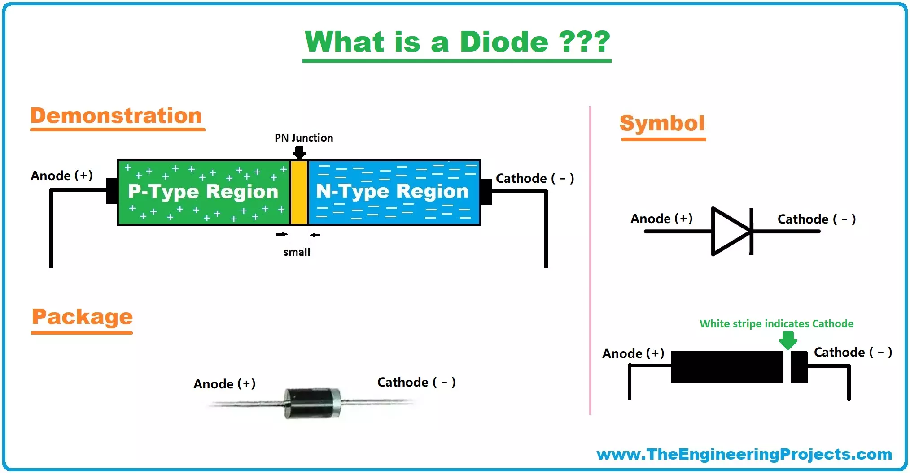
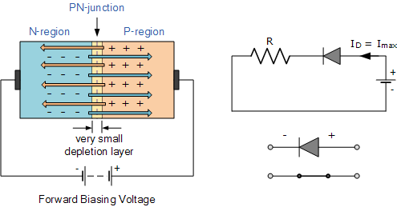
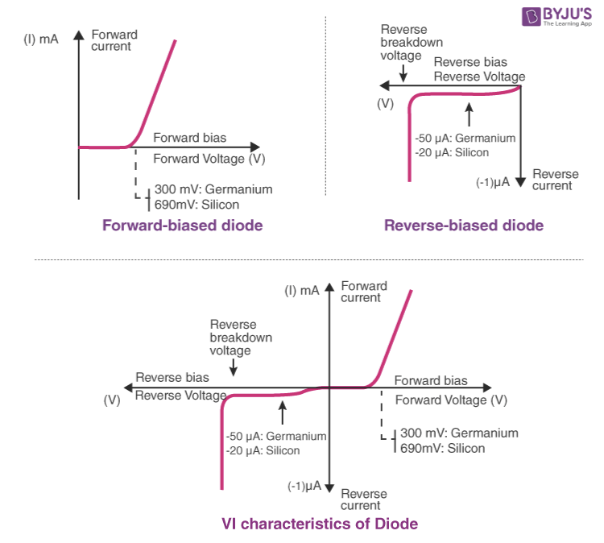
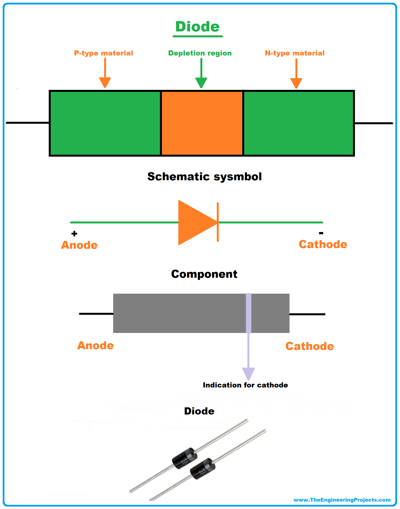
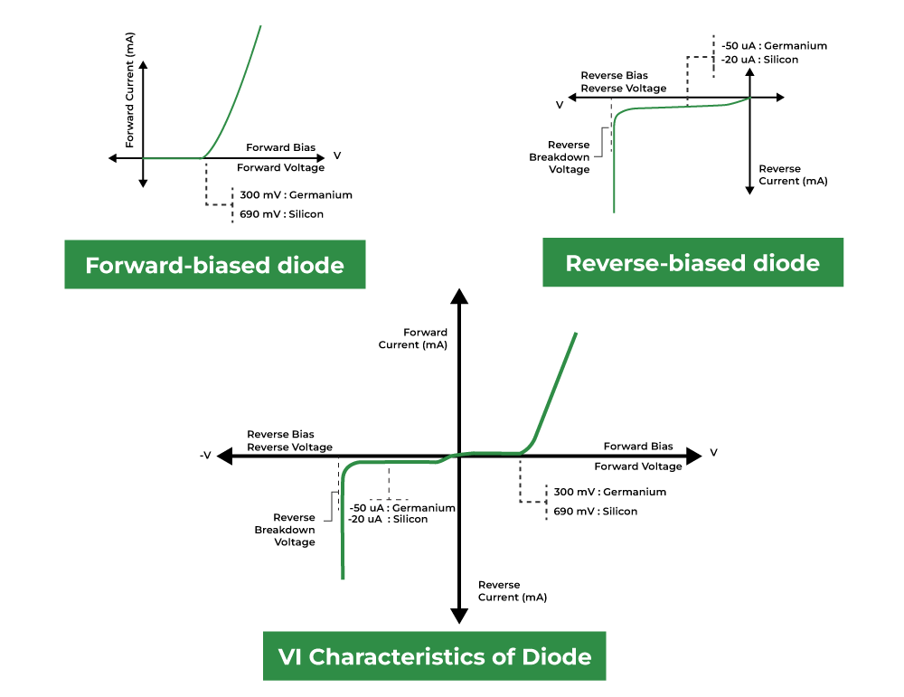
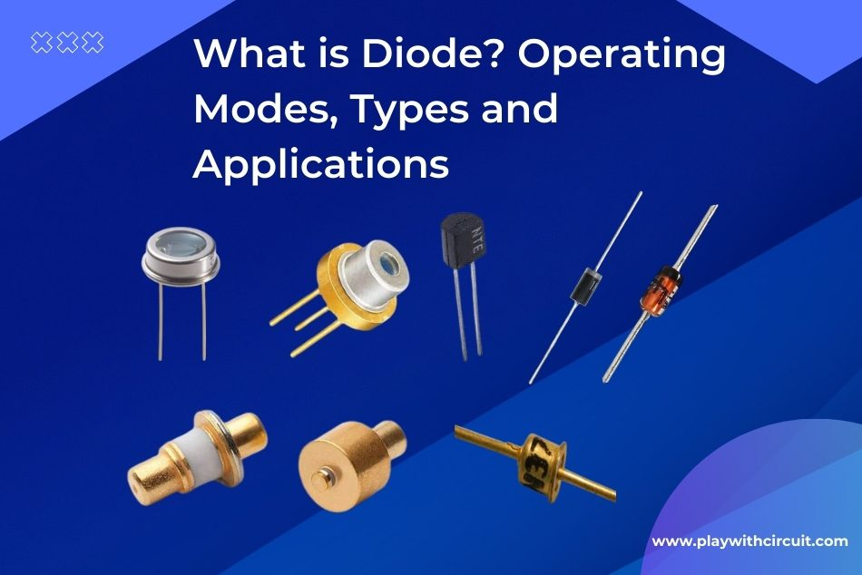

A diode is a two-terminal semiconductor device that allows electric current to flow in only one direction. It is a fundamental component in modern electronics and has a wide range of applications in various industries. 

## Intuitive Explanation

Imagine you have a one-way valve in a pipe.

Think of the one-way valve as a diode. Just as the valve allows water to flow in one direction while blocking it in the other, a diode permits electric current to flow in one direction (forward bias) while hindering it in the opposite direction (reverse bias).

When you apply pressure to the valve in the direction it's designed to allow flow, it opens easily. This is similar to forward biasing a diode, where current can flow freely. Conversely, when you apply pressure in the opposite direction, the valve shuts tight, blocking the flow. This is like reverse biasing a diode, where it prevents current from passing through.

Consider the minimum pressure required to open the valve. Similarly, a diode has a threshold voltage that must be surpassed to allow current flow in the forward direction. Once this threshold is reached, the diode conducts electricity effectively.

Imagine water flowing through the pipe with the valve in place. When the valve is open (forward biased), water can move through easily. Conversely, when the valve is closed (reverse biased), water cannot pass through. Similarly, in a diode, when it's forward biased, current flows; when it's reverse biased, current is blocked.

Think of scenarios where you need to control the flow of fluid in a specific direction, like preventing backflow in a plumbing system. Similarly, diodes are used in various electronic circuits for rectification (converting AC to DC), voltage regulation, and signal demodulation, among other purposes.

## Working Principle of a Diode

A diode is made up of a semiconductor material, typically silicon or germanium, with a p-n junction. The p-type semiconductor has an excess of holes (positive charge carriers), while the n-type semiconductor has an excess of electrons (negative charge carriers). When these two materials are joined together, a depletion region is formed at the junction, which acts as an insulator.

When a diode is forward-biased (anode positive and cathode negative), the depletion region narrows, allowing current to flow easily. In this configuration, the diode has a low resistance. However, when the diode is reverse-biased (anode negative and cathode positive), the depletion region widens, blocking the flow of current. In this configuration, the diode has a high resistance.

The current-voltage (I-V) characteristic of a diode can be approximated by four operating regions:

1. **Breakdown region**: At very high reverse voltages, the diode breaks down and allows current to flow in the reverse direction.
2. **Reverse-bias region**: At lower reverse voltages, the diode has a high resistance and blocks the flow of current.
3. **Forward-bias region**: At lower forward voltages, the diode has a low resistance and allows current to flow easily.
4. **Saturation region**: At higher forward voltages, the diode reaches its maximum current capacity.

## Types of Diodes

There are several types of diodes, each designed for specific applications. Here are some of the most common types:

### 1. **PN Junction Diode**

A PN junction diode is the most basic type of diode. It consists of a p-type semiconductor and an n-type semiconductor joined together to form a p-n junction. PN junction diodes are used in various applications, such as rectification, voltage regulation, and signal detection.

### 2. **Zener Diode**

A Zener diode is a heavily doped PN junction diode that operates in the reverse-bias region. It is designed to break down at a specific reverse voltage, known as the Zener voltage. Zener diodes are used for voltage regulation, circuit protection, and as voltage references.

### 3. **Light-Emitting Diode (LED)**

An LED is a diode that emits light when forward-biased. It is made of a semiconductor material that emits photons when electrons recombine with holes. LEDs are used in various applications, such as displays, indicators, and lighting.

### 4. **Photodiode**

A photodiode is a diode that generates a current when exposed to light. It operates in the reverse-bias region and is used in various applications, such as optical communication, light detection, and imaging.

### 5. **Schottky Diode**

A Schottky diode is a metal-semiconductor junction diode that has a lower forward voltage drop and faster switching speed compared to PN junction diodes. It is made by joining a metal (such as platinum or tungsten) with an n-type semiconductor. Schottky diodes are used in high-frequency applications, such as mixers, detectors, and switches.

### 6. **Varactor Diode**

A varactor diode, also known as a varicap diode, is a diode that acts as a voltage-controlled capacitor. It is used in applications that require variable capacitance, such as tuning circuits in radios and televisions.

### 7. **PIN Diode**

A PIN diode consists of a p-type semiconductor, an intrinsic semiconductor, and an n-type semiconductor. It is used in applications that require high-power handling, such as switches and attenuators in microwave circuits.

### 8. **Tunnel Diode**

A tunnel diode is a heavily doped PN junction diode that exhibits negative resistance in its I-V characteristic. It is used in high-frequency oscillators and amplifiers.

## Operating Characteristics of Diodes

The operating characteristics of diodes can be described by their I-V curves, which show the relationship between the current flowing through the diode and the voltage applied across it. The I-V curve of a diode can be approximated by the following equation:

I = I_s * (e^(V/n*V_T) - 1)

where:
- I is the diode current
- I_s is the reverse saturation current
- V is the voltage across the diode
- n is the ideality factor (typically between 1 and 2)
- V_T is the thermal voltage (approximately 26 mV at room temperature)

The thermal voltage V_T is given by:

V_T = k*T/q

where:
- k is the Boltzmann constant (1.38 × 10^-23 J/K)
- T is the absolute temperature in Kelvin
- q is the charge of an electron (1.60 × 10^-19 C)

The reverse saturation current I_s is the current that flows through the diode when it is reverse-biased. It is typically very small (in the range of nanoamperes to microamperes) and depends on the semiconductor material and the doping concentration.

The ideality factor n accounts for the deviation of the diode's behavior from the ideal case. It is a measure of how closely the diode follows the exponential relationship between current and voltage. An ideal diode has an ideality factor of 1, while real diodes have values between 1 and 2.

## Applications of Diodes

Diodes have a wide range of applications in various industries, including:

1. **Rectification**: Diodes are used to convert alternating current (AC) to direct current (DC) in power supplies and other circuits.

2. **Voltage regulation**: Zener diodes are used to maintain a constant voltage in circuits, despite variations in the input voltage or load.

3. **Clipping and clamping**: Diodes are used in clipping and clamping circuits to limit or shift the voltage levels of signals.

4. **Logic gates**: Diodes can be used to implement simple logic gates, such as AND and OR gates, in digital circuits.

5. **Lighting**: LEDs are used in various lighting applications, such as indicator lights, displays, and general illumination.

6. **Optical communication**: Photodiodes are used in optical communication systems to detect and receive optical signals.

7. **Microwave circuits**: PIN diodes and Schottky diodes are used in high-frequency applications, such as switches, attenuators, and mixers.

8. **Oscillators**: Tunnel diodes and Gunn diodes are used in high-frequency oscillators and amplifiers.

9. **Transient voltage suppression**: Transient voltage suppressor (TVS) diodes are used to protect electronic circuits from voltage spikes and surges.

10. **Temperature sensing**: Diodes can be used as temperature sensors due to their temperature-dependent forward voltage drop.

References:

[1] https://testbook.com/physics/diodes

[2] https://www.theengineeringprojects.com/2021/06/diode.html

[3] https://www.geeksforgeeks.org/diode/

[4] https://en.wikipedia.org/wiki/Diode

[5] https://www.jameco.com/Jameco/workshop/Howitworks/different-types-of-diodes-and-how-they-work.html