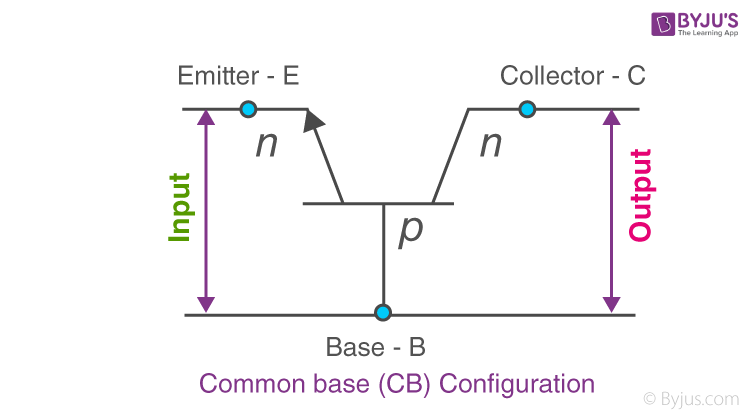
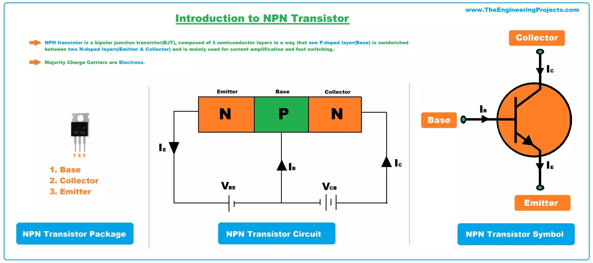

Transistors are semiconductor devices crucial in electronics for amplifying or switching signals. They consist of three terminals: base, collector, and emitter. The working principle involves controlling current flow by varying a smaller current. 

## Intuitive Explanation

Imagine you have a water faucet with a lever that controls the flow of water.

Think of the water faucet as a transistor. It can control the flow of water (current) between two pipes (terminals) based on the position of the lever (input signal).

There are two main types of transistors: bipolar junction transistors (BJTs) and field-effect transistors (FETs). For simplicity, let's focus on BJTs.

Visualize a lever on the faucet that can be pushed or pulled. In a BJT, the lever represents the base terminal, and the flow of water through the faucet represents the collector-emitter current. By moving the lever (applying a small input current), you control the flow of water (larger collector-emitter current) through the faucet.

Just as you can turn the lever on the faucet to different positions, a BJT transistor can operate in different modes: cutoff, saturation, and active. In cutoff mode, the transistor acts like a closed faucet, blocking the flow of current. In saturation mode, it acts like an open faucet, allowing maximum current flow. In active mode, the flow of current is controlled by the input signal, just like adjusting the lever on the faucet controls the flow of water.

Imagine using the faucet to regulate the water flow in a sprinkler system. Similarly, transistors are used in electronic circuits to amplify signals, switch currents on and off, and control the flow of electricity in various devices, from amplifiers and radios to computers and smartphones.

## Theoretical Explanation

There are two main types: Bipolar Junction Transistors (BJT) and Field Effect Transistors (FET). Transistor characteristics, like input, output, and current transfer, depict the relationship between current and voltage in different configurations. These characteristics are vital for understanding a transistor's behavior in circuits.

### Types of Transistors:
- **Bipolar Junction Transistor (BJT):** It has three terminals - base, emitter, and collector. A small base current controls a larger collector-emitter current.
- **Field Effect Transistor (FET):** Another type of transistor with different operating principles

### Transistor Configurations:
1. **Common Emitter (CE):** Offers medium input/output impedance and current/voltage gain.
2. **Common Base (CB):** Provides low input impedance, high output impedance, and high voltage gain.
3. **Common Collector (CC):** Known as the emitter follower, with high input impedance and low output impedance.

### Characteristics of Transistors:
- **Input Characteristics:** Show input current changes with input voltage for constant output voltage.
- **Output Characteristics:** Depict output current changes with output voltage at constant input current.
- **Current Transfer Characteristics:** Illustrate output current changes concerning input current at constant output voltage.

NPN transistors are a type of bipolar junction transistor (BJT) that consist of a p-type semiconductor sandwiched between two n-type semiconductors. They are named "NPN" based on the arrangement of their three semiconductor layers.

## Important Jargons

1. **Q-Point (Quiescent Point):**
   - The Q-point represents the operating point of a transistor, denoting the current and voltage at which the transistor operates under steady-state conditions.
   - It is selected based on the application of the transistor, ensuring stable and optimal performance.

2. **Saturation Region:**
   - In the saturation region, the transistor operates with maximum collector current and minimal collector-emitter voltage.
   - The base-emitter and collector-base junctions are no longer reverse biased, leading to a loss of normal transistor action.

3. **Active Region:**
   - The active region is where the transistor functions normally, with the collector-base junction reverse biased and the base-emitter junction forward biased
   
   - It is the region where the transistor is typically used for amplification purposes.

4. **VCE and VCC:**
   - **VCE (Collector-Emitter Voltage):** It is the voltage across the collector and emitter terminals of the transistor.
   - **VCC (Collector Supply Voltage):** The voltage supplied to the collector terminal of the transistor.

Understanding these terms is essential for analyzing and designing transistor circuits effectively. The Q-point ensures stable operation, while the saturation and active regions define the transistor's behavior under different biasing conditions. VCE and VCC play critical roles in determining the operating characteristics of the transistor in various applications.

## Construction and Working

The three terminals of an NPN transistor are:

1. **Emitter (E)**: Heavily doped n-type semiconductor that supplies majority charge carriers (electrons)
2. **Base (B)**: Lightly doped p-type semiconductor that forms junctions with the emitter and collector
3. **Collector (C)**: Moderately doped n-type semiconductor that collects the charge carriers from the emitter

When a small positive voltage is applied between the base and emitter terminals, the emitter-base junction becomes forward biased. This injects electrons from the emitter into the base region. Since the base is lightly doped, most of these electrons pass through to the reverse biased collector-base junction.

The reverse bias at the collector-base junction creates a strong electric field that sweeps the electrons from the base to the collector. This allows a large collector-emitter current to be controlled by a much smaller base current, enabling amplification.

## Characteristics and Applications

NPN transistors have the following characteristics:

- Electrons are the majority charge carriers
- Emitter-base junction is forward biased, collector-base junction is reverse biased
- Collector current is much larger than base current

NPN transistors are widely used in electronics for:

- Amplification of signals
- Switching in digital circuits
- Oscillator circuits
- Voltage regulation

They offer advantages like small size, fast switching speeds, and cost-effectiveness. However, they can generate heat and are sensitive to temperature variations

Transistors find applications in various industries like telecommunications, computing, and power electronics due to their amplification and switching capabilities. Understanding transistor characteristics is essential for designing efficient electronic circuits and optimizing their performance.

References:

[1] https://byjus.com/jee/transistor/

[2] https://www.electrical4u.com/transistor-characteristics/

[3] https://testbook.com/physics/characteristics-of-a-transistor

[4] https://uotechnology.edu.iq/dep-laserandoptoelec-eng/branch/lectures/electronic1/%D8%A7%D9%84%D9%85%D8%AD%D8%A7%D8%B6%D8%B1%D8%A9%20%D8%A7%D9%84%D8%AE%D8%A7%D9%85%D8%B3%D8%A9.pdf

[5] https://byjus.com/physics/characteristics-of-a-transistor/

[6] https://www.geeksforgeeks.org/npn-transistor/

[7] https://www.idc-online.com/technical_references/pdfs/electronic_engineering/Q_point.pdf

[8] https://instrumentationtools.com/transistor-cut-off-saturation-active-regions/