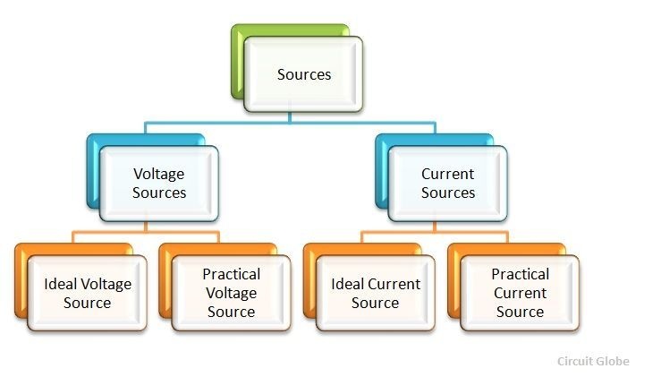
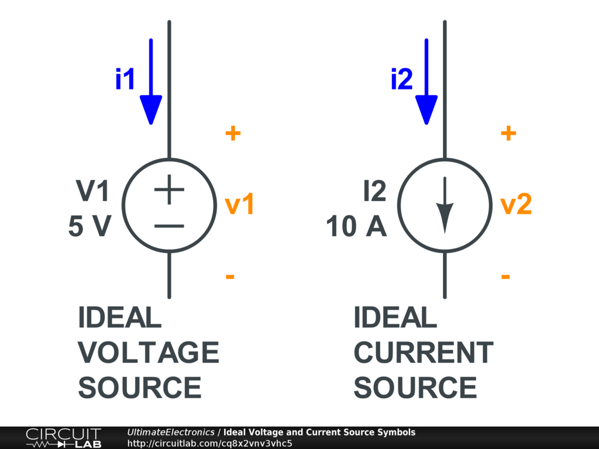
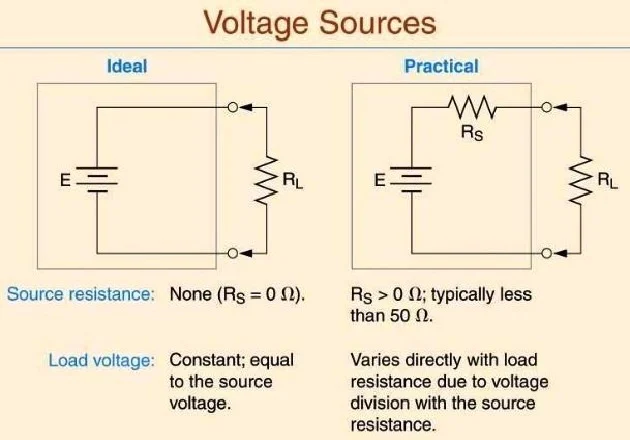
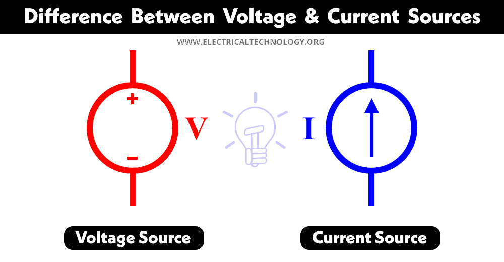

Current and voltage sources are fundamental components in electrical circuits that provide the necessary electrical energy for proper functionality. There are two main types of sources: voltage sources and current sources.

## Voltage Sources

A voltage source generates a potential difference across its two terminals. When these terminals are connected to a network of interconnected components that form a continuous conductive path, current will flow. Voltage sources can be classified into two categories:

Imagine a voltage source as a kind of electrical 'pressure' pump. It provides a certain level of 'push' to make electricity flow in a circuit. Just like a water pump creates pressure to move water through pipes, a voltage source creates pressure to move electrical charge through wires.

1. **Independent voltage sources**: These sources maintain a constant voltage irrespective of the load. Examples include batteries and AC voltage sources. The voltage remains stable as long as the internal resistance of the source is much smaller than the load resistance.

2. **Dependent voltage sources**: These sources have their voltage controlled by another voltage or current elsewhere in the circuit. They are denoted as VCVS (Voltage Controlled Voltage Source) or CCVS (Current Controlled Voltage Source).

Imagine a fan that speeds up or slows down based on how fast you're pedaling a bike. In a CCVS, the voltage across the fan represents the output voltage, while the speed at which you pedal the bike represents the input current. So, the voltage across the fan changes depending on how much current you're putting in.

Think of a speaker where the volume changes depending on the strength of the signal from your phone. In a VCVS, the voltage across the speaker represents the output voltage, while the strength of the signal from your phone represents the input voltage. So, the voltage across the speaker changes depending on the voltage from your phone.

Voltage sources are commonly used in circuits where a stable voltage is required, such as power supplies, amplifiers, and digital logic circuits.

## Current Sources

let's think about current sources as something that provides a constant flow of electricity, like a tap that's always running at a certain rate.

A current source establishes a specified amount of electric current in a portion of a circuit. Current sources can also be classified into two categories:

1. **Independent current sources**: These sources maintain a constant current irrespective of the load. The voltage varies to maintain the constant current. For an ideal current source, the internal resistance is infinitely large compared to the load resistance.

2. **Dependent current sources**: These sources have their current controlled by another voltage or current elsewhere in the circuit. They are denoted as VCCS (Voltage Controlled Current Source) or CCCS (Current Controlled Current Source).

Imagine you have a water tank with a faucet, and you're controlling the flow of water by turning a knob. In a CCCS, the flow of water represents the current, and the knob you turn represents another current. So, in simpler terms, the current flowing in the tank is controlled by the current flowing through the knob.

Picture a light bulb where the brightness depends on how much you twist a dimmer switch. In a VCCS, the current flowing through the bulb represents the output current, while the position of the dimmer switch represents the input voltage. So, the current flowing through the bulb changes depending on the voltage applied to the dimmer switch.

Current sources are used in applications where a stable current is required, such as LED drivers, current mirrors in analog circuits, and sensor interfaces.

It is important to note that in practical circuits, neither ideal voltage sources nor ideal current sources exist. Real-life sources have internal resistances and non-ideal characteristics that need to be considered in circuit analysis.

In summary, voltage sources and current sources are fundamental components in electrical circuits that provide the necessary electrical energy. Understanding their characteristics and applications is crucial for designing and analyzing circuits effectively.

References:

[1] https://www.allaboutcircuits.com/video-tutorials/voltage-and-current-sources/

[2] https://electronics.stackexchange.com/questions/208694/is-current-source-also-a-voltage-source

[3] https://www.engineeringscribbles.com/voltage-and-current-source-differences/

[4] https://www.reddit.com/r/ECE/comments/24j8bb/voltage_source_vs_current_source/

[5] https://www.griet.ac.in/nodes/BEEE.pdf