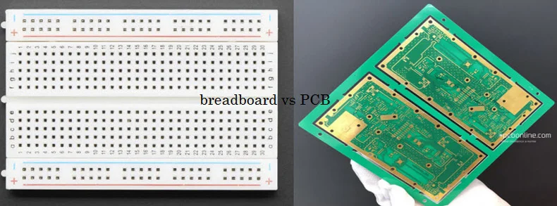
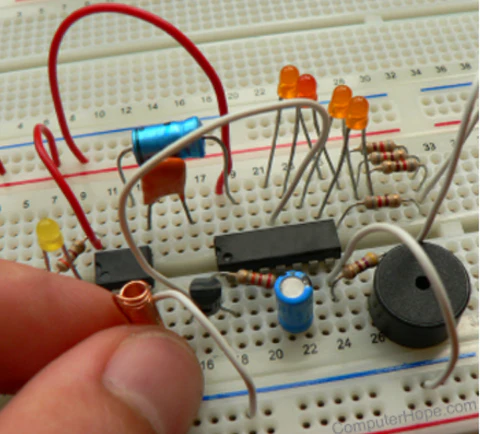

## Breadboard

A breadboard is a prototyping tool used in electronics to quickly assemble and test circuits without the need for soldering. Here is a more detailed explanation of its components and functionality:

### Layout
A breadboard consists of a plastic board with a grid of holes. The holes are arranged in rows and columns, with each row typically having five holes. Underneath the holes are metal spring contacts that connect components placed into the holes. The spring contacts are arranged in a specific pattern to facilitate easy connections.

### Connectivity
Components are connected by inserting their metal leads into the holes, allowing them to make contact with the metal springs below. The spring contacts are designed to grip the component leads firmly, ensuring a secure connection. Rows of interconnected pins on the sides of the breadboard provide power and ground connections, making it easy to supply power to the circuit.

### Advantages
Breadboards are ideal for rapid prototyping, allowing quick circuit modifications and testing. They are versatile and accommodate through-hole components with a 0.1" spacing. Components can be easily inserted and removed without the need for soldering, making them suitable for educational purposes and hobbyist projects.

## Printed Circuit Board (PCB)

A Printed Circuit Board (PCB) is a more permanent solution for circuit construction. Here is a detailed overview of its components, fabrication process, and advantages:

### Layout
A PCB consists of an insulating material, typically made of fiberglass or epoxy resin, with a layer of copper foil laminated to it. The copper is etched to create conducting lines called tracks or circuits. These tracks connect the various components on the board, providing electrical pathways for signals and power.

### Etching Process
The etching process involves removing excess copper from the board to isolate the desired copper pattern. Various methods are used to etch the copper, including:

1. **Immersion Etching**: The board is immersed in a chemical solution that dissolves the unprotected copper.
2. **Bubble Etching**: The board is placed in a chemical solution, and air bubbles are used to agitate the solution, accelerating the etching process.
3. **Spray Etching**: The board is placed in a machine that sprays a chemical solution onto the surface, removing the unprotected copper.

### Fabrication
PCBs go through several phases from prototyping to the finished product. The design is printed onto glossy paper and transferred to the board using an iron. This mask protects areas from the etching solution that removes excess copper. After etching, the board is drilled to create holes for component leads and plated with a protective layer, such as solder mask and silkscreen.

### Testing
Bare board PCB testing is crucial to detect post-fabrication issues. It involves running tests like the flying probe test or fixture test to ensure the PCB's schematic correctness before assembly. These tests check for shorts, opens, and other defects in the copper tracks.

### Advantages
PCBs offer a more permanent and reliable solution compared to breadboards. They are essential for mass production and provide a structured layout for components. PCBs also offer better electrical performance, as the copper tracks have lower resistance and inductance compared to jumper wires used in breadboards. Additionally, PCBs are more compact and durable, making them suitable for commercial and industrial applications.
