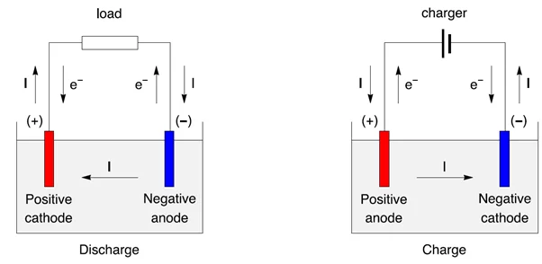
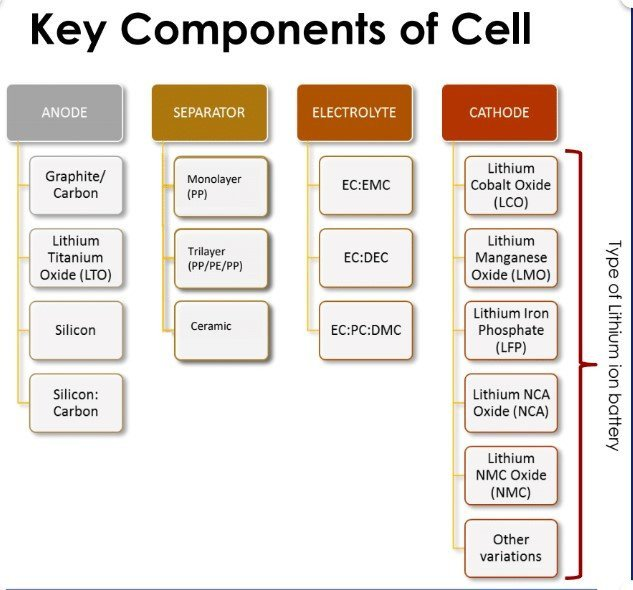
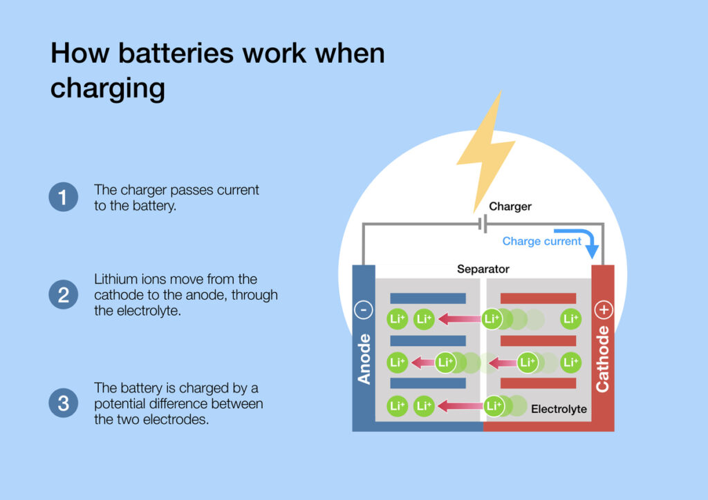
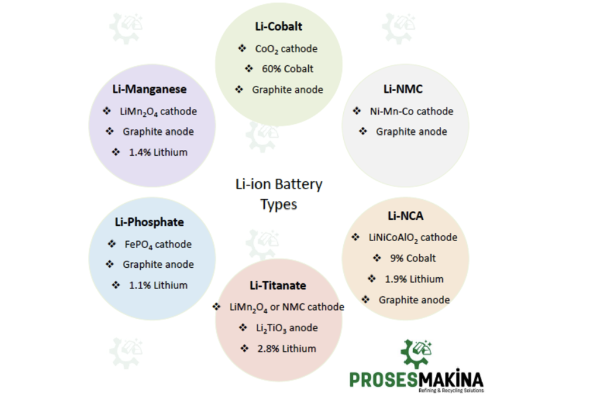

To explain a battery and its components in detail, we need to understand the roles of the cathode and anode within a battery, as well as the different types of batteries available.

## Intuition

Think of a battery as a tiny powerhouse that stores and releases energy when needed. It's like a compact reservoir of electricity. Now, within this powerhouse, you have two main parts: the cathode and the anode.

Let's start with the cathode. Think of the cathode as the giver in a relationship. It's where all the action happens. When the battery is in use, the cathode is the source of electrons, which are the tiny charged particles that flow through circuits to create electricity. So, the cathode is like the positive hub where all the electrons originate.

On the other hand, the anode is like the receiver. It's where all those electrons want to go. When the battery is connected to a circuit, electrons flow from the cathode, through the circuit, and end up at the anode. This movement of electrons is what creates the electric current that powers your devices. So, the anode acts as the negative terminal, attracting the electrons flowing from the cathode.

Together, the cathode and anode create the potential difference, or voltage, that drives the flow of electrons through the circuit. It's like a push-pull relationship, with the cathode pushing electrons out and the anode pulling them in. And that's how these two essential components work together to make a battery function!

### Battery Components:
1. **Anode**: 
   - An anode is where oxidation occurs, leading to the release of electrons. It is the electrode where current enters the battery.
   - In a galvanic cell, the anode is negative, while in an electrolytic cell, it is positive.
   - Anodes can be plates or wires with excess positive charge.

2. **Cathode**:
   - A cathode is where reduction occurs, accepting electrons. It is the electrode where current exits the battery.
   - In a galvanic cell, the cathode is positive, while in an electrolytic cell, it is negative.
   - Cathodes can be either hot (heated to emit electrons) or cold (not heated).

3. **Electrolyte**:
   - The electrolyte allows the movement of ions between the cathode and anode, crucial for the battery's function.
   - It ensures that only ions move through it, while electrons flow through the external circuit.

### Types of Batteries:
1. **Lithium-Ion Batteries**:
   - Consist of cathode, anode, electrolyte, and separator.
   - Cathode materials like lithium oxide determine battery capacity and voltage.
   - Common cathode materials include lithium cobalt oxide, lithium nickel manganese cobalt oxide, and lithium iron phosphate.

2. **Lithium Titanate (LTO)**:
   - Cathode can be lithium manganese oxide or NMC; anode is Li2TiO3.
   - Known for long life, fast charge, and safety features.

3. **Lithium Nickel Manganese Cobalt Oxide (NMC)**:
   - Cathode is LiNiMnCoO2, and anode is graphite.
   - Offers high capacity and power, suitable for various applications.

4. **Lithium Nickel Cobalt Aluminum Oxide (NCA)**:
   - Cathode is LiNiCoAlO2, and anode is graphite.
   - Used in applications like medical devices, industrial, and electric powertrains.

### Battery Operation:
- Electrons flow from the anode to the cathode through the external circuit, creating an electric current.
- The movement of ions through the electrolyte allows for the chemical reactions necessary for the battery to function.
- Different battery types have varying characteristics in terms of voltage, specific energy, charge/discharge rates, cycle life, thermal stability, and cost.

Understanding the roles of the cathode, anode, and electrolyte in a battery, along with the various types of batteries available, provides insight into how these components work together to store and release energy efficiently.

References:
[1] https://www.biologic.net/topics/anode-cathode-positive-and-negative-battery-basics/

[2] https://byjus.com/chemistry/cathode-and-anode/

[3] https://www.samsungsdi.com/column/technology/detail/55272.html?brdCode=001&idx=55272&listType=list&pageIndex=1

[4] https://batteryuniversity.com/article/bu-205-types-of-lithium-ion

[5] https://chem.libretexts.org/Bookshelves/Analytical_Chemistry/Supplemental_Modules_%28Analytical_Chemistry%29/Electrochemistry/Exemplars/Case_Study:_Battery_Types