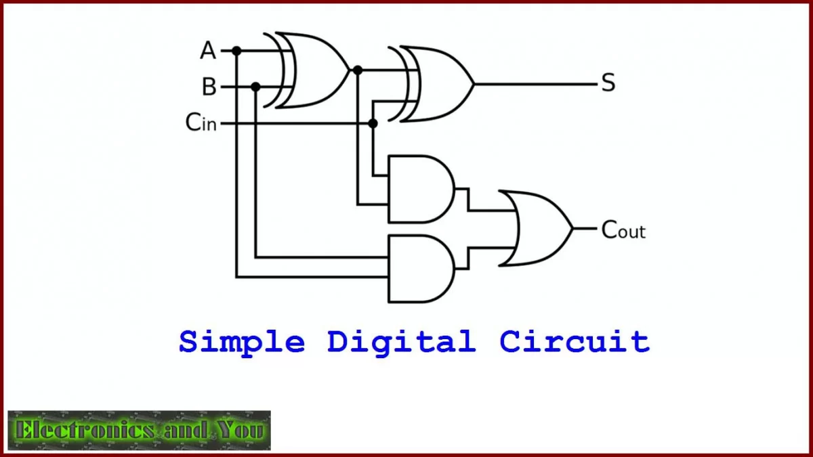
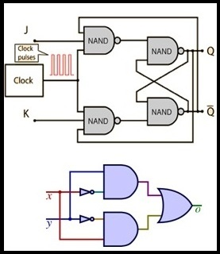

### Intuitive Explanation of Logic Gates

Imagine you have a bunch of switches that can either be on or off. Now, let's say you want to perform some kind of decision-making based on the states of these switches. Logic gates are like these decision-making switches in the digital world. They take in inputs, process them according to certain rules, and produce outputs based on those rules.

### Importance of Logic Gates

Logic gates are the fundamental building blocks of digital circuits. They form the basis of complex digital systems, such as computers, calculators, smartphones, and much more. Understanding how logic gates work is crucial for designing and analyzing digital circuits.

### Types of Logic Gates

There are several types of logic gates, each with its own unique behavior and function. The basic logic gates are:

1. AND gate
2. OR gate
3. NOT gate
4. NAND gate
5. NOR gate
6. XOR gate
7. XNOR gate

Each of these gates performs a specific logical operation on one or more binary inputs and produces a single binary output.

### Logic Gate Behavior

Before delving into the detailed explanation of each logic gate, let's understand the basic behavior of logic gates.

1. **Input**: Logic gates take one or more binary inputs (0 or 1).
2. **Processing**: Each logic gate performs a specific logical operation on its inputs.
3. **Output**: After processing the inputs, the logic gate produces a single binary output based on its internal logic.

Now, let's explore each logic gate in detail, along with its combinatorial logic and practical applications.

### 1. AND Gate

**Intuitive Explanation**: Think of the AND gate as a gate that only opens when all the input switches are on. If any of the input switches is off, the gate remains closed, and the output is off. Only when all input switches are on does the gate open, and the output turns on.

**Combinatorial Logic**:

| Input A | Input B | Output |
| ------- | ------- | ------ |
|   0     |   0     |   0    |
|   0     |   1     |   0    |
|   1     |   0     |   0    |
|   1     |   1     |   1    |

**Practical Applications**: AND gates are used in various applications such as:

- Digital signal processing
- Microprocessor control unit
- Arithmetic and logic units (ALUs)
- Multiplexers

**Implementation**: AND gates can be implemented using transistors. For example, a simple implementation involves connecting multiple transistors in series. When all input signals are high, the output is also high.

### 2. OR Gate

**Intuitive Explanation**: Unlike the AND gate, the OR gate opens if any of the input switches are on. It's like a gate that says, "if at least one of you is on, I'll let the output be on."

**Combinatorial Logic**:

| Input A | Input B | Output |
| ------- | ------- | ------ |
|   0     |   0     |   0    |
|   0     |   1     |   1    |
|   1     |   0     |   1    |
|   1     |   1     |   1    |

**Practical Applications**: OR gates find applications in:

- Digital calculators
- Logic synthesis
- Memory systems
- Data processing circuits

**Implementation**: Similar to AND gates, OR gates can be implemented using transistors. By connecting transistors in parallel, the output is high if any input signal is high.

### 3. NOT Gate

**Intuitive Explanation**: The NOT gate is like a switch in reverse. If you give it an on signal, it turns off, and if you give it an off signal, it turns on. It's essentially an inverter.

**Combinatorial Logic**:

| Input | Output |
| ----- | ------ |
|   0   |   1    |
|   1   |   0    |

**Practical Applications**: NOT gates are used in:

- Memory circuits
- Clocking systems
- Control systems
- Inverting buffers

**Implementation**: NOT gates can be implemented using a single transistor. When the input is high, the transistor conducts, pulling the output low, and vice versa.

### 4. NAND Gate

**Intuitive Explanation**: NAND gate stands for NOT-AND. It's like an AND gate followed by a NOT gate. So, it's only off when all inputs are on, and on otherwise.

**Combinatorial Logic**:

| Input A | Input B | Output |
| ------- | ------- | ------ |
|   0     |   0     |   1    |
|   0     |   1     |   1    |
|   1     |   0     |   1    |
|   1     |   1     |   0    |

**Practical Applications**: NAND gates are extensively used in:

- Memory circuits
- Flip-flops
- Counters
- Multiplexers

**Implementation**: NAND gates can be implemented using a combination of AND and NOT gates. Alternatively, they can be directly implemented using transistors arranged in a specific configuration.

### 5. NOR Gate

**Intuitive Explanation**: NOR gate stands for NOT-OR. It's like an OR gate followed by a NOT gate. So, it's only on when all inputs are off, and off otherwise.

**Combinatorial Logic**:

| Input A | Input B | Output |
| ------- | ------- | ------ |
|   0     |   0     |   1    |
|   0     |   1     |   0    |
|   1     |   0     |   0    |
|   1     |   1     |   0    |

**Practical Applications**: NOR gates are used in:

- Address decoding
- Control circuits
- Multiplexers
- Arithmetic circuits

**Implementation**: NOR gates can be implemented using a combination of OR and NOT gates or directly using transistors arranged in a specific configuration.

### 6. XOR Gate

**Intuitive Explanation**: XOR gate stands for Exclusive OR. It's like a gate that tells you if the number of inputs that are on is odd. So, it's on if the inputs are different from each other.

**Combinatorial Logic**:

| Input A | Input B | Output |
| ------- | ------- | ------ |
|   0     |   0     |   0    |
|   0     |   1     |   1    |
|   1     |   0     |   1    |
|   1     |   1     |   0    |

**Practical Applications**: XOR gates are used in:

- Data encryption
- Error detection and correction
- Comparators
- Adders

**Implementation**: XOR gates can be implemented using a combination of AND, OR, and NOT gates or directly using transistors arranged in a specific configuration.

### 

7. XNOR Gate

**Intuitive Explanation**: XNOR gate stands for Exclusive NOR. It's like a gate that tells you if the number of inputs that are on is even. So, it's on if the inputs are the same as each other.

**Combinatorial Logic**:

| Input A | Input B | Output |
| ------- | ------- | ------ |
|   0     |   0     |   1    |
|   0     |   1     |   0    |
|   1     |   0     |   0    |
|   1     |   1     |   1    |

**Practical Applications**: XNOR gates are used in:

- Data transmission systems
- Clocking circuits
- Comparator circuits
- Parity generators

**Implementation**: XNOR gates can be implemented using a combination of XOR and NOT gates or directly using transistors arranged in a specific configuration.

## References

[1] https://www.tutorialspoint.com/digital_circuits/digital_circuits_logic_gates.htm

[2] https://www.allaboutcircuits.com/textbook/digital/

[3] https://www.electronicsforu.com/technology-trends/learn-electronics/digital-circuit-design-types-applications-examples

[4] https://www.circuit-diagram.org

[5] https://circuitverse.org