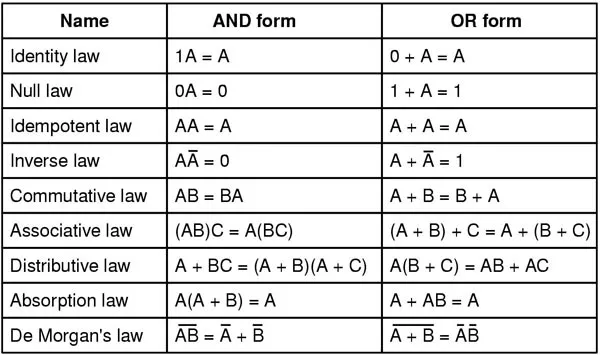

Boolean algebra is a branch of mathematics that deals with logical operations on binary variables that can have only two possible values: 0 (false) or 1 (true). It is used extensively in digital electronics and computer science to simplify and analyze digital circuits and logic gates.

## Intuitive Explanation

Imagine you have two toy boxes, one for your cars and one for your dolls. Boolean algebra is like playing with these boxes but instead of toys, we use special items called "true" and "false".

Let's say we have two buttons: Button A and Button B. Each button can be pressed or not pressed, like an on/off switch. When both buttons are pressed, we get a special toy from the toy box. This toy is called "true". When neither button is pressed, we don't get any toy, so we call that "false". 

Now, let's make a game. We want a toy if either Button A or Button B is pressed. So, if we press Button A, we get a toy, that's "true". If we press Button B, we also get a toy, which is "true" again. But what if we press both buttons? In our game, we still get only one toy, so it's still "true".

Boolean algebra helps us figure out what happens when we press these buttons in different combinations. We can make rules to say if we press this button and that button, what do we get? It's like solving a puzzle to know when we get a toy and when we don't!

The three main operations in Boolean algebra are:

1. **AND (conjunction)**: The AND operation is denoted by the symbol "·" or simply by juxtaposition. The result is 1 if both operands are 1, otherwise it is 0.

   Example: A · B = 1 if A = 1 and B = 1, otherwise A · B = 0

2. **OR (disjunction)**: The OR operation is denoted by the symbol "+". The result is 1 if either or both operands are 1, otherwise it is 0.

   Example: A + B = 1 if A = 1 or B = 1 or both, otherwise A + B = 0

3. **NOT (negation)**: The NOT operation is denoted by a bar over the variable or by the symbol "'". It reverses the logic value of the operand.

   Example: $$\overline{A}$$ = 1 if A = 0, otherwise $$\overline{A}$$ = 0

Some important laws and identities of Boolean algebra are:

- Commutative law: A + B = B + A, A · B = B · A
- Associative law: (A + B) + C = A + (B + C), (A · B) · C = A · (B · C)
- Distributive law: A · (B + C) = (A · B) + (A · C)
- Identity laws: A + 0 = A, A · 1 = A
- Complement laws: A + $$\overline{A}$$ = 1, A · $$\overline{A}$$ = 0
- Idempotent laws: A + A = A, A · A = A

Boolean algebra is useful in simplifying complex Boolean expressions and optimizing digital circuits. For example, consider the expression:

(A + B) · (A + $$\overline{B}$$) = A + (B · $$\overline{B}$$) = A + 0 = A

Here, we used the distributive law, complement law, and identity law to simplify the expression to A.

Some real-world applications of Boolean algebra include:

1. **Digital electronics**: Designing and analyzing logic gates and circuits in computers, calculators, and other digital devices.

2. **Computer programming**: Implementing conditional statements, logical operations, and bitwise operations in programming languages.

3. **Switching theory**: Analyzing and designing switching circuits and networks.

4. **Data processing**: Performing logical operations on data, such as filtering, sorting, and searching.

5. **Information retrieval**: Constructing Boolean queries for searching databases and the internet.

References:

[1] https://www.cuemath.com/data/boolean-algebra/

[2] https://byjus.com/maths/boolean-algebra-questions/

[3] https://byjus.com/maths/boolean-algebra/

[4] https://testbook.com/maths/boolean-algebra

[5] https://www.electronics-lab.com/article/boolean-algebra-examples/