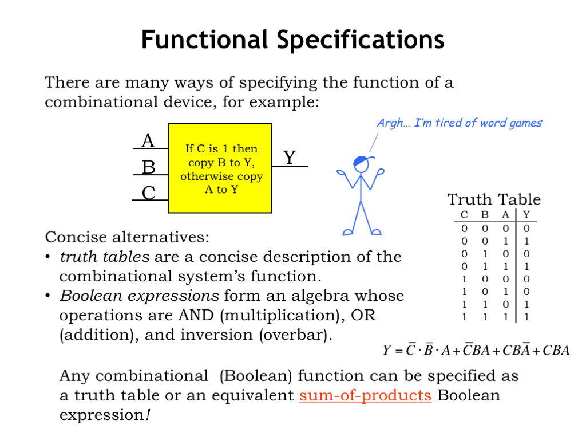

## Intuitive Explanation

Let's start with a simple idea. Imagine you have a machine that takes in some switches as input and produces a light as output. These switches can either be on (1) or off (0). Now, you want to decide when the light should turn on based on the positions of these switches. 

Here's where combinational logic design comes in. It's like figuring out a recipe for the machine to follow: if you flip this switch and that switch, then the light turns on. But if you flip only that switch, the light stays off.

Mathematically, we represent these switches and the light using variables and equations. Let's say we have two switches, A and B, and a light, L. We can represent their states like this:

- A = 0 or 1 (off or on)
- B = 0 or 1 (off or on)
- L = 0 or 1 (light off or on)

Now, we want to figure out when the light turns on based on the switches. We can write this as an equation, like a recipe:

- If A is on (1) AND B is on (1), then L is on (1).
- If A is off (0) OR B is off (0), then L is off (0).

This is like saying, "If both switches are on, turn on the light. Otherwise, keep the light off."

In combinational logic design, we use logical operations like AND, OR, and NOT to create these recipes. AND means both conditions must be true for the output to be true, OR means at least one condition must be true for the output to be true, and NOT reverses the input.

So, we can represent our recipe mathematically like this:

- L = A AND B

This equation says the light is on (1) only when both switches, A and B, are on (1).

Combinational logic design helps us build these recipes for machines to follow, allowing us to control outputs based on inputs using logical operations and equations.

Truth tables are used to tabulate all possible combinations of inputs and their corresponding outputs for a given Boolean function. This table helps us understand how the function behaves for different input scenarios.

Karnaugh maps provide a graphical method to simplify Boolean functions by grouping 1's in the truth table. By identifying patterns and grouping adjacent 1's, we can simplify the expression and reduce the number of terms.

The Quine-McCluskey algorithm is a tabular method used to simplify Boolean functions further by finding prime implicants. It systematically combines minterms to identify essential prime implicants, resulting in a simplified expression.

Some common combinational logic circuits include:

- Adders and subtractors: These circuits perform binary addition and subtraction. Examples include half adders, full adders, and parallel adders.
- Multiplexers: These circuits route one of many input signals to a single output based on selection inputs. They act like a switchboard, directing the desired input to the output.
- Decoders: Decoders convert coded inputs into coded outputs. For example, 7-segment display decoders translate binary inputs into signals that light up specific segments of a display.
- Encoders: Encoders perform the reverse operation of decoders, converting coded inputs into coded outputs. They compress information by encoding multiple input signals into a smaller set of output signals.

References:

[1] https://www.geeksforgeeks.org/analysis-and-design-of-combinational-and-sequential-circuits/

[2] https://en.wikipedia.org/wiki/Combinational_logic

[3] https://www.allaboutcircuits.com/textbook/digital/chpt-9/combinational-logic-functions/

[4] https://www.tutorialspoint.com/computer_logical_organization/combinational_circuits.htm

[5] https://study.com/academy/lesson/basic-combinational-circuits-types-examples.html