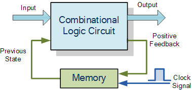
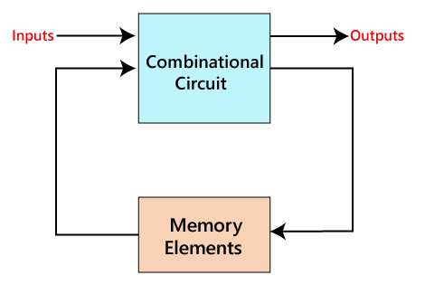
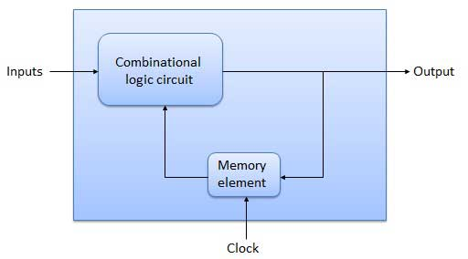
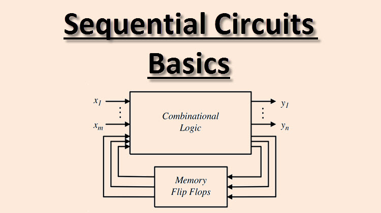
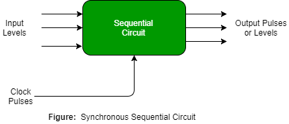

Sequential logic design involves creating digital circuits where the output depends not only on the present input but also on the previous state stored in memory elements. Unlike combinational circuits that produce outputs solely based on current inputs, sequential circuits incorporate memory elements to store past information, influencing their current output. 

## Intuitive Explanation

Imagine you have a special toy robot that can remember things. This robot has buttons you can press, and each time you press a button, it remembers it. So, if you press a button, the robot knows you pressed it, and it can do something based on that.

Now, think of each button press as an input, and the robot's action as an output. In combinational logic (which we discussed earlier), pressing a button would directly trigger an action. But in sequential logic, it's a bit different.

In sequential logic, the robot doesn't just react to the current button press; it also considers its past actions. It's like the robot has a little memory, remembering not only the latest button press but also what it did before.

Here's how it works:

1. **Memory (Flip-flops)**: Think of the robot's memory as a flip-flop. It's like a switch that can be either on or off. When you press a button, it changes the state of the flip-flop, indicating if the button was pressed or not.

2. **Clock (Timing)**: Now, imagine there's a clock ticking. Each tick of the clock represents a moment in time. The robot only pays attention to the button presses when the clock ticks. So, even if you press a button, the robot won't react until the next tick of the clock.

3. **Processing (Logic)**: When the clock ticks, the robot looks at the current button press and its memory (the flip-flop). Based on this information, it decides what action to take. For example, it might move forward if the last button press was "go" or stop if it was "halt."

4. **State Machine (Behavior)**: The robot's behavior forms a sequence of actions based on its current state (the flip-flop) and the input (button press). It transitions between different states depending on what happens at each clock tick and the current state it's in. This sequence of actions is what we call a state machine.

So, in sequential logic design, we're not only thinking about what happens with each individual input but also how the system evolves over time, based on its current state and past inputs. It's like teaching the robot to remember and learn from its experiences to make decisions.

The key components and concepts in sequential logic design include:

1. **Memory Elements**: Sequential circuits utilize memory elements like flip-flops to store binary information, defining the circuit's state at a given time.

2. **Types of Sequential Circuits**:
   - *Asynchronous Sequential Circuits*: These circuits operate without a clock signal, using input pulses for state changes. They are faster but more challenging to design and can have uncertain outputs.
   - *Synchronous Sequential Circuits*: These circuits rely on clock signals for synchronization, ensuring outputs change only at specific clock edges. They are commonly used in digital systems and offer more predictable behavior.

3. **Clock Signal and Triggering**:
   - *Clock Signal*: A periodic signal used to synchronize the circuit's operations. It can have different ON and OFF times, represented as a square wave.
   - *Triggering*: Refers to how the circuit responds to the clock signal.
     - *Level Triggering*: Activates the circuit when the clock pulse reaches a specific level (positive or negative).
     - *Edge Triggering*: Activates the circuit based on transitions in the clock signal (positive or negative).

4. **Design Process**:
   - Sequential logic circuits are built using bistable devices like flip-flops, latches, and counters, which are constructed from standard logic gates.
   - These circuits can be simple edge-triggered flip-flops or more complex designs like storage registers, shift registers, memory units, or counters.

Sequential logic circuits are crucial in implementing state machines, timers, counters, and memory elements in digital systems. They provide the ability to retain and utilize past information, enabling complex functionalities beyond what combinational circuits can achieve.

References:

[1] https://www.renesas.com/us/en/support/engineer-school/digital-circuits-03-sequential-logic

[2] https://www.geeksforgeeks.org/introduction-of-sequential-circuits/

[3] https://www.elprocus.com/different-types-of-sequential-circuits/

[4] https://www.electronics-tutorials.ws/sequential/seq_1.html

[5] https://www.javatpoint.com/sequential-circuits-in-digital-electronics