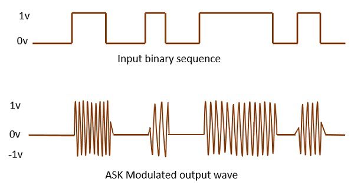
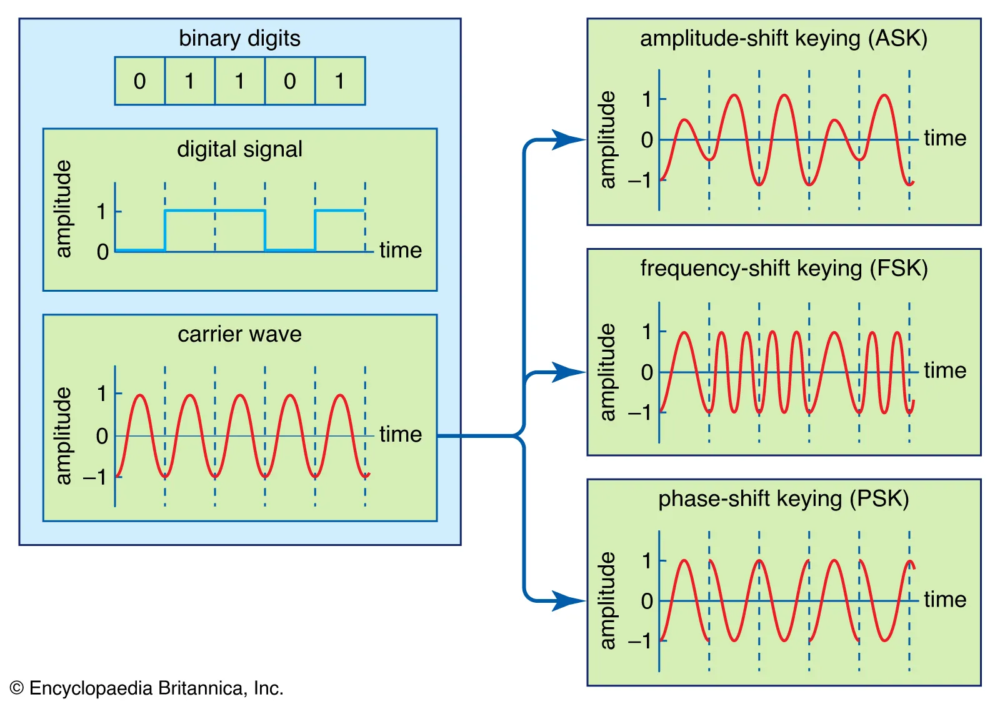
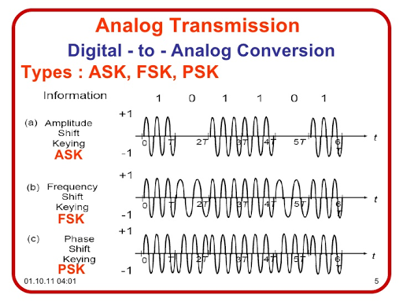
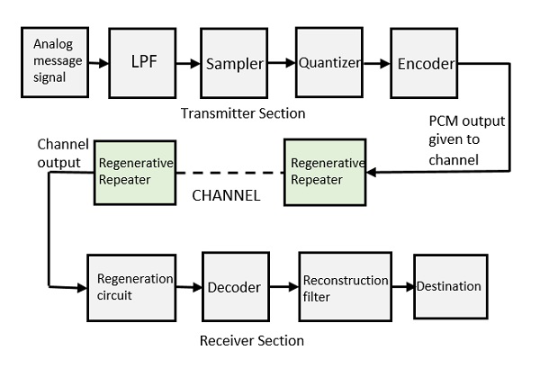

## Digital Modulation Techniques

Digital modulation techniques are fundamental in modern communication systems for transmitting digital data over analog channels. They involve encoding digital data into analog signals for efficient transmission and reception. Here, we will delve into various digital modulation techniques, providing detailed explanations and intuitive insights for a comprehensive understanding.

### 1. Amplitude Shift Keying (ASK)
Amplitude Shift Keying modulates digital data by varying the amplitude of a carrier signal. In ASK, different amplitudes represent different symbols. Mathematically, ASK can be represented as:

$$ s(t) = A_c \cdot m(t) \cdot \cos(2\pi f_c t) $$

where:
- $s(t)$ is the modulated signal,
- $A_c$ is the carrier amplitude,
- $m(t)$ is the binary message signal,
- $f_c$ is the carrier frequency.

### 2. Frequency Shift Keying (FSK)
Frequency Shift Keying changes the frequency of the carrier signal to encode digital data. It uses different frequencies to represent different symbols. The mathematical expression for FSK is:

$$ s(t) = A_c \cdot \cos(2\pi f_c t + 2\pi \Delta f \int_{0}^{t} m(\tau) d\tau) $$

where:
- $\Delta f$ is the frequency deviation.

### 3. Phase Shift Keying (PSK)
Phase Shift Keying alters the phase of the carrier signal to convey digital information. Different phase shifts correspond to different symbols. The mathematical representation of PSK is:

$$ s(t) = A_c \cdot \cos(2\pi f_c t + \theta) $$

where:
- $\theta$ is the phase shift.

### Additional Modulation Techniques

#### 4. Quadrature Amplitude Modulation (QAM)
Quadrature Amplitude Modulation combines ASK and PSK to transmit data efficiently. It uses both amplitude and phase variations to encode multiple bits per symbol.

#### 5. Differential Phase Shift Keying (DPSK)
Differential Phase Shift Keying is a variant of PSK where the phase changes are relative to the previous symbol, simplifying demodulation.

#### 6. Orthogonal Frequency Division Multiplexing (OFDM)
Orthogonal Frequency Division Multiplexing divides the data stream into multiple parallel substreams, each modulated using different frequencies. OFDM is robust against frequency-selective fading.

By understanding these modulation techniques, one can appreciate how digital data is efficiently transmitted over communication channels, enabling seamless connectivity in our modern world.

References:

[1] https://github.com/topics/modulation-techniques

[2] https://digitalcommons.unl.edu/cgi/viewcontent.cgi?article=1128&context=elecengtheses

[3] https://github.com/satellite-image-deep-learning/techniques/blob/master/README.md

[4] https://www.modwiggler.com/forum/viewtopic.php?t=43964

[5] https://www.thinksrs.com/downloads/pdfs/manuals/DS345m.pdf