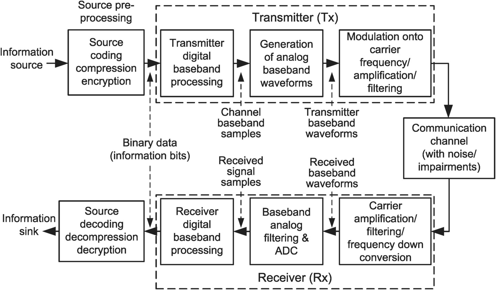
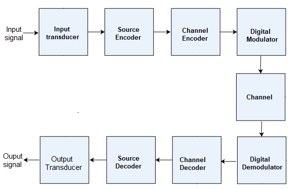

Digital communication systems are integral in modern-day information exchange, facilitating the transfer of data or information using digital signals over point-to-point channels. These systems consist of various components that work together to ensure efficient communication between sender and receiver. Here is a detailed breakdown of the key elements of digital communication systems:

### Components of a Digital Communication System:
1. **Source**: The source generates the message, which can be in the form of human voice, data, or images. This message is converted into an electrical waveform.
2. **Input Transducer**: Converts physical inputs (e.g., sound) into electrical signals, often involving analog to digital conversion.
3. **Source Encoder**: Compresses data to minimize the number of bits, enhancing bandwidth utilization by removing redundant bits.
4. **Channel Encoder**: Adds error-correcting codes to the transmitted data to counter noise-induced alterations during transmission.
5. **Digital Modulator**: Modulates the signal onto a carrier for transmission, converting digital signals into analog for channel transmission.
6. **Channel**: The medium through which the analog signal is transmitted from the sender to the receiver.
7. **Digital Demodulator**: At the receiver end, demodulates the received signal back to digital form for further processing.
8. **Channel Decoder**: Detects and corrects errors in the received signal by utilizing redundant bits added during encoding.
9. **Source Decoder**: Reconstructs the original message by digitizing the signal, ensuring minimal loss of information.

### Features of Digital Communication Systems:
- **Instantaneous Communication**: Messages are transmitted instantly, enabling global communication.
- **Verbal Dominance**: Verbal communication takes precedence over non-verbal cues in digital interactions.
- **Limited Information Transmission**: Due to the screen-based nature, limited information is conveyed, potentially leading to misinterpretation.
- **Data Replication and Modification**: Digital data can be easily copied, modified, or reissued.
- **Cost-Effective**: Digital communication is cost-efficient, with many services being free of charge.
- **Storage and Accessibility**: Personal information can be stored on devices, offering convenience but requiring caution.

Digital communication systems have revolutionized the way information is exchanged, offering speed, efficiency, and accessibility in a variety of communication contexts.

References:

[1] https://www.uotechnology.edu.iq/dep-eee/lectures/4th/Electrical/Communication%20engineering%202/part1.pdf

[2] https://www.tutorialspoint.com/digital_communication/digital_communication_quick_guide.htm

[3] https://www.egr.msu.edu/~tongli/teaching/ece865/Introduction

[4] https://www.epitech-it.es/digital-communication-what-is-it/

[5] https://www.javatpoint.com/digital-communication