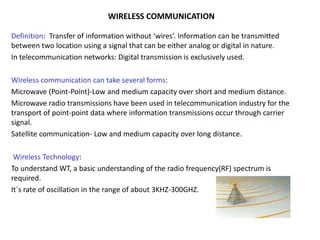
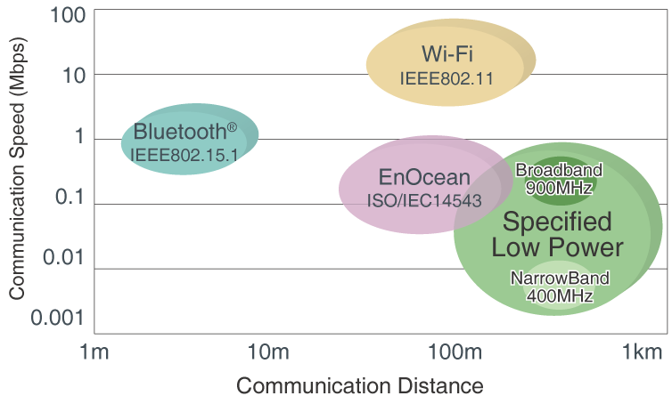
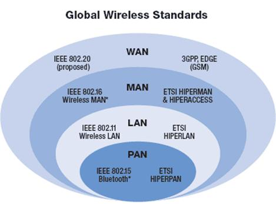
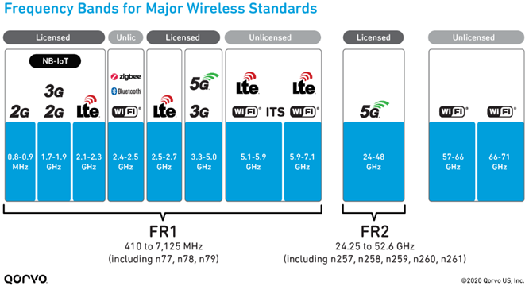
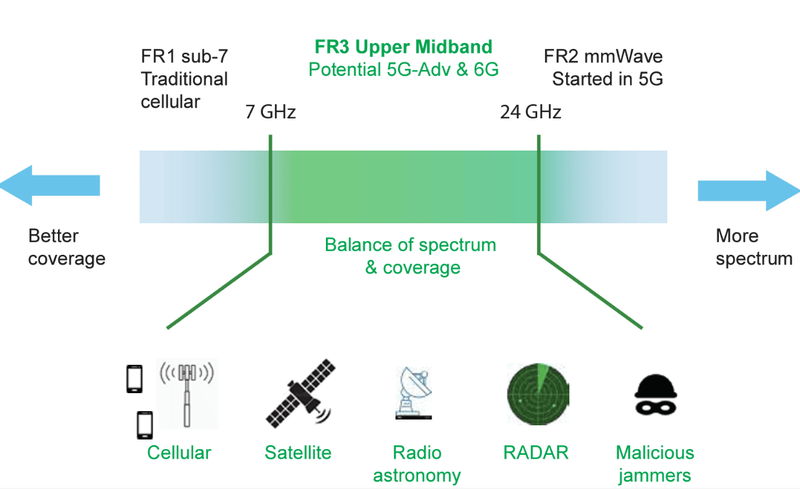
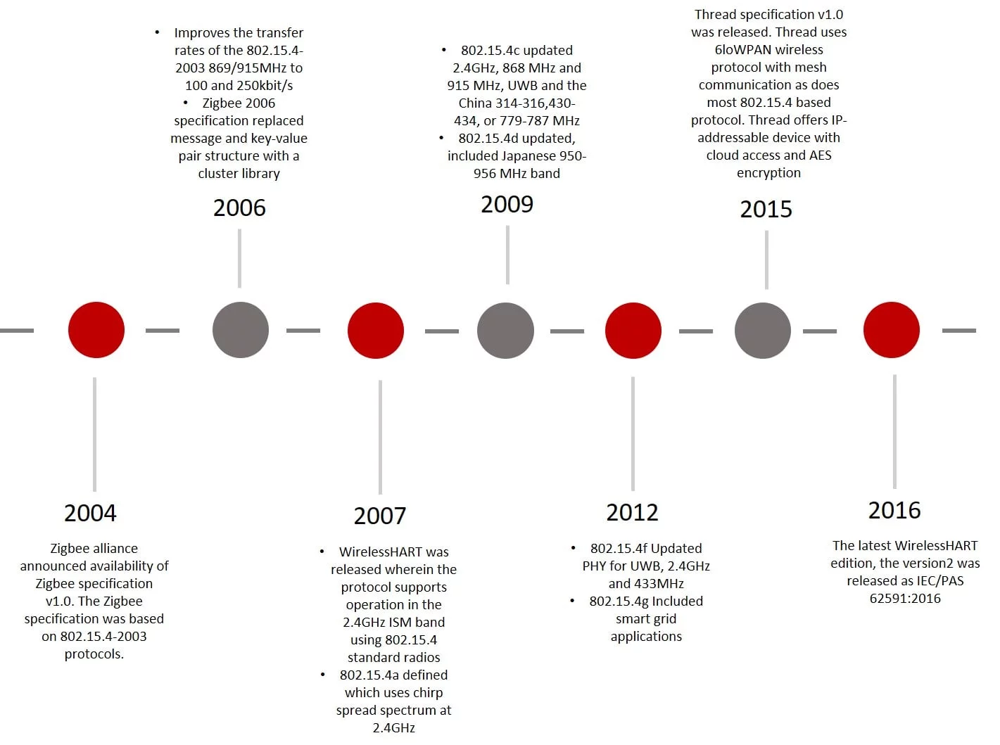
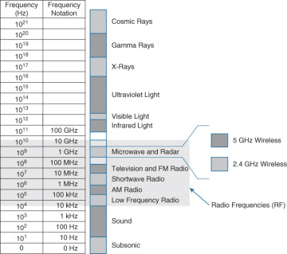

Wireless communication standards are protocols and guidelines that define the specifications for wireless communication systems. These standards ensure interoperability between different devices and networks, enabling seamless communication. 

### Bluetooth
- Bluetooth is a short-range wireless technology standard used for connecting devices like headphones, keyboards, and mice to computers and smartphones[1].
- The IEEE 802.15.1 standard defines the Bluetooth protocol, which includes different sub-standards for various applications.

### Wi-Fi (IEEE 802.11)
- Wi-Fi is a longer-range wireless technology standard used for connecting devices to the internet and local networks.
- The IEEE 802.11 standard defines the Wi-Fi protocol, which includes several sub-standards like 802.11a, 802.11b, 802.11g, 802.11n, 802.11ac, and 802.11ax.
- These sub-standards differ in terms of frequency bands, data rates, and other technical specifications.

### Cellular Standards
- Cellular technologies like LTE and 5G are used for connecting devices to the internet over a cellular network.
- The IEEE 802.16 standard defines the cellular protocols, including LTE (802.16e) and 5G (802.16n).

### Zigbee (IEEE 802.15.4)
- Zigbee is a wireless personal area network (WPAN) standard based on the IEEE 802.15.4 protocol, designed for low-power, low-cost wireless sensor networks.

## Network Types

### Wireless Wide Area Network (WWAN)
- WWANs are designed for citywide, national, or global coverage areas and seamless mobility between access points (base stations).
- Examples include cellular networks (LTE, 5G), GPRS, EDGE, and CDMA2000.

### Wireless Metropolitan Area Network (MAN)
- MANs are designed to provide wireless connectivity over a metropolitan area, typically covering a city or a large campus.
- An example is WiMAX, which is based on the IEEE 802.16 standard.

### Wireless Local Area Network (WLAN)
- WLANs are used to provide wireless access to local networks and the internet, typically within a range of 150 feet.
- The most common WLAN standard is Wi-Fi, based on the IEEE 802.11 protocol

### Wireless Personal Area Network (WPAN)
- WPANs are intended for short-range communication between devices, typically controlled by a single person.
- Examples include Bluetooth, Zigbee, and Wireless USB.

## Cellular Ones

## 1G (First Generation) Standards:
- **AMPS (Advanced Mobile Phone System)**: Introduced in 1983, AMPS was the first analog cellular network standard used in North America.

## 2G (Second Generation) Standards:
- **GSM (Global System for Mobile Communications)**: Introduced in 1991, GSM is a digital cellular network standard widely used worldwide. It operates in the 900MHz and 1800MHz frequency bands.
- **CDMA (Code Division Multiple Access)**: Introduced in 1995, CDMA is a digital cellular network standard used in North America and parts of Asia.

## 2.5G Standards:
- **GPRS (General Packet Radio Service)**: Introduced in 2001, GPRS is a packet-switched data service that enables higher data rates on GSM networks.
- **EDGE (Enhanced Data rates for GSM Evolution)**: Introduced in 2003, EDGE is an enhancement to GPRS that provides higher data rates and improved spectral efficiency.

## 3G (Third Generation) Standards:
- **UMTS (Universal Mobile Telecommunications System)**: Introduced in 2001, UMTS is a 3G standard based on CDMA that provides higher data rates and improved performance.
- **CDMA2000**: Introduced in 2000, CDMA2000 is a 3G standard based on CDMA that provides higher data rates and improved performance.

## 4G (Fourth Generation) Standards:
- **LTE (Long-Term Evolution)**: Introduced in 2009, LTE is a 4G standard that provides significantly higher data rates, lower latency, and improved spectral efficiency compared to previous generations.
- **WiMAX (Worldwide Interoperability for Microwave Access)**: Introduced in 2006, WiMAX is a 4G standard that provides wireless broadband access over long distances.

## 5G (Fifth Generation) Standards:
- **5G NR (New Radio)**: Introduced in 2019, 5G NR is the global standard for 5G networks that provides ultra-high data rates, low latency, and support for a large number of connected devices.

## More 

### Starlink Ka and Ku Bands
- **Ka-Band**: Starlink operates in the Ka-band frequency range for its satellite communication services, offering high-speed internet access globally.
- **Ku-Band**: Starlink also utilizes the Ku-band frequency for its downlink signals, providing broadband internet services and enabling signal identification and synchronization for positioning, navigation, and timing applications.

### ORAN (Open Radio Access Network)
- ORAN is an initiative that promotes open and interoperable standards for radio access networks, aiming to enhance flexibility, innovation, and cost-effectiveness in the deployment of 5G networks.

### LoWPAN (Low-Power Wireless Personal Area Network)
- LoWPAN is a type of wireless network designed for low-power, short-range communication between devices, often used in IoT applications for sensor networks and smart devices.

### LoRa (Long Range)
- LoRa is a wireless communication technology known for its long-range capabilities and low power consumption, making it suitable for IoT applications that require long-distance connectivity.

### NB-IoT (Narrowband Internet of Things)
- NB-IoT is a low-power wide-area network (LPWAN) radio technology standard developed to enable a wide range of IoT devices and services to be connected using cellular networks.

### LTE-M (Long-Term Evolution for Machines)
- LTE-M, also known as LTE-MTC (Machine Type Communications), is a low-power wide-area (LPWA) technology that enables low-cost, low-power IoT applications to be deployed using LTE networks.

### Thread
- Thread is an IPv6-based low-power mesh networking protocol designed for IoT applications, providing secure and reliable communication between devices.

### Z-Wave
- Z-Wave is a wireless communication protocol designed for home automation, allowing devices like lighting, appliances, HVAC systems, and security systems to communicate with each other.

### ANT/ANT+
- ANT is a proprietary wireless sensor network protocol used for low-power applications, particularly in fitness and wellness devices, such as heart rate monitors and sports watches.

### Sigfox
- Sigfox is a low-power wide-area network (LPWAN) technology that enables low-bandwidth communication for IoT devices, focusing on long-range, low-power, and low-cost applications.

References:

[1] https://www.slideshare.net/slideshow/introduction-to-wireless-communication/28178271

[2] https://www.gplisana.edu.in/downloads/files/n5d81c1acb96e3.pdf

[3] https://www.sciencedirect.com/topics/engineering/wireless-communication

[4] https://www.tutorialspoint.com/wireless_communication/wireless_communication_overview.htm

[5] https://www.techopedia.com/definition/10062/wireless-communications

[6] https://www.networkingsignal.com/what-are-wireless-communication-standards-and-different-types-of-ieee/

[7] https://www.slideshare.net/slideshow/introduction-to-wireless-communication/28178271

[8] https://en.wikipedia.org/wiki/Comparison_of_wireless_data_standards

[9] https://en.wikipedia.org/wiki/Starlink