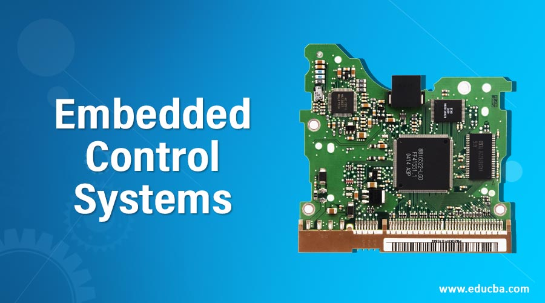
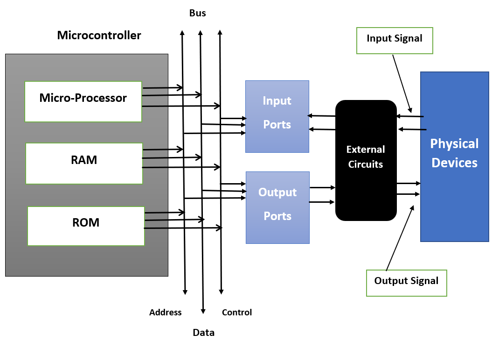
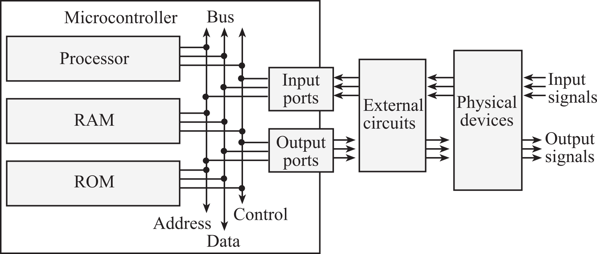
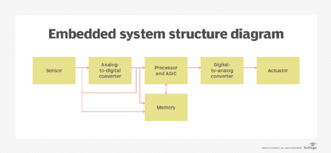

Embedded systems are a crucial component in various control applications, combining hardware and software to perform specific tasks that are not handled by the CPU. These systems are designed to operate efficiently and innovatively, making them ideal for applications that require high-speed control, custom algorithms, and high-level signal processing.

### When to Use Embedded Systems
Embedded systems are a clear choice for applications that demand high-speed control, custom-made algorithms, and high-level signal processing. They offer flexibility, as they can be used for a range of different kinds of applications, reducing the time and cost of redesigning systems repeatedly or relying on custom designs.

### Examples of Embedded Systems
Embedded controllers can perform a variety of tasks, including:

- Sending and receiving processing signals from the keyboard and touchpad
- Turning the CPU on and off
- Resetting the LAN and GPU
- eSATA, 3G, and 4G toggling
- Bridging between BIOS chips and platform hubs
- Muting audio
- Enabling chargers
- Controlling A20 line access

These controllers can easily be adapted to meet the needs of the host application and the operating conditions of the device.

### Overview of Embedded Control
Embedded control systems involve a microprocessor being used as the controller and located as an integral element, i.e., embedded, within a larger system. These systems are used in a wide range of technologies across various industries, including automobiles, mobile phones, industrial machines, and medical equipment.

References:
[1] https://www.delkin.com/blog/understanding-controls-applications-embedded-systems/

[2] https://idsc.ethz.ch/education/lectures/embedded-control-systems.html

[3] https://www.sciencedirect.com/topics/computer-science/embedded-control

[4] https://www.techtarget.com/iotagenda/definition/embedded-system

[5] https://web.eecs.umich.edu/~jfr/embeddedctrls/files/embedded_controls_intro_W09.pdf