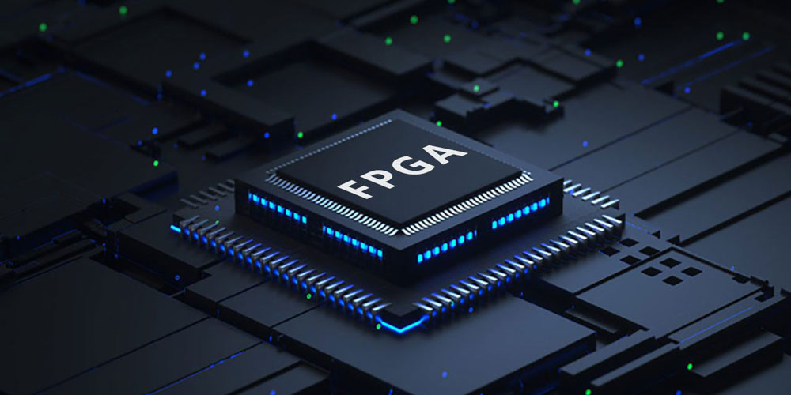
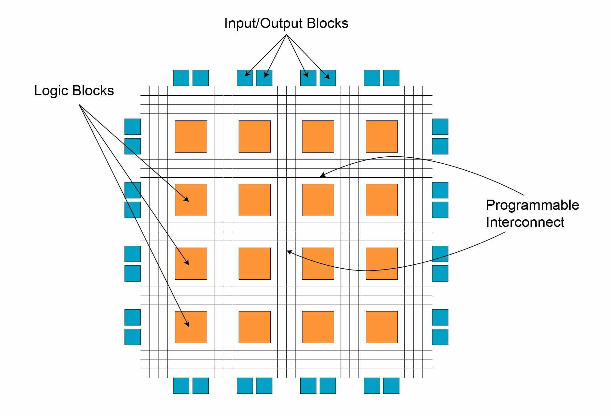
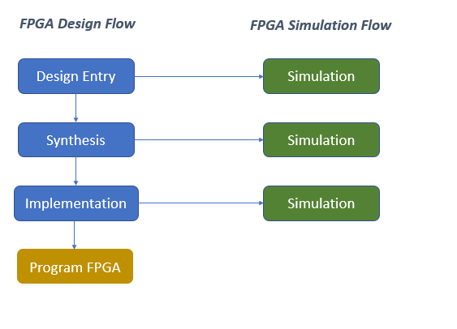
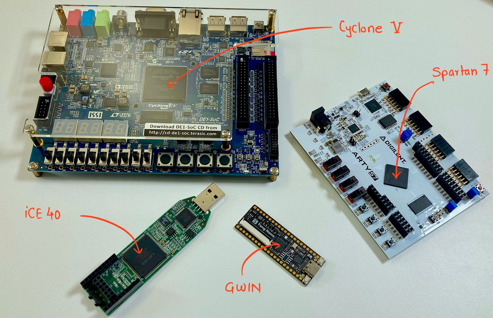
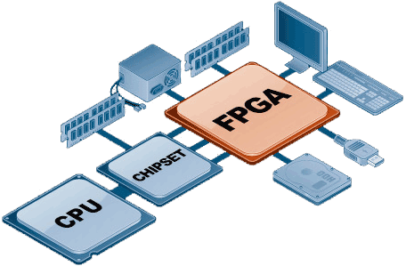

## FPGA Design and Implementation



### Introduction to FPGAs
FPGAs (Field-Programmable Gate Arrays) are semiconductor devices that can be programmed to perform specific digital functions. Unlike application-specific integrated circuits (ASICs), which are designed for a specific purpose, FPGAs can be reprogrammed to implement different digital circuits and systems.




### FPGA Design Flow




The typical FPGA design flow consists of the following key steps:

1. **Design Entry**: The design is entered using a hardware description language (HDL) like VHDL or Verilog, or a schematic capture tool.

2. **Synthesis**: The HDL code is synthesized into a netlist of logic gates and other FPGA-specific primitives.

3. **Placement and Routing**: The synthesized netlist is placed onto the physical FPGA resources (logic blocks, I/O pins, etc.) and the connections between them are routed.

4. **Timing Analysis**: The design is analyzed to ensure it meets the required timing constraints.

5. **Bitstream Generation**: The placed and routed design is converted into a bitstream file that can be used to program the FPGA.

6. **FPGA Programming**: The bitstream file is loaded into the FPGA, configuring it to implement the desired digital circuit.




### FPGA Programming
FPGA programming involves converting the design into a bitstream file that can be loaded into the FPGA. This is typically done using vendor-specific software tools, such as Xilinx Vivado or Intel Quartus Prime.

The programming process involves the following steps:

1. **Hardware Architecture Design**: Defining the hardware architecture, including the use of dedicated FPGA resources like DSP blocks, memory, and I/O.

2. **Design**: Creating the HDL code (VHDL or Verilog) to implement the desired functionality.

3. **Verification**: Simulating and verifying the design to ensure it works as expected.

4. **Synthesis**: Translating the HDL code into a netlist of FPGA-specific primitives.

5. **Implementation**: Placing the synthesized design onto the FPGA resources and routing the connections between them.

6. **Bitstream Generation**: Generating the bitstream file that can be used to program the FPGA.

7. **FPGA Programming**: Loading the bitstream file into the FPGA to configure it with the desired digital circuit.




### Advanced FPGA Design Techniques
More advanced FPGA design techniques include:

1. **Partial Reconfiguration**: Allowing specific parts of the FPGA to be reconfigured without affecting the rest of the design.

2. **Hardware-Software Co-Design**: Integrating a processor (e.g., a microcontroller) with the FPGA logic to create a system-on-chip (SoC) solution.

3. **High-Level Synthesis**: Using tools like Xilinx Vivado HLS or Intel High-Level Synthesis Compiler to automatically generate HDL code from high-level programming languages like C/C++.

4. **FPGA-Based Acceleration**: Implementing computationally intensive algorithms in FPGA logic to achieve significant performance improvements over software-based solutions.

5. **FPGA-Based Emulation**: Using FPGAs to emulate complex systems, such as ASICs or entire systems-on-chip, for pre-silicon verification and validation.

Programming an FPGA involves several steps, including design entry, synthesis, implementation, and verification. Here's a general overview of the process:

### Design Entry
The first step in programming an FPGA is to enter the design into a design software tool. This can be done using a hardware description language (HDL) like VHDL or Verilog, or a schematic capture tool.

### Synthesis
The HDL code is then synthesized into a netlist of logic gates and other FPGA-specific primitives. This step transforms the HDL code into a digital logic circuit that can be implemented on the FPGA

### Implementation
The synthesized netlist is then placed onto the physical FPGA resources (logic blocks, I/O pins, etc.) and the connections between them are routed. This step determines which physical resources on the FPGA to program with which logic, and how to connect (route) them

### Verification
The design is verified to ensure it works as intended before FPGA programming. This can be done using simulation tools or by testing the design on the FPGA itself

### FPGA Programming
The final step is to generate a bitstream file that can be loaded into the FPGA, configuring it to implement the desired digital circuit

Here are some coding examples to program FPGAs to mimic some functionalities:

### Example 1: Blinking LED
This example uses VHDL to program an FPGA to blink an LED:
```vhdl
library IEEE;
use IEEE.STD_LOGIC;
use IEEE.NUMERIC_STD.ALL;

entity blink_led is
    Port ( clk : in  STD_LOGIC;
           led : out  STD_LOGIC);
end blink_led;

architecture Behavioral of blink_led is
    signal counter : unsigned(24 downto 0) := (others => '0');
begin
    process(clk)
    begin
        if rising_edge(clk) then
            counter <= counter + 1;
            if counter = 25000000 then
                led <= not led;
                counter <= (others => '0');
            end if;
        end if;
    end process;
end Behavioral;
```
This code defines a digital circuit that blinks an LED connected to the FPGA. The `counter` signal is used to generate a clock signal that toggles the LED every 25000000 clock cycles

### Example 2: Simple Adder
This example uses Verilog to program an FPGA to implement a simple adder:
```verilog
module adder(
    input  wire [3:0] a,
    input  wire [3:0] b,
    output wire [4:0] sum
);

assign sum = a + b;

endmodule
```
This code defines a digital circuit that adds two 4-bit numbers `a` and `b` and produces a 5-bit result `sum`

### Example 3: Finite State Machine
This example uses VHDL to program an FPGA to implement a finite state machine:
```vhdl
library IEEE;
use IEEE.STD_LOGIC;
use IEEE.NUMERIC_STD.ALL;

entity fsm is
    Port ( clk : in  STD_LOGIC;
           reset : in  STD_LOGIC;
           input : in  STD_LOGIC;
           output : out  STD_LOGIC);
end fsm;

architecture Behavioral of fsm is
    type state_type is (s0, s1, s2);
    signal current_state : state_type := s0;
begin
    process(clk, reset)
    begin
        if reset = '1' then
            current_state <= s0;
        elsif rising_edge(clk) then
            case current_state is
                when s0 =>
                    if input = '1' then
                        current_state <= s1;
                    end if;
                when s1 =>
                    if input = '0' then
                        current_state <= s2;
                    end if;
                when s2 =>
                    if input = '1' then
                        current_state <= s0;
                    end if;
            end case;
        end if;
    end process;

    output <= '1' when current_state = s2 else '0';
end Behavioral;
```
This code defines a digital circuit that implements a finite state machine with three states `s0`, `s1`, and `s2`. The `output` signal is set to '1' when the machine is in state `s2`

These are just a few examples of how to program FPGAs to mimic some functionalities. The specific coding examples will vary depending on the desired functionality and the FPGA device being used.

## References:

[1] https://fpgatek.com/implementation-steps-with-fpga/

[2] https://digitalsystemdesign.in/fpga-implementation-step-by-step/

[3] https://in.mathworks.com/discovery/fpga-programming.html

[4] https://fpgatutorial.com/introduction-to-fpga-development/

[5] https://www.researchgate.net/publication/268424617_Design_and_Implementation_of_FPGA-Based_Systems_-A_Review

[6] https://in.mathworks.com/discovery/fpga-programming.html

[7] https://digitalsystemdesign.in/fpga-implementation-step-by-step/

[8] https://fpgatutorial.com/introduction-to-fpga-development/

[9] https://docs.arduino.cc/built-in-examples

[10] https://fpgatek.com/implementation-steps-with-fpga/