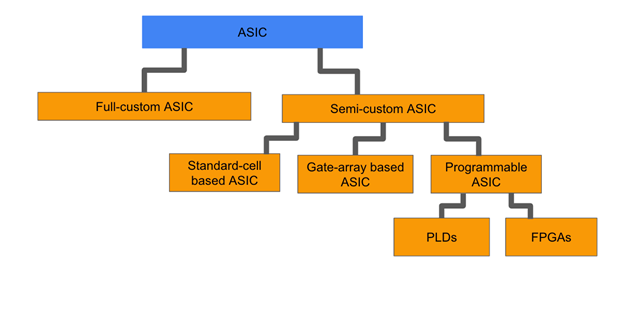
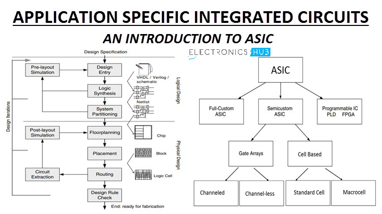
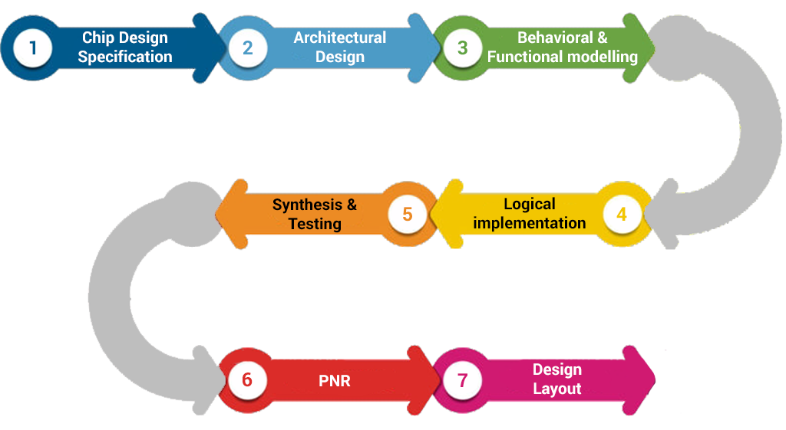
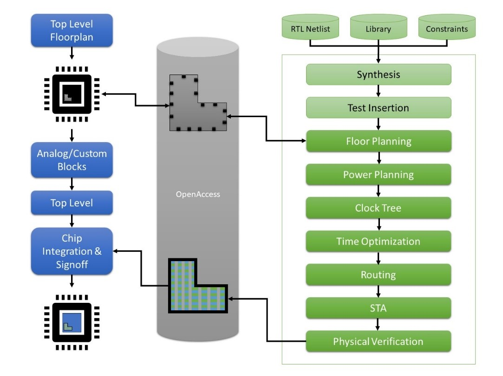

## ASIC Design: A Comprehensive Overview



ASIC (Application Specific Integrated Circuit) design is a specialized field in electronics engineering that involves creating custom semiconductor devices tailored for specific applications. This process is crucial for developing high-performance, low-power, and compact electronic systems. To become proficient in ASIC design, one needs to understand the design flow, programming languages, and key concepts involved in this domain.



### Design Flow and Methodologies
The ASIC design flow encompasses several stages, starting from chip specification to final verification and fabrication. Key steps include design entry, functional verification, RTL synthesis, partitioning, floor planning, placement, routing, clock tree synthesis, and final verification using tools like HDL Coder and HDL Verifier. Each stage is critical in ensuring the functionality, performance, and power efficiency of the ASIC design.



### ASIC Design Programming Language
VHDL (VHSIC Hardware Description Language) is the most common language used for designing ASICs. VHDL allows engineers to describe the behavior and structure of the hardware, facilitating the creation of complex digital systems. Additionally, tools like MATLAB and Simulink are employed for algorithm development and simulation in ASIC designs. These high-level languages enable efficient modeling, optimization, and implementation of ASIC algorithms.




### Programming Samples and Examples
In ASIC design, programming samples typically involve creating hardware descriptions, optimizing algorithms, and generating HDL code for synthesis. Engineers use VHDL constructs to define logic, data paths, and control structures in ASIC designs. For instance, a simple VHDL code snippet for an adder circuit could be:

```vhdl
entity adder is
  port (a, b: in std_logic_vector(3 downto 0);
        sum: out std_logic_vector(3 downto 0));
end adder;

architecture Behavioral of adder is
begin
  sum <= a + b;
end Behavioral;
```

This code snippet illustrates a basic adder circuit in VHDL, showcasing how logic operations are described in hardware description languages for ASIC designs.

## Key components of ASIC Design

1. **Design Flow and Methodologies**:
   - The ASIC design flow encompasses several stages, including design entry, functional verification, RTL synthesis, partitioning, floor planning, placement, routing, clock tree synthesis, and final verification.
   - Each stage is critical in ensuring the functionality, performance, and power efficiency of the ASIC design.

2. **ASIC Design Programming Languages**:
   - VHDL (VHSIC Hardware Description Language) is the most common language used for designing ASICs.
   - VHDL allows engineers to describe the behavior and structure of the hardware, facilitating the creation of complex digital systems.
   - Tools like MATLAB and Simulink are also employed for algorithm development and simulation in ASIC designs.

3. **ASIC Design Types**:
   - Full-Custom ASIC: Includes some or all logic cells, circuits, or layout specifically designed for one ASIC.
   - Semi-Custom ASIC: Uses predefined, diffused layers, transistors, and other active devices to minimize up-front design work and costs.
   - Programmable ASIC: Can be programmed to meet a variety of use case requirements after manufacturing.

4. **ASIC Design Considerations**:
   - Power dissipation: Includes leakage current, crowbar current, and current associated with charging and discharging of capacitances.
   - Partitioning: Weighing off-the-shelf part capabilities against ASIC capabilities, considering the ASIC's higher up-front costs.
   - Standard Cells: Offer more function per die area and often more speed than gate array implementations.
   - Gate Arrays: Require customizing only the layers of a wafer devoted to interconnect, allowing for more consistency and reliability.

5. **ASIC Design Tools and Resources**:
   - CAD tools for translating high-level descriptions into specific functions like registers, microcontrollers, ALU, and control units.
   - Arm Flexible Access for no-cost or low-cost access to proven IP, tools, and training.
   - Arm Approved Design Partners for design service companies to help turn ideas into working silicon.

References:

[1] https://www.reddit.com/r/BitcoinBeginners/comments/2chakt/asic_programming/?rdt=35564

[2] https://www.tce.edu/sites/default/files/PDF/14EC770-ASIC-DESIGN-K-Kalyani.pdf

[3] https://www.geeksforgeeks.org/asic-full-form/

[4] https://in.mathworks.com/discovery/asic-design.html

[5] https://www.bharathuniv.ac.in/colleges1/downloads/courseware_ece/notes/BEC015%20%20-ASIC%20design.pdf

[6] https://www.system-to-asic.com/blog/what-is-asic-design/

[7] https://www.arm.com/glossary/asic