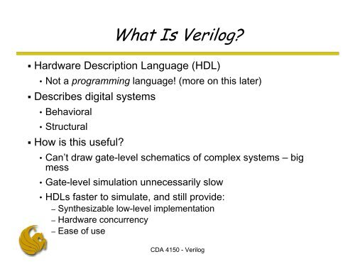

Hardware Description Languages (HDLs) are specialized programming languages used to describe the structure, behavior, and timing of electronic circuits, particularly digital logic circuits. HDLs are used to design, verify, and synthesize digital systems, from simple flip-flop memory units to complex communications protocols.

**History of HDLs**

The concept of HDLs dates back to the 1950s, but their widespread adoption began in the 1980s with the introduction of Verilog and VHDL. These languages were developed to describe digital circuits, aiming to create high-performance digital circuits for military applications.


**Purpose of HDLs**

HDLs serve several purposes:

1. **Design**: HDLs provide a way to design digital circuits that meet specific requirements.
2. **Simulation**: HDLs allow designers to test and verify digital circuits before they are built.
3. **Verification**: HDLs enable designers to verify the functionality of digital circuits by testing them against different inputs and ensuring that the circuit functionality is correct.
4. **Synthesis**: HDLs can be used to synthesize digital circuits automatically from HDL code.
5. **Timing Analysis**: HDLs provide designers with a way to analyze the timing behavior of digital circuits and ensure that they meet timing requirements.
6. **Design Reusability**: HDLs offer a way to design reusable components that can be used for multiple circuit designs, reducing time and effort and improving overall design quality.
7. **Optimization**: HDLs provide a way to optimize the design of digital circuits for performance.

**Popular HDLs**

There are several HDLs available, but the most popular ones are:

1. **Verilog**: Verilog is used to model and stimulate digital circuits, particularly Application-Specific Integrated Circuits (ASICs) and Field-Programmable Gate Arrays (FPGAs). Its syntax includes modules, inputs, outputs, and statements.
2. **VHDL**: VHDL is used to design digital circuits, often for complex systems like microprocessors and digital signal processors. Its syntax includes entities, architectures, and statements
3. **SystemC**: SystemC is a more recent HDL that allows for electronic system-level and transaction modeling

**HDL Syntax**

HDL syntax is similar to traditional programming languages but is specifically designed to describe hardware. HDLs distinguish themselves by representing extensive parallel operations, unlike traditional programming languages that primarily represent serial operations.

**Verilog Example**

Here's an example of Verilog code that describes a simple AND gate:
```verilog
module and_gate(input a, b, output y);
  assign y = a & b;
endmodule
```
**VHDL Example**

Here's an example of VHDL code that describes a simple AND gate:
```vhdl
library ieee;
use ieee.std_logic_1164.all;

entity and_gate is
  port (a, b : in std_logic;
        y : out std_logic);
end and_gate;

architecture behavioral of and_gate is
begin
  y <= a and b;
end behavioral;
```
**SystemC Example**

Here's an example of SystemC code that describes a simple AND gate:
```systemc
#include <systemc.h>

SC_MODULE(and_gate) {
  sc_in<bool> a, b;
  sc_out<bool> y;

  void and_operation() {
    y = a & b;
  }
};
```

In conclusion, HDLs are powerful tools for designing and verifying digital circuits. They offer a range of benefits, including design reusability, optimization, and timing analysis. By understanding the syntax and capabilities of HDLs like Verilog, VHDL, and SystemC, designers can create complex digital systems efficiently and effectively

References:

[1] https://www.geeksforgeeks.org/hardware-description-language/

[2] https://www.mepits.com/tutorial/143/vlsi/hardware-description-language

[3] https://www.slideshare.net/RAIAB2/hdl-hardware-description-language-presentation

[4] https://www.allaboutcircuits.com/technical-articles/what-is-a-hardware-description-language-hdl/

[5] https://courses.cs.washington.edu/courses/cse467/11wi/lectures/CombVerilog.pdf