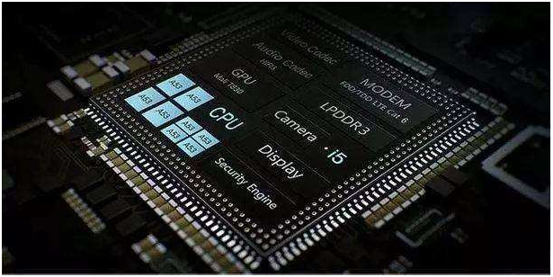
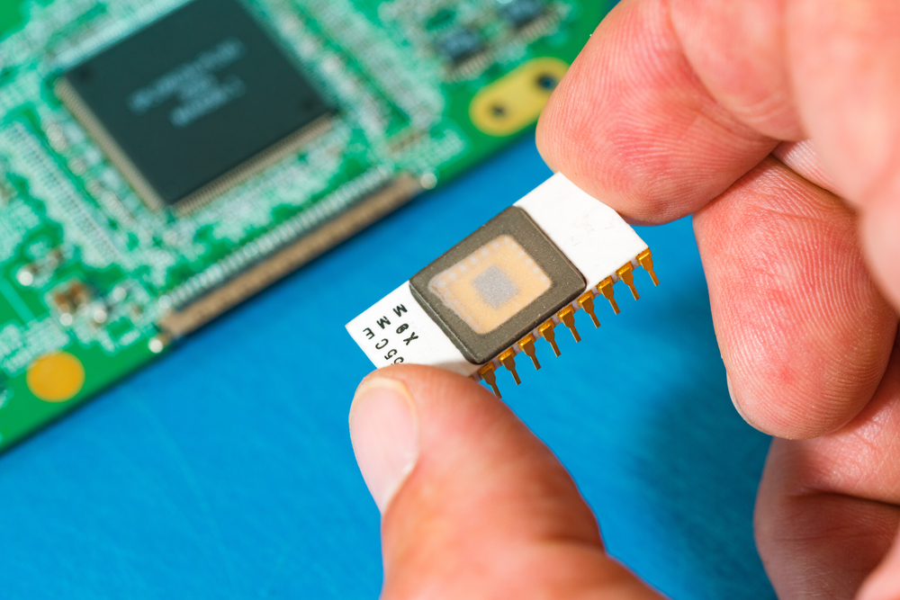
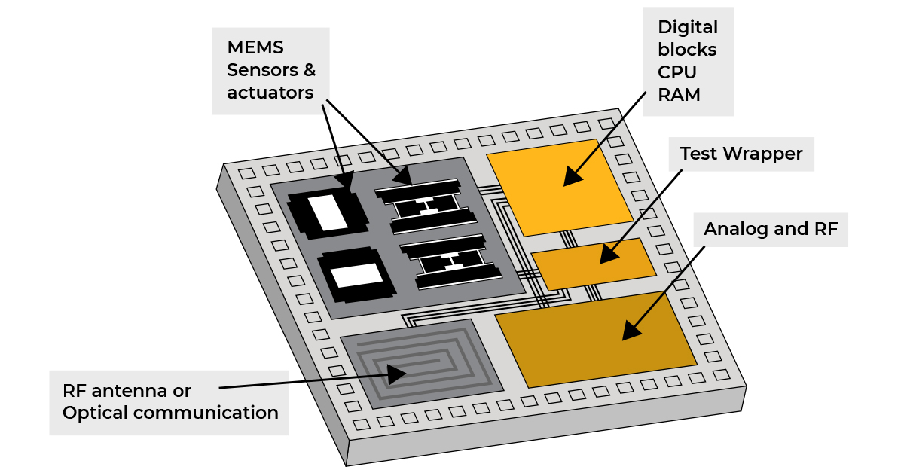
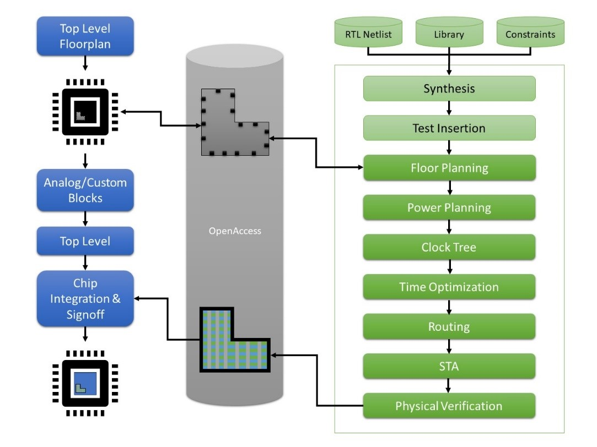

## Intuitive Explanation:
Imagine you're building a small city. In this city, everything you need—houses, shops, roads, parks—is built into one compact area. That's what an SoC is like for electronic devices. It's like a mini city where all the essential components, like the processor (the brain), memory (short-term memory), input/output interfaces (like roads for data to travel), and sometimes even specialized functions like graphics processing or wireless communication, are all packed into one tiny chip.

## Comprehensive Explanation:

1. **Integration**: SoC design integrates multiple electronic components onto a single chip. These components can include a processor, memory, input/output interfaces, and specialized hardware accelerators.

2. **Architecture**: SoC architecture involves designing the layout and connectivity of the various components on the chip to optimize performance, power consumption, and area usage.

3. **Processor Core**: This is the central processing unit (CPU) of the SoC, responsible for executing instructions and performing calculations. It can be a general-purpose CPU or a specialized processor optimized for specific tasks.

4. **Memory**: SoCs contain different types of memory, such as RAM (random access memory) for temporary storage of data and instructions, and ROM (read-only memory) for storing permanent instructions and firmware.

5. **Interconnect**: The interconnect fabric connects different components within the SoC, allowing them to communicate with each other efficiently. It includes buses, switches, and routers.

6. **Peripheral Interfaces**: These interfaces enable the SoC to communicate with external devices, such as sensors, displays, storage devices, and networking components. Examples include USB, HDMI, Ethernet, and SPI.

7. **Power Management**: SoCs incorporate power management techniques to optimize energy usage and extend battery life in portable devices. This involves controlling voltage levels, activating sleep modes, and dynamically adjusting clock frequencies.

8. **Verification and Validation**: Before manufacturing, SoC designs undergo rigorous testing to ensure they meet functional and performance requirements. This involves simulation, emulation, and prototyping.

9. **Manufacturing Process**: SoCs are fabricated using advanced semiconductor manufacturing processes. This involves lithography, etching, doping, and other steps to create intricate patterns of transistors and interconnects on silicon wafers.

10. **Packaging and Testing**: Once fabricated, SoCs are packaged into a protective housing and subjected to further testing to identify and eliminate defects. This includes electrical testing, thermal testing, and reliability testing.

#### Additional

SoC design involves integrating various components, known as IP (Intellectual Property) cores, into a single chip. These IP cores can be obtained from different sources, such as IP vendors, foundries, or designed in-house. The SoC design process includes the following key steps:

1. **System Partitioning**: The overall system is divided into smaller, manageable blocks that can be implemented as IP cores

2. **IP Integration**: The selected IP cores are integrated into the SoC design, considering factors such as compatibility, performance, and power requirements

3. **Interconnect Design**: The communication between different IP cores is facilitated through interconnects, such as buses or networks-on-chip (NoCs)

4. **Software Development**: Embedded software is developed concurrently with the hardware design to ensure seamless integration and functionality

5. **Verification**: The SoC design is thoroughly verified at various stages to ensure correct functionality, performance, and compliance with design specifications

6. **Physical Design**: The SoC layout is created, considering factors such as floorplanning, placement, routing, and power distribution

7. **Manufacturing**: The SoC design is fabricated using advanced semiconductor manufacturing processes, such as CMOS technology

SoC design offers several advantages, including reduced system size, lower power consumption, and improved performance. However, it also presents challenges, such as increased design complexity, IP integration challenges, and the need for advanced verification techniques

In essence, SoC design involves integrating hardware and software components into a single chip, optimizing performance, power consumption, and area usage, and ensuring reliability through rigorous testing and manufacturing processes.

References:

[1] https://www.system-to-asic.com/blog/what-is-asic-design/

[2] https://www.arm.com/glossary/asic

[3] https://www.wevolver.com/article/the-ultimate-guide-to-asic-design-from-concept-to-production

[4] https://www.bharathuniv.ac.in/colleges1/downloads/courseware_ece/notes/BEC015%20%20-ASIC%20design.pdf

[5] https://parts.jpl.nasa.gov/asic/Sect.3.2.html