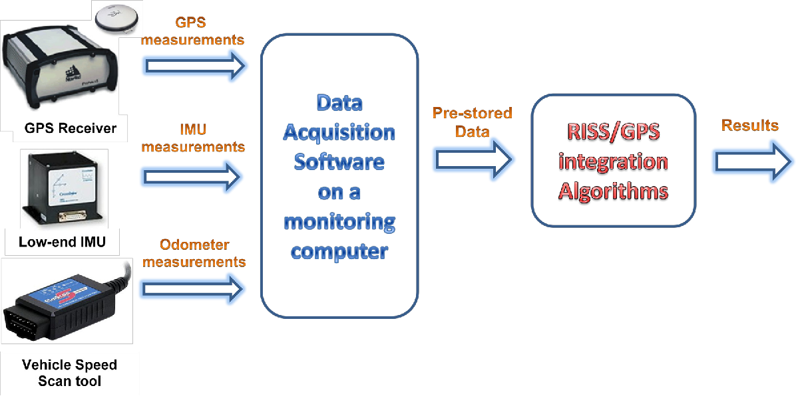
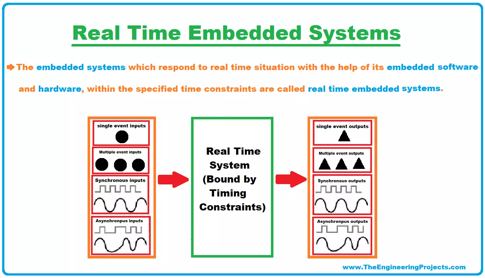

## Intuitive Explanation of Real-Time Embedded Systems

Imagine you have a smart home where various devices, like lights, thermostats, and security cameras, work together seamlessly. When you enter a room, the lights turn on instantly, and the temperature adjusts to your preferred setting. If an intruder tries to break in, the security system immediately sounds an alarm. These devices are examples of real-time embedded systems.

Real-time embedded systems are designed to perform specific tasks quickly and reliably, without any delays. They are like a well-oiled machine, where each part works together to ensure everything runs smoothly and efficiently.

## Comprehensive Explanation of Real-Time Embedded Systems

Real-time embedded systems are specialized computer systems designed to perform specific tasks within strict time constraints. These systems are characterized by their ability to respond to external events or stimuli within a predefined time limit, ensuring that critical tasks are completed on time.

Real-time embedded systems are typically divided into two categories:

1. **Hard real-time systems**: These systems have very strict time constraints, and missing a deadline can lead to catastrophic consequences. Examples include medical devices, aircraft control systems, and nuclear power plant monitoring systems.

2. **Soft real-time systems**: These systems have less stringent time constraints, and missing a deadline may result in degraded performance but not necessarily catastrophic failure. Examples include multimedia applications, online gaming, and some industrial control systems.

The structure of a real-time embedded system typically includes the following components:

- **Sensors**: Devices that convert physical quantities into electrical signals, allowing the system to gather information from the environment.
- **Actuators**: Devices that convert electrical signals into physical actions, enabling the system to interact with and control the environment.
- **Microcontrollers or microprocessors**: The "brain" of the system, responsible for processing data and executing control algorithms.
- **Memory**: Stores the software code and data required for the system to function.
- **Input/Output (I/O) interfaces**: Allow the system to communicate with external devices and sensors.

The design of real-time embedded systems involves several key aspects:

1. **Real-time operating system (RTOS)**: Provides a framework for managing tasks, scheduling, and communication within the system.
2. **Task scheduling**: Ensures that critical tasks are executed within their deadlines, using techniques like rate-monotonic scheduling or earliest-deadline-first scheduling.
3. **Task communication and synchronization**: Enables different tasks to exchange data and coordinate their actions, using mechanisms like shared memory, message passing, or semaphores.
4. **Hardware-software co-design**: Involves optimizing the hardware and software components of the system to meet performance, power, and cost requirements.

Real-time embedded systems are widely used in various industries, including:

- **Automotive**: Engine control, anti-lock braking systems, and airbag deployment.
- **Industrial automation**: Process control, robotics, and condition monitoring.
- **Aerospace and defense**: Flight control systems, missile guidance, and satellite communications.
- **Medical**: Pacemakers, infusion pumps, and patient monitoring systems.
- **Consumer electronics**: Digital cameras, smartphones, and home appliances.

The design of real-time embedded systems requires a deep understanding of hardware, software, and real-time system concepts. It involves trade-offs between performance, power consumption, cost, and reliability, and requires rigorous testing and validation to ensure the system meets its design requirements.

References:

[1] https://www.sam-solutions.com/blog/real-time-embedded-systems/

[2] https://www.geeksforgeeks.org/embedded-real-time-system/

[3] https://www.digi.com/blog/post/examples-of-embedded-systems

[4] https://www.eventhelix.com/embedded/

[5] https://www.slideshare.net/slideshow/realtime-embedded-system-design/257694501