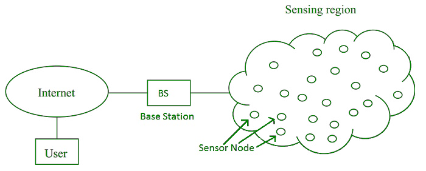
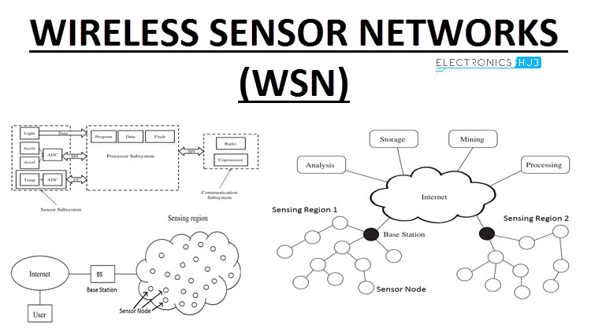
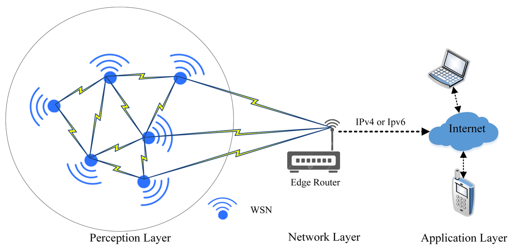

## Introduction to Wireless Sensor Networks

Wireless Sensor Networks (WSNs) are a revolutionary technology that enables the collection and transmission of data from various environments without the need for physical wires[1][2]. These networks consist of a large number of sensor nodes that are strategically placed to monitor and gather information about their surroundings.

Imagine a vast field with thousands of tiny, intelligent devices scattered throughout, each one capable of sensing its environment and communicating with its neighbors. These devices, called sensor nodes, work together to create a network that can detect and report on various phenomena, such as temperature, humidity, or the presence of certain chemicals.

## Components of a Wireless Sensor Network

A typical WSN consists of several key components:

1. **Sensor nodes**: These are the devices responsible for sensing the environment and collecting data. They are equipped with sensors, a microcontroller, a radio transceiver, and a power source.

2. **Radio nodes**: These nodes receive the data collected by the sensor nodes and transmit it to a WLAN access point.

3. **WLAN access point**: This component receives the data from the radio nodes and sends it to a computer or server for further processing.

4. **Evaluation software**: This software analyzes the data received from the WLAN access point and presents it to users in a meaningful way.

## Types of Wireless Sensor Networks

WSNs can be classified based on various factors, such as the environment in which they are deployed, the topology of the network, and the type of sensor nodes used. Some common types include:

1. **Terrestrial WSNs**: These networks are deployed on land and are used for applications such as environmental monitoring and precision agriculture.

2. **Underground WSNs**: These networks are deployed underground and are used for applications such as pipeline monitoring and mine safety.

3. **Underwater WSNs**: These networks are deployed in water and are used for applications such as ocean monitoring and disaster prevention.

4. **Multi-media WSNs**: These networks use sensor nodes capable of capturing audio, video, and images and are used for applications such as surveillance and traffic monitoring.

5. **Mobile WSNs**: These networks consist of sensor nodes that can move around and are used for applications such as animal tracking and disaster response.

## Advantages of Wireless Sensor Networks

WSNs offer several advantages over traditional wired sensor systems:

1. **Low cost**: WSNs consist of small, low-cost sensor nodes that are easy to deploy, making them a cost-effective solution for many applications.

2. **Flexibility**: Wireless communication enables flexible deployment and reconfiguration of the network, allowing it to adapt to changing requirements.

3. **Energy efficiency**: WSNs use low-power devices and protocols to conserve energy, enabling long-term operation without the need for frequent battery replacements.

4. **Real-time monitoring**: WSNs enable real-time monitoring of physical phenomena in the environment, providing timely information for decision making and control.

## Challenges in Wireless Sensor Network Design

While WSNs offer many benefits, they also face several challenges in their design and implementation

1. **Limited range**: The range of wireless communication in WSNs is limited, which can be a challenge for large-scale deployments or in environments with obstacles that obstruct radio signals.

2. **Limited processing power**: WSNs use low-power devices, which may have limited processing power and memory, making it difficult to perform complex computations or support advanced applications.

3. **Data security**: WSNs are vulnerable to security threats, such as eavesdropping, tampering, and denial of service attacks, which can compromise the confidentiality, integrity, and availability of data

4. **Quality of service**: Ensuring that the network can provide reliable and consistent performance in terms of latency, throughput, and reliability is a significant challenge.

5. **Energy efficiency**: Designing energy-efficient protocols and algorithms to maximize the lifetime of the network is a critical aspect of WSN design

## Applications of Wireless Sensor Networks

WSNs have a wide range of applications in various domains, including

1. **Environmental monitoring**: Monitoring air quality, water quality, soil moisture, and other environmental parameters.

2. **Healthcare**: Patient monitoring, drug administration, and elderly care.

3. **Industrial automation**: Condition monitoring, process control, and asset tracking.

4. **Smart cities**: Traffic monitoring, street lighting control, and waste management.

5. **Agriculture**: Precision farming, livestock monitoring, and greenhouse control.

6. **Military**: Battlefield surveillance, target tracking, and intrusion detection.

As technology continues to advance, the potential applications of WSNs will only continue to grow, revolutionizing the way we interact with and monitor our environment.

References:

[1] https://www.tescaglobal.com/blog/what-is-wireless-sensor-network-and-types-of-wsn/

[2] https://www.geeksforgeeks.org/wireless-sensor-network-wsn/

[3] https://www.shiksha.com/online-courses/articles/what-is-a-wireless-sensor-network-wsn-blogId-144627

[4] https://en.wikipedia.org/wiki/System_on_a_chip

[5] https://www.sam-solutions.com/blog/real-time-embedded-systems/