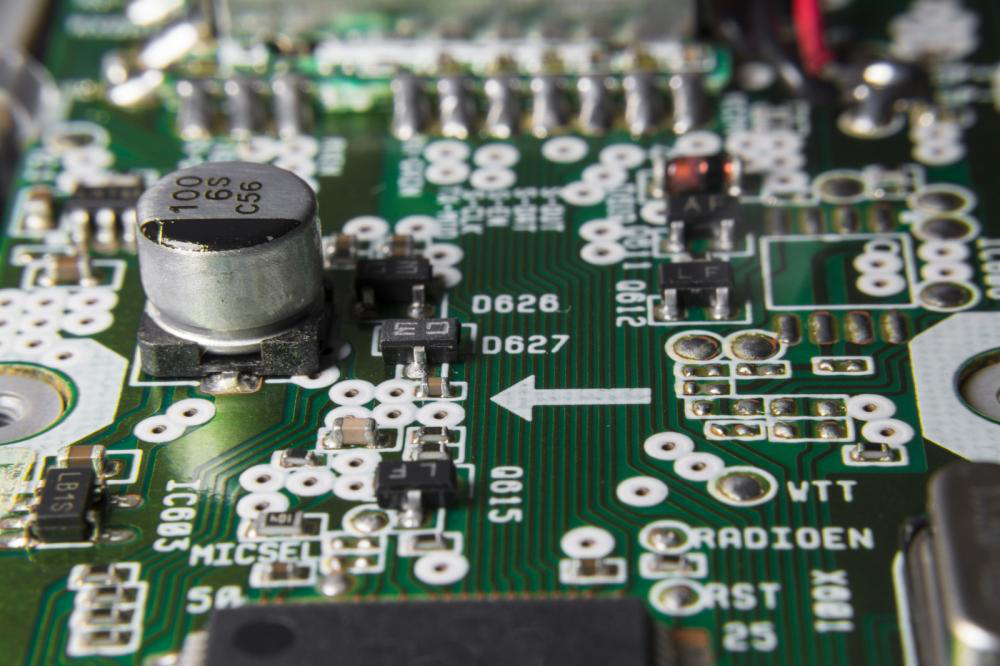
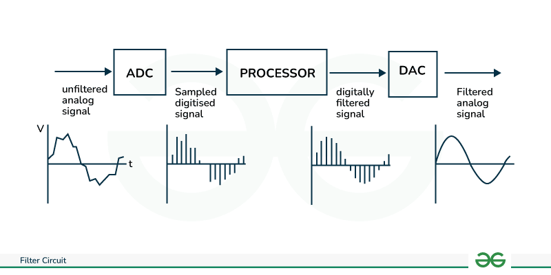
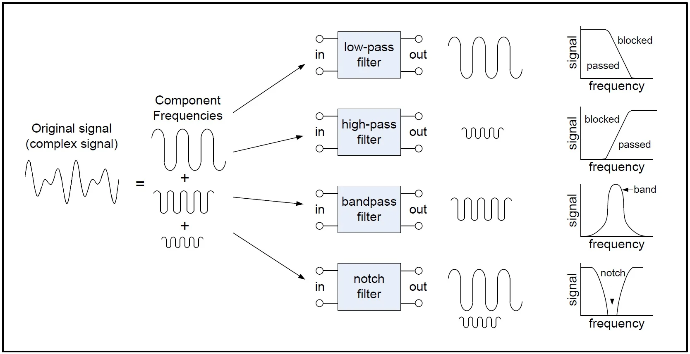
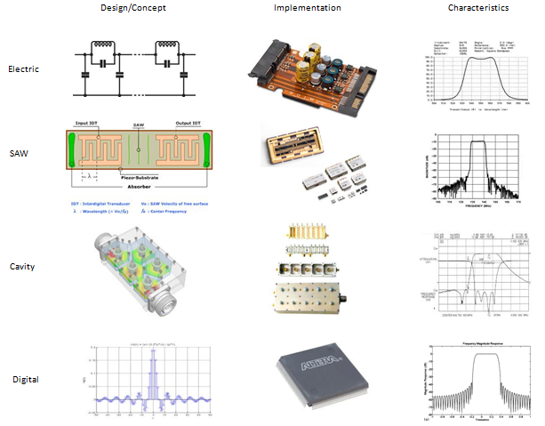

## Introduction to Digital Filters

Digital filters are mathematical algorithms that are used to process and manipulate digital signals, such as audio, video, or sensor data. They are a fundamental component of digital signal processing (DSP) and are widely used in various industries, from audio and video processing to communication systems and control systems

Imagine you have a bucket of water, and you want to remove all the small pebbles and dirt from it. You could use a filter, like a mesh screen, to separate the clean water from the unwanted particles. Digital filters work in a similar way, but instead of physical objects, they operate on digital data, removing unwanted frequencies, noise, or other undesirable components from the signal

## Types of Digital Filters

Digital filters can be classified into two main categories[

1. **Finite Impulse Response (FIR) Filters**: FIR filters have a finite impulse response, meaning that their output is a weighted sum of the current and past input samples. They are generally simpler to design and implement, and they are always stable

2. **Infinite Impulse Response (IIR) Filters**: IIR filters have an infinite impulse response, meaning that their output depends on the current and past input samples, as well as the past output samples. They can achieve sharper frequency selectivity than FIR filters, but they are more complex to design and may be unstable.

Within these two categories, there are various types of digital filters, each with its own characteristics and applications, such as:

- **Low-pass filters**: Remove high-frequency components from a signal.
- **High-pass filters**: Remove low-frequency components from a signal.
- **Band-pass filters**: Allow a specific range of frequencies to pass through.
- **Band-stop filters**: Reject a specific range of frequencies.

## Design and Implementation of Digital Filters

The design of digital filters involves several steps:

1. **Specification**: Define the desired filter characteristics, such as the cutoff frequency, passband and stopband ripple, and transition bandwidth.
2. **Filter type selection**: Choose the appropriate filter type (FIR or IIR) based on the design requirements and constraints.
3. **Filter design**: Determine the filter coefficients using various design techniques, such as the window method, the frequency sampling method, or the bilinear transformation.
4. **Implementation**: Implement the filter algorithm in software or hardware, using techniques like direct form, cascade form, or parallel form.

The implementation of digital filters can be done in software, using programming languages like MATLAB, Python, or C, or in hardware, using specialized digital signal processors (DSPs) or field-programmable gate arrays (FPGAs).

## Applications of Digital Filters

Digital filters have a wide range of applications in various industries:

1. **Audio and video processing**: Noise reduction, echo cancellation, and audio/video enhancement.
2. **Communication systems**: Channel equalization, pulse shaping, and signal modulation/demodulation.
3. **Control systems**: Filtering sensor data, smoothing control signals, and implementing digital controllers.
4. **Image processing**: Edge detection, image enhancement, and image restoration.
5. **Biomedical engineering**: Filtering ECG, EEG, and other physiological signals.
6. **Instrumentation and measurement**: Filtering and conditioning sensor data.

As technology continues to advance, the applications of digital filters will only continue to grow, enabling more efficient and effective signal processing in a wide range of industries.

References:

[1] https://www.theknowledgeacademy.com/blog/digital-communication/

[2] https://www.verizon.com/about/blog/digital-footprint-definition-examples-and-ways-reduce

[3] https://emeritus.org/blog/what-is-digital-transformation-definition-examples-strategies/

[4] https://northwest.education/insights/finance/digital-transformation-in-finance-definition-examples-and-tips/

[5] https://advertising.amazon.com/library/guides/digital-analytics