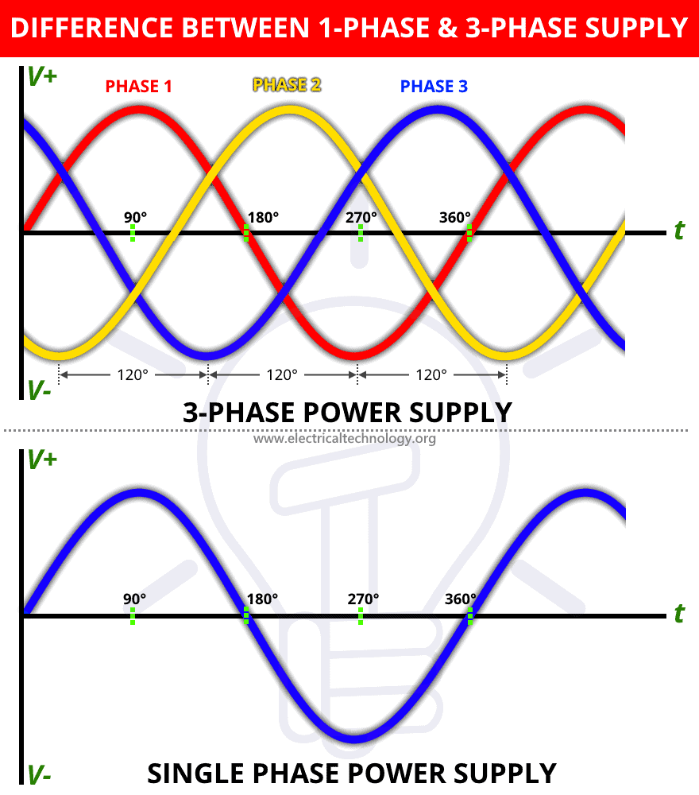
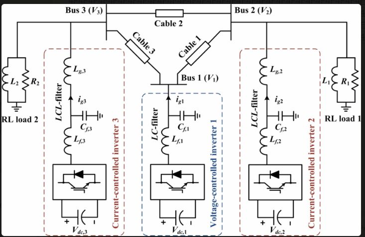

Power System Analysis involves the study and evaluation of electrical power systems to ensure their efficient and reliable operation. It encompasses various techniques and methodologies to analyze, design, and optimize power systems using mathematical principles and equations.

### Components of Power System Analysis

Power system analysis involves the examination of electrical networks, including generators, transformers, transmission lines, and loads, to ensure stable and secure power supply. Key components include:

- **Three-Phase Electric Power:** Three-phase power is a common type of alternating current used in electricity generation, transmission, and distribution. It consists of three phases, typically denoted as A, B, and C, with each phase signal 120 electrical degrees apart. The phase difference between any two phases is given by:

  θ = 120° or 2π/3 radians

- **Single-Phase vs. Three-Phase Power:** Single-phase power is a two-wire AC power circuit, while three-phase power is a three-wire AC power circuit with each phase signal 120 electrical degrees apart. Three-phase power supplies are more efficient and can transmit three times as much power as single-phase supplies. The power transmitted by a three-phase system is given by:

  P = √3 × V × I × cos(φ)

  where P is the power, V is the line voltage, I is the line current, and cos(φ) is the power factor.

- **Superposition Theorem:** The superposition theorem is a circuit analysis method used to solve networks with multiple sources by evaluating one source at a time and then summing the results. It simplifies complex circuit analysis by breaking it down into individual sources. The theorem states that the voltage or current in any branch of a linear network is the algebraic sum of the voltages or currents produced by each source acting alone, with all other sources replaced by their internal impedances.

### Techniques in Power System Analysis

- **System Analysis Examples:** System analysis involves evaluating processes to create a product or service, focusing on resource efficiency and interrelated processes. It is used in various industries like transportation, food, healthcare, and technology to manage inventory, production, and customer service.

- **Superposition Theorem Application:** The superposition theorem simplifies circuit analysis by evaluating each power source separately and then combining the results. It is particularly useful for linear circuits with multiple power sources, allowing for the analysis of voltage drops and currents in complex circuits. The theorem can be expressed mathematically as:

  V = V1 + V2 + ... + Vn

  where V is the total voltage in a branch, and V1, V2, ..., Vn are the voltages produced by each source acting alone.

### Importance and Applications

- **Purpose of System Analysis:** The main purpose of system analysis is to collect information for decision-making, problem-solving, efficiency improvement, and expansion. It involves evaluating processes, patterns, and trends within an organization to ensure effective operations and support.

- **Benefits of System Analysis:** System analysis provides valuable information about progress towards goals, helps new managers learn about industries, and aids in decision-making and problem-solving. It is crucial for enhancing decision-making and policy adoption in complex systems.

- **Efficiency and Consistency:** Three-phase power supplies offer consistent power delivery, making them more efficient and suitable for higher loads compared to single-phase supplies. They provide a steady and constant rate of power transmission, ensuring reliability in power distribution. The efficiency of a three-phase system can be expressed as:

  η = (P × cos(φ)) / (√3 × V × I)

  where η is the efficiency, P is the power, cos(φ) is the power factor, V is the line voltage, and I is the line current.

## References

[1] https://web.engr.oregonstate.edu/~webbky/ESE470_files/Section%202%20Three%20Phase%20Power%20Fundamentals.pdf

[2] https://www.researchgate.net/figure/Phasor-diagram-of-the-three-phase-system_fig1_266136861

[3] https://www.fluke.com/en-in/learn/blog/power-quality/single-phase-vs-three-phase-power

[4] https://en.wikipedia.org/wiki/Three-phase_electric_power

[5] https://www.allaboutcircuits.com/textbook/alternating-current/chpt-10/three-phase-y-delta-configurations/