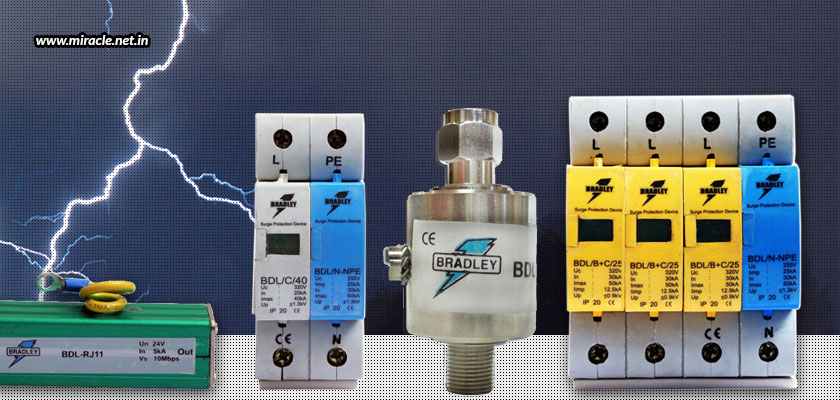
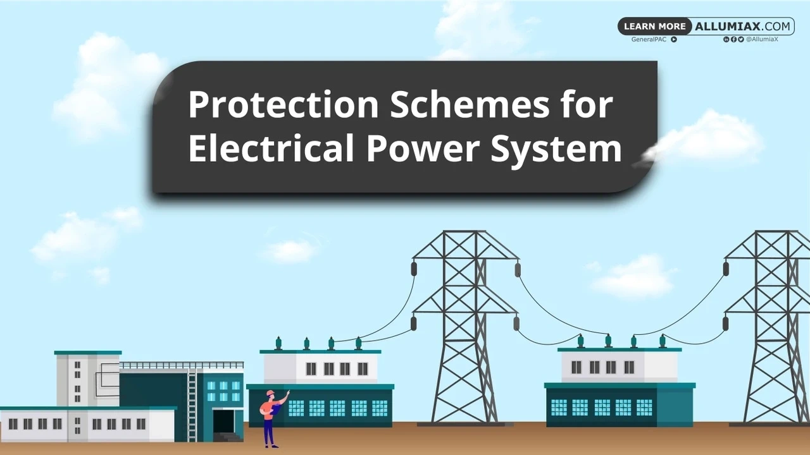
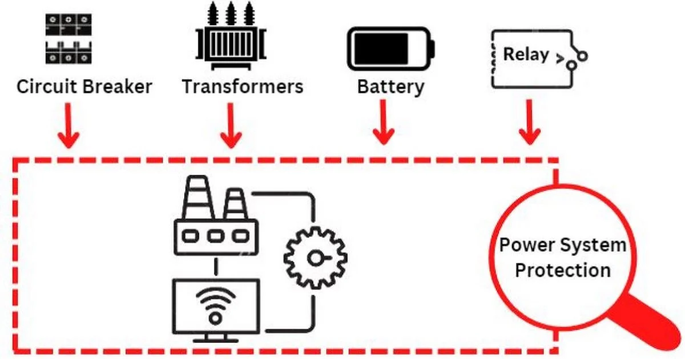
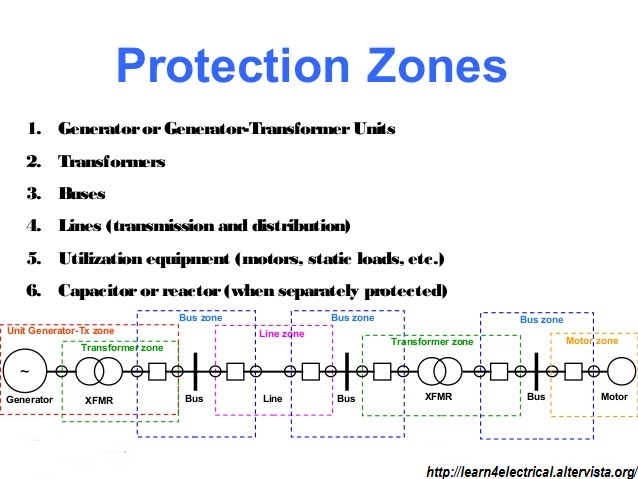

Power System Protection is a critical aspect of power systems engineering that involves safeguarding electrical networks from faults and ensuring the reliability and safety of the system. It encompasses various techniques and methodologies to analyze, design, and optimize protection schemes using mathematical principles and equations.

### Overview of Power System Protection
- **Purpose:** Power System Protection aims to detect and isolate faults in the power system to prevent damage to equipment, ensure system stability, and maintain continuity of power supply to consumers.
- **Components:** Protection systems consist of protective relays, circuit breakers, and other devices that work together to detect faults and isolate faulty components from the rest of the system.
- **Importance:** Effective power system protection is crucial for maintaining the integrity and reliability of electrical networks, minimizing the impact of faults, and ensuring the safety of personnel and equipment.

### Mathematical Aspects of Power System Protection
- **Fault Analysis:** Fault analysis involves calculating fault currents and voltages during different types of faults in the power system. The fault current can be calculated using Ohm's Law:

  I = V / Z

  where I is the fault current, V is the system voltage, and Z is the impedance of the faulted section. The impedance can be calculated using the following equation:

  Z = √(R² + X²)

  where R is the resistance and X is the reactance of the faulted section.

- **Protection Coordination:** Protection coordination ensures that the protective devices operate in a coordinated manner to isolate faults while minimizing the impact on the rest of the system. This involves setting appropriate time-current coordination curves for protective relays. The time-current characteristic of a relay can be expressed using the following equation:

  t = k / (I^n - I_s^n)

  where t is the operating time of the relay, k and n are constants that depend on the relay type, I is the fault current, and I_s is the relay setting current.

- **Relay Settings:** Protective relays are set based on the system's characteristics and fault levels. The settings of the relays are determined using mathematical calculations to ensure proper operation during faults. The pickup current of a relay can be calculated using the following equation:

  I_p = I_s × CT_ratio

  where I_p is the pickup current, I_s is the relay setting current, and CT_ratio is the current transformer ratio.

### Key Concepts in Power System Protection
- **Types of Faults:** Common types of faults in power systems include three-phase faults, single-line-to-ground faults, line-to-line faults, and double-line-to-ground faults. Each type of fault requires specific protection schemes for detection and isolation.
- **Protection Zones:** Power systems are divided into protection zones to localize faults and prevent unnecessary tripping of healthy sections. Zone settings are calculated based on the system's impedance and fault levels. The impedance of a protection zone can be calculated using the following equation:

  Z_zone = √(R_zone² + X_zone²)

  where R_zone and X_zone are the resistance and reactance of the protection zone, respectively.

- **Symmetrical Components:** Symmetrical components are used to analyze unbalanced faults in power systems. The method involves transforming the unbalanced system into three balanced systems: positive sequence, negative sequence, and zero sequence. The sequence impedances are used in fault calculations and protection settings.

### Importance of Mathematics in Power System Protection
- **Fault Current Calculation:** Accurate fault current calculations are essential for setting protective devices to operate within the desired time and coordination limits. Fault current calculations are based on the system's impedance and voltage levels.
- **Relay Coordination:** Mathematical analysis is crucial for setting time-current characteristics of protective relays to ensure proper coordination and selectivity in fault detection and isolation. Relay coordination involves calculating the operating times of relays at different fault levels to ensure that the relays operate in the desired sequence.
- **Protection Scheme Design:** Mathematical modeling and simulation are used to design and optimize protection schemes for power systems. This includes determining the optimal placement and settings of protective devices, considering factors such as fault levels, system stability, and economic considerations.

References:

[1] https://www.slideshare.net/anupriyamt/power-system-protection-16949803

[2] https://www.mdpi.com/topics/DM37984BI1

[3] https://www.sciencedirect.com/topics/engineering/power-system-protection

[4] https://www.linkedin.com/pulse/why-we-need-power-system-protection-system-protection

[5] https://ieeexplore.ieee.org/book/9715737