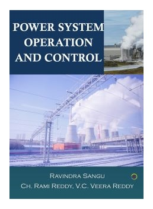
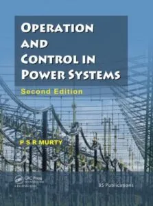

### Power System Operation and Control Overview
- **Objective:** The main goal of power system operation and control is to maintain continuous power supply with acceptable quality to all consumers in the system.
- **Components:** The operation and control of power systems involve various aspects such as real power-frequency interaction, reactive power-voltage control, economic load dispatch, and security control.

### Real Power-Frequency Control
- **Frequency Control:** In power systems, maintaining the system frequency within acceptable limits is crucial for system stability and reliability. Load characteristics, speed governors, and automatic generation control (AGC) play key roles in frequency control.

### Reactive Power-Voltage Control
- **Voltage Control:** Reactive power and voltage control are essential for regulating the voltage levels in the system. Methods such as injection of reactive power, shunt capacitors, series capacitors, and synchronous compensators are used for voltage control.

### Economic Load Dispatch
- **Objective:** Economic Load Dispatch (ELD) aims to optimize the scheduling of power generating units to minimize total fuel costs while meeting the load demand and operational constraints.
- **Challenges:** ELD optimization faces challenges in practical systems due to the nonlinearity of incremental cost curves of generating units.

### Power System Operational Planning
- **Operational Planning:** The operational planning of power systems involves maximizing the utilization of energy resources while ensuring the safe transfer of electrical energy from generating stations to consumers at minimum cost.
- **Steps:** Operational planning includes load forecasting, unit commitment, economic dispatch, frequency and voltage maintenance, and interchanges among interconnected systems.

### Security Control
- **Contingency Analysis:** Security control involves assessing the impact of contingencies on the power system and identifying potentially harmful situations that could lead to operating limit violations.
- **Preventive Action:** Recommendations for corrective control actions are provided to alleviate existing or potential overloads in the system while minimizing operational costs.

### Computer Control of Power Systems
- **Need for Computer Control:** Computer control of power systems is essential for real-time monitoring, data acquisition, and control functions to ensure system stability and reliability.
- **Functions:** Computer control systems include energy control centers, state estimation, SCADA, and EMS functions to manage system operations efficiently.

## Power system ops and control in factories

1. **Automatic Generation Control (AGC):**
   - **Description:** AGC is a key function in power system operation and control that regulates the generation of power plants to maintain system frequency within acceptable limits.
   - **Application in Factories:** In factories with their own power generation units, AGC is used to automatically adjust the power output of generators based on the load demand to ensure stable and reliable power supply.

2. **Voltage and Reactive Power Control:**
   - **Description:** Control of voltage and reactive power is essential for maintaining voltage levels and power quality in power systems.
   - **Application in Factories:** Factories often use methods like injection of reactive power, shunt capacitors, and reactors to control voltage levels and improve power factor, ensuring efficient operation of electrical equipment.

3. **Supervisory Control and Data Acquisition (SCADA):**
   - **Description:** SCADA systems are used for real-time monitoring, data acquisition, and control functions in power systems.
   - **Application in Factories:** Factories utilize SCADA systems to monitor and control various processes, equipment, and energy consumption, enabling efficient operation and maintenance of electrical systems.

4. **Load Shedding and Restoration:**
   - **Description:** Load shedding is a protective measure to shed non-essential loads during emergencies to prevent system collapse, while load restoration involves gradually restoring power after a blackout.
   - **Application in Factories:** Factories implement load shedding strategies to prioritize critical loads and prevent equipment damage during power disturbances. Load restoration procedures are followed to bring the system back to normal operation systematically.

5. **Automatic Load Frequency Control (ALFC):**
   - **Description:** ALFC is a control mechanism that adjusts the power output of generators to match the load demand and maintain system frequency.
   - **Application in Factories:** In factories with multiple generators, ALFC is used to ensure that power generation matches the varying load demand, optimizing the operation of the power system within the factory.

## Mathematical equations used

Here are some mathematical equations commonly used in power system operation and control:

1. **Real Power-Frequency Control:**
   - **Frequency Deviation Calculation:** The frequency deviation (Δf) in hertz is calculated as the difference between the actual frequency (f) and the nominal frequency (f_nominal):
     $$ \Delta f = f - f_{\text{nominal}} $$

2. **Reactive Power-Voltage Control:**
   - **Reactive Power Calculation:** The reactive power (Q) in volt-amperes reactive (VAR) is calculated using the voltage (V) and the current (I) in the system:
     $$ Q = V \times I \times \sin(\theta) $$
   - **Voltage Regulation:** The voltage regulation (VR) of a system is calculated as the percentage change in voltage from no-load to full-load conditions:
     $$ \text{VR} = \left( \frac{V_{\text{no-load}} - V_{\text{full-load}}}{V_{\text{full-load}}} \right) \times 100\% $$

3. **Economic Load Dispatch:**
   - **Total Cost Calculation:** The total cost (TC) of power generation is calculated as the sum of the individual generator costs (C_i) multiplied by their respective power outputs (P_i):
     $$ \text{TC} = \sum_{i} C_i \times P_i $$
   - **Objective Function:** In economic load dispatch, the objective function to minimize total cost subject to power balance constraints can be formulated as:
     $$ \text{Minimize } \sum_{i} C_i \times P_i \text{ subject to } \sum_{i} P_i = P_{\text{demand}} $$

4. **Load Shedding and Restoration:**
   - **Load Shedding Decision:** Load shedding decisions are made based on predefined criteria and priorities, considering factors like critical load requirements and system stability.
   - **Load Restoration Strategy:** Load restoration involves gradually reconnecting loads based on priority levels and system conditions to restore normal operation.

5. **Automatic Load Frequency Control (ALFC):**
   - **Control Signal Calculation:** The control signal for ALFC is calculated based on the frequency deviation and system parameters to adjust the power output of generators:
     $$ \text{Control Signal} = K_p \times \Delta f + K_i \times \int \Delta f \, dt $$

References:

[1] https://www.bharathuniv.ac.in/colleges1/downloads/courseware_eee/Notes/CE3/BEE047%20PSOC%20notes.pdf

[2] https://www.srecwarangal.ac.in/eee-downloads/Power%20System%20Operation%20and%20Control.pdf

[3] https://www.msajce-edu.in/academics/eee/LectureNote/EE8702-LN.pdf

[4] https://www.azdocuments.in/2022/10/power-system-operation-and-control.html

[5] https://archive.nptel.ac.in/courses/108/101/108101040/

[6] https://www.msajce-edu.in/academics/eee/LectureNote/EE8702-LN.pdf

[7] https://www.azdocuments.in/2022/10/power-system-operation-and-control.html