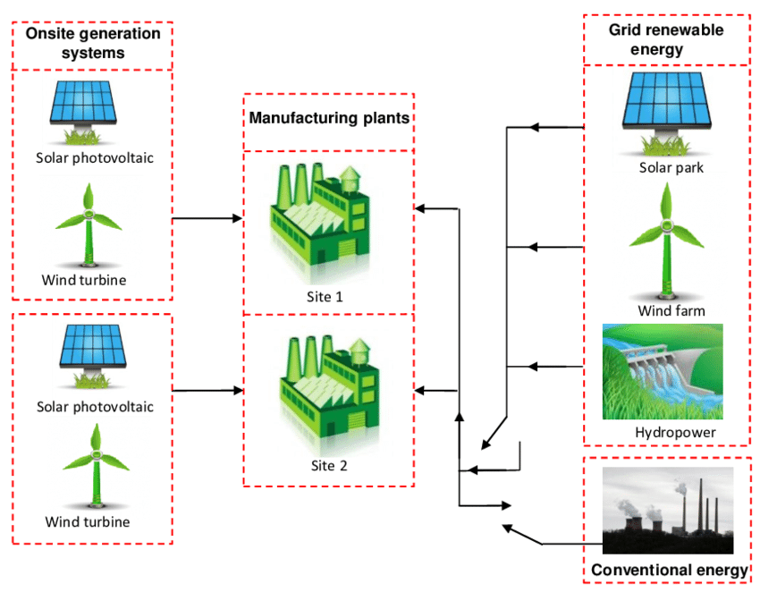
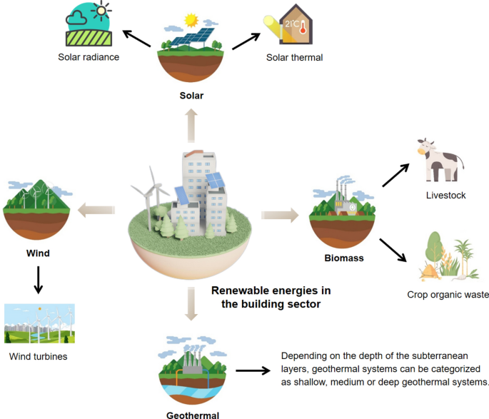
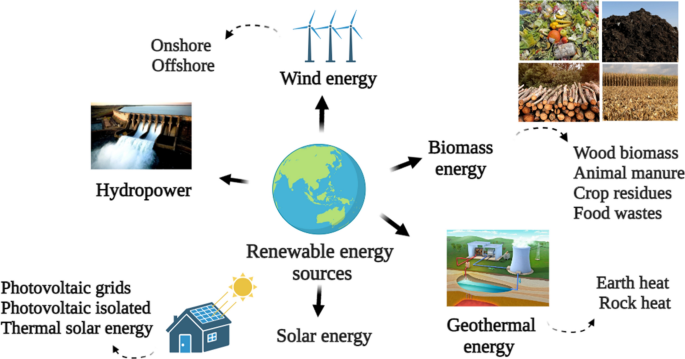
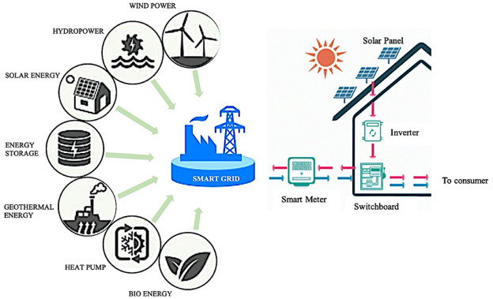

Renewable energy integration in industries, factories, and practical use cases involves a strategic approach to incorporating renewable energy sources into existing infrastructure to optimize energy production, reduce environmental impact, and enhance sustainability. Here is a detailed explanation of how this integration is achieved in various settings:

### Industries:
1. **Smart Factories**: Industry 4.0 technologies like the Internet of Things (IoT), Blockchain, and Cloud Computing are utilized to transform conventional factories into smart factories. These technologies enable real-time monitoring, data analytics, and automation, enhancing energy efficiency and reducing waste

2. **Virtual Power Plants**: The development of virtual power plants allows industries to aggregate and manage distributed energy resources, including renewables, to optimize energy generation and consumption
3. **Circular Economies**: Implementing circular economy principles in industries involves recycling and reusing materials, reducing waste, and maximizing resource efficiency, which aligns with sustainable energy practices and renewable energy integration

### Factories:
1. **Energy Optimization**: Renewable energy integration in factories focuses on optimizing energy production through the use of renewable sources like solar panels, wind turbines, and geothermal systems. This involves assessing energy needs, installing appropriate renewable technologies, and managing energy consumption efficiently
2. **Grid Management**: Factories integrate renewable energy sources into the grid through grid optimization technologies such as advanced sensors and automation. These technologies help balance energy supply and demand, ensuring stable and reliable power distribution

### Practical Use Cases:
1. **Mining Industry**: Integrating renewable energy in the mining sector involves leveraging renewable sources like solar and wind to power operations, reduce environmental impact, and enhance sustainability. This integration can create new jobs, reduce pollution, and contribute to a circular economy within the industry.
2. **Corporate Settings**: Companies integrate renewable energy sources like solar panels on rooftops or wind turbines on-site to reduce reliance on traditional power sources, lower energy costs, and demonstrate environmental stewardship.
3. **Manufacturing Industry**: Successful examples of renewable energy integration in the manufacturing sector showcase the benefits of incorporating renewables to reduce carbon footprint, lower energy expenses, and promote sustainability.

In summary, achieving renewable energy integration in industries, factories, and practical use cases involves a combination of technological advancements, strategic planning, and a commitment to sustainability. By leveraging renewable energy sources, optimizing energy production, and implementing smart grid solutions, industries and factories can transition towards cleaner, more sustainable energy systems, contributing to a greener future and reduced environmental impact.

References:

[1] https://www.researchgate.net/publication/378864482_INTEGRATING_RENEWABLE_ENERGY_SOLUTIONS_IN_THE_MANUFACTURING_INDUSTRY_CHALLENGES_AND_OPPORTUNITIES_A_REVIEW

[2] https://www.linkedin.com/pulse/renewable-energy-integration-corporate-settings-99tqe

[3] https://www.sciencedirect.com/science/article/pii/S259012302300539X

[4] https://www.sciencedirect.com/science/article/pii/S2096248723000103

[5] https://www.encora.com/insights/what-is-renewable-energy-integration-benefits-process