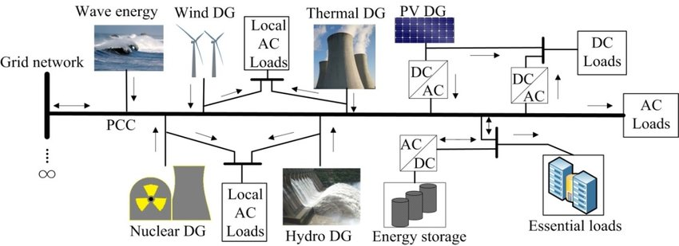

Power system reliability and planning are crucial aspects of the electric power industry, especially in industries, factories, and plants.

### Power System Reliability
Power system reliability refers to the ability of an electrical system to deliver electricity consistently and dependably to meet the demands of consumers. In industries, factories, and plants, ensuring power system reliability is essential for uninterrupted operations. Components like generators, switches, circuit breakers, and loads are controlled to maintain safe and predictable operation. The transmission system is designed to provide base load and peak load capability with margins for safety and fault tolerance, considering factors like home air conditioning, heating loads, and seasonal variations in power requirements. Load balancing is critical to prevent overloading generation equipment and ensure a stable power supply.

### Power System Planning
Power system planning involves designing and managing the generation, transmission, and distribution of electricity to meet current and future demands efficiently. In industries, the electrification of fuel used for energy offers benefits like lower maintenance costs, reduced greenhouse gas emissions, and improved energy efficiency. It is technologically feasible to electrify a significant portion of industrial fuel consumption using available technologies today. This shift towards electrification can lead to financial and environmental benefits for industrial companies, especially with the increasing availability of renewable energy sources like wind and solar power.

### Industry-Specific Considerations
In industrial settings, load flexibility (LF) is crucial for ensuring the stable operation of the power system by facilitating dynamic changes in demand. Industrial loads play a significant role in providing LF resources, but acquiring industrial demand data can be challenging due to data confidentiality concerns. Studies have focused on analyzing the characteristics of industrial factories to evaluate demand response and encourage their participation in LF resources through demand-side management (DSM). The availability of datasets on electricity consumption from manufacturing factories in South Korea provides valuable insights for industrial load characteristic analysis and market system design to enhance power system operations and achieve energy efficiency goals

In a practical scenario, the operation of power stations within an interconnected system is crucial for ensuring economic efficiency and reliability of power supply. When a power station experiences a peak demand exceeding its rated capacity, excess load sharing among interconnected stations becomes essential to maintain continuous and reliable power supply. Here is how this scenario is typically mitigated:

### Practical Scenario:
- **Peak Demand Exceeding Rated Capacity:** When a power station faces a peak demand that surpasses its rated capacity, the excess load needs to be shared among other interconnected stations to prevent disruptions in power supply.

### Mitigation Strategies:
1. **Efficient Load Sharing:** Interconnected power stations are strategically operated to ensure that more efficient plants operate continuously at high load factors, while less efficient plants are utilized during peak load hours only. This approach optimizes the overall efficiency of the system

2. **Diversity Factor Improvement:** The interconnected system benefits from diverse load curves of different stations, leading to a reduced maximum demand on the system compared to the sum of individual maximum demands. This improvement in the diversity factor enhances the effective capacity of the system.

3. **Reduced Plant Reserve Capacity:** By connecting multiple power stations in parallel, the need for individual standby units is minimized, reducing the overall reserve capacity required. This reduction in plant reserve capacity enhances the efficiency of the system.

4. **Enhanced Supply Reliability:** The interconnected system boosts the reliability of power supply. In case of a major breakdown in one station, other healthy stations can maintain continuity of supply, ensuring uninterrupted power delivery to consumers.

### Practical Application:
- **Example:**  a base load station with an 18 MW capacity and a standby station with a 20 MW capacity are interconnected to share a common load. By efficiently managing the load sharing and operational strategies, the system can maintain a reliable and continuous power supply, even during peak demand periods or unexpected breakdowns in individual stations

Here's how it works:

1. **Load Sharing:** The interconnected system allows for efficient load sharing between the two stations. The more efficient base load station (18 MW) is used to supply the continuous base load, while the less efficient standby station (20 MW) is used to supply the peak loads

2. **Diversity Factor:** The interconnected system benefits from the diverse load curves of the two stations. The maximum demand on the system is much lower compared to the sum of individual maximum demands, leading to an improved diversity factor and increased effective capacity

3. **Reserve Capacity:** By connecting the two stations in parallel, the need for individual standby units is minimized, reducing the overall reserve capacity required. This reduction in plant reserve capacity enhances the efficiency of the system

4. **Reliability:** The interconnected system boosts the reliability of power supply. In case of a major breakdown in one station, the other healthy station can maintain continuity of supply, ensuring uninterrupted power delivery to consumers

For example, during normal operation, the base load station (18 MW) supplies the continuous base load, while the standby station (20 MW) remains on standby. However, if the base load station experiences a breakdown or if the load exceeds its capacity, the standby station can automatically take over the additional load, ensuring a reliable and continuous power supply

By efficiently managing the load sharing and operational strategies, the interconnected system can optimize the use of available resources, reduce costs, and maintain a stable and reliable power supply, even during peak demand periods or unexpected outages in individual stations.

References:

[1] https://www.ncbi.nlm.nih.gov/pmc/articles/PMC9130238/

[2] https://www.mckinsey.com/industries/electric-power-and-natural-gas/our-insights/plugging-in-what-electrification-can-do-for-industry

[3] https://en.wikipedia.org/wiki/Electric_power_transmission

[4] https://en.wikipedia.org/wiki/Electric_power_industry

[5] https://www.deskera.com/blog/30-small-manufacturing-business-ideas-you-can-use/