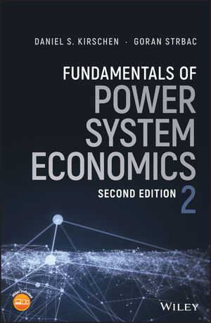

Power system economics involves analyzing the costs associated with generating electricity and ensuring a balance between affordability for consumers and profitability for power providers.

## Intuitive Explanation

Power system economics involves analyzing the costs involved in producing electrical energy per unit, typically measured in kilowatt-hours (kWh). It encompasses various factors such as fixed costs (capital costs, land, labor, permits), running costs (maintenance, repair, fuel), and tariffs (charges for supplying electricity to consumers). The goal is to ensure that the cost of producing electricity is reasonable for consumers while also covering the expenses and generating profits for power suppliers.

#### Understanding Power System Economics:
Power system economics focuses on determining the cost of producing electrical energy per unit (kWh) and ensuring that this cost is reasonable for consumers while covering expenses and generating profits for power suppliers. It involves various cost components such as fixed charges, semi-fixed costs, and variable costs, each playing a crucial role in the overall economics of power generation.

#### Components of Power System Economics:
1. **Fixed Charges (A):** These costs remain constant regardless of energy output and include capital costs, land expenses, and administrative costs.
   
2. **Semi-Fixed Costs (B):** These costs are partially dependent on energy production and may include maintenance costs, insurance, and depreciation.
   
3. **Variable Costs (C):** These costs are directly related to the amount of electricity generated and include fuel costs, operating expenses, and labor costs.

#### Numerical Example in INR:
Let's consider a hypothetical scenario for a power plant in India with the following cost structure:
- Fixed Charges (A): Rs 500,000 per year
- Semi-Fixed Costs (B): Rs 20 per kW of installed capacity per year
- Variable Costs (C): Rs 0.05 per kWh generated

Assuming the power plant has an installed capacity of 10,000 kW and operates at an average load factor of 70%, we can calculate the total annual cost of production as follows:

1. **Fixed Charges (A):** Rs 500,000 per year
2. **Semi-Fixed Costs (B):** Rs 20/kW/year x 10,000 kW = Rs 200,000 per year
3. **Variable Costs (C):** Rs 0.05/kWh x 0.7 load factor

Total Cost of Production = Fixed Charges + Semi-Fixed Costs + Variable Costs

By understanding and optimizing these cost components, power systems can operate efficiently, offer competitive electricity prices to consumers, and maintain financial sustainability in the energy market.

Citations:

[1] https://mrcet.com/downloads/digital_notes/EEE/31082020/Power%20System%20Operation%20%26%20Control.pdf

[2] https://www.slideshare.net/shwetayadav58958/exp-6-1

[3] https://testbook.com/electrical-engineering/economics-of-power-generation-and-factors

[4] https://www.slideshare.net/jagniyant/1-economics-of-power-generation

[5] https://en.wikipedia.org/wiki/Electric_power_system