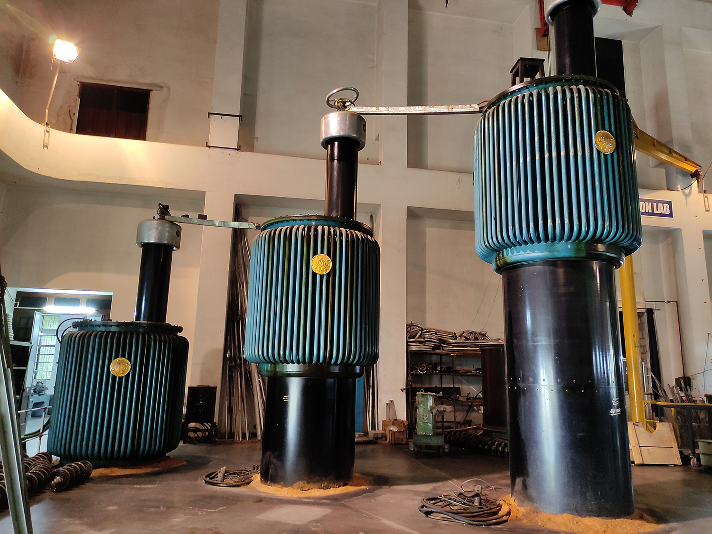
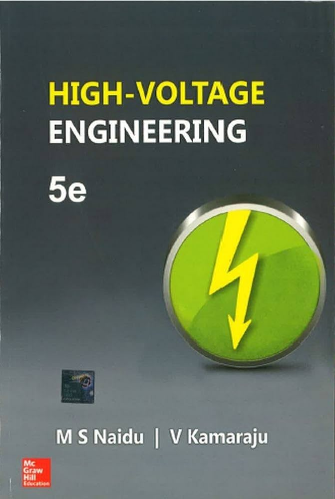

High voltage engineering is a specialized field within electrical engineering that focuses on the study and application of electrical phenomena occurring at very high voltages. It encompasses the understanding of dielectric behavior, insulation systems, and the generation and measurement of high test voltages:

#### Understanding High Voltage Engineering:
High voltage engineering involves the analysis of electrical insulating materials under high electrical stress to assess their performance in various conditions. The field is crucial for ensuring the reliability and safety of power systems, as well as for developing advanced technologies for high voltage applications.

#### Components of High Voltage Engineering:
1. **Dielectric Behavior:** Understanding how dielectric materials behave under different types of high voltages, including AC, DC, and impulse voltages.
   
2. **Insulation Systems:** Examining the performance of insulation systems under various stress conditions to ensure the integrity of power systems.
   
3. **Generation of High Test Voltages:** Developing techniques for generating and measuring high test voltages for testing and diagnostics.
   
4. **Measurement and Testing:** Conducting non-destructive testing, measuring high voltages, and assessing dielectric properties to ensure system reliability.

#### Numerical Example in Indian Ecosystem:
Consider a scenario in the Indian power sector where a high voltage engineering team is tasked with testing the insulation of a high voltage transmission line. The team needs to determine the breakdown voltage of the insulating material to ensure the line's reliability and safety.

- **Insulation Test:** The team conducts a breakdown voltage test on the insulating material used in the transmission line. They apply a gradually increasing voltage until the material breaks down, measuring the voltage at which breakdown occurs.
  
- **Numerical Example:** If the insulating material withstands a voltage of 50 kV before breakdown, the team can conclude that the material has a breakdown strength of 50 kV.

In the Indian ecosystem, high voltage engineering is crucial for the efficient and safe operation of power systems, especially in a country with a growing demand for electricity. By applying advanced high voltage engineering principles and practices, India can enhance the reliability and performance of its electrical infrastructure, contributing to the overall development and sustainability of the power sector.

## References:
[1] https://nitc.ac.in/department/electrical-engineering/programmes/high-voltage-engineering

[2] https://bharatsrajpurohit.weebly.com/high-voltage-engineering-course.html

[3] https://www.shiksha.com/college/nit-calicut-national-institute-of-technology-4288/course-m-tech-in-high-voltage-engineering-298328

[4] https://gian.iitkgp.ac.in/files/brochures/BR1508765235IITKGPEENKKUWSJHVA_%281%29.pdf
