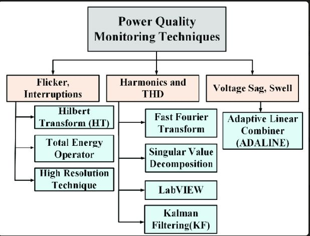
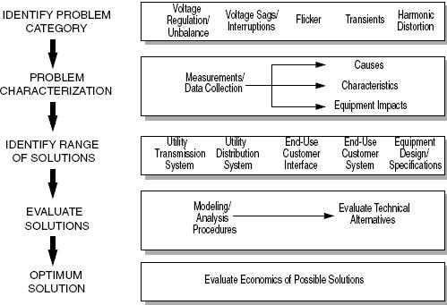

Power quality analysis involves assessing the quality of electrical power to ensure it meets specified standards. It encompasses various aspects such as voltage variations, harmonics, frequency deviations, and interruptions.

### Voltage Variations:
- **Mathematical Analysis**: Engineers use mathematical formulas to calculate voltage variations, including sags, swells, and interruptions. These calculations involve analyzing voltage waveforms and deviations from the nominal voltage level.
- **Example**: Calculating the Root Mean Square (RMS) voltage to determine the average voltage level over a specific time period.

### Harmonics:
- **Mathematical Analysis**: Harmonic analysis involves decomposing complex waveforms into sinusoidal components using Fourier analysis. Engineers use mathematical equations to quantify harmonic distortion levels and assess their impact on power quality.
- **Example**: Applying Fourier Transform to analyze the frequency components present in the voltage or current waveforms.

### Frequency Deviations:
- **Mathematical Analysis**: Frequency deviations refer to variations in the standard power frequency (e.g., 50 Hz or 60 Hz). Engineers utilize mathematical calculations to measure frequency deviations and assess their impact on equipment operation.
- **Example**: Calculating the percentage deviation from the nominal frequency to identify frequency variations.

### Interruptions:
- **Mathematical Analysis**: Analyzing power interruptions involves statistical methods to assess the duration and frequency of power outages. Engineers use mathematical models to predict the impact of interruptions on equipment reliability.
- **Example**: Using probability distributions to estimate the likelihood of power interruptions based on historical data.

In summary, power quality analysis relies heavily on mathematical techniques such as statistical analysis, Fourier analysis, and mathematical modeling to evaluate voltage variations, harmonics, frequency deviations, and interruptions. By applying these mathematical tools, engineers can identify power quality issues, optimize system performance, and ensure reliable operation of electrical systems.

### Flicker Interruptions:

**Mathematics:**
To quantify flicker interruptions, flicker meters typically analyze the voltage signal in the time domain. One common method is to calculate the flicker severity index ($P_{st}$) over a specified time interval:

$$P_{st} = \frac{100}{V_{\text{max}}}\sqrt{\frac{1}{T}\int_0^T(F(t)-F_{\text{nom}})^2dt}$$

Where:
- $V_{\text{max}}$ is the maximum voltage level allowed by the standard.
- $T$ is the integration time (typically 10 minutes for $P_{\text{lt}}$).
- $F(t)$ is the flicker level at time $t$.
- $F_{\text{nom}}$ is the nominal flicker level.

### Harmonics and THD (Total Harmonic Distortion):

**Mathematics:**
To calculate THD, you first need to determine the RMS values of the fundamental frequency and each harmonic component. Then, THD is calculated as the root mean square of all harmonic components divided by the RMS value of the fundamental frequency:

$$\text{THD} = \frac{\sqrt{\sum_{n=2}^{N}V_n^2}}{V_1} \times 100\%$$

Where:
- $V_n$ is the RMS voltage of each harmonic component.
- $V_1$ is the RMS voltage of the fundamental frequency.
- $N$ is the total number of harmonics considered.

### Voltage Sag and Swell:

**Mathematics:**
Voltage sags and swells are typically characterized by their magnitude, duration, and frequency. The analysis involves measuring the voltage waveform during the event and comparing it to the nominal voltage level. The magnitude of the sag or swell is quantified as the difference between the minimum or maximum voltage level during the event and the nominal voltage level. Duration is the time interval over which the voltage deviates from the nominal level. Frequency refers to how often these events occur within a given time period.

These representations should make the equations clearer. Let me know if you need further clarification or if there's anything else I can assist you with!

Let's consider a manufacturing facility that has been experiencing frequent voltage sags and harmonics issues. The plant manager decides to conduct a power quality analysis to identify the root causes and implement corrective measures.

1. **Initial Assessment**:
   - The facility has sensitive equipment like CNC machines and PLCs that are susceptible to voltage disturbances
   - The plant manager sets the objectives to characterize the power quality issues and identify potential solutions.

2. **Site Survey**:
   - A power quality engineer performs a site survey and gathers the following information:
     - Frequent tripping of CNC machines and PLCs due to voltage sags
     - Presence of variable frequency drives (VFDs) and welding machines that can cause harmonics
     - One-line diagram showing the transformer size of 1000 kVA and cable lengths

3. **Monitoring Parameters**:
   - The engineer decides to monitor voltage, current, power factor (PF), and total harmonic distortion (THD) at the main switchboard

4. **Data Collection**:
   - A power quality meter is installed at the main switchboard to collect data on voltage, current, PF, and THD at 10-minute intervals for a week

5. **Data Analysis**:
   - The collected data is analyzed, and the following key findings are observed:
     - Voltage sags with a minimum voltage of 0.8 pu (per unit) lasting for 0.5 to 2 seconds occurred 10 times per day
     - The average PF was 0.85 lagging
     - The THD for current reached up to 25%, with significant 5th and 7th harmonic components

6. **Recommendations and Solutions**:
   - Based on the analysis, the engineer recommends the following solutions:
     - Install a voltage regulator to mitigate voltage sags
     - Implement power factor correction by installing capacitor banks to improve the PF to 0.95
     - Install passive harmonic filters tuned to the 5th and 7th harmonics to reduce the THD to below 5%

7. **Continuous Monitoring**:
   - After implementing the recommended solutions, the plant continues to monitor the power quality parameters to ensure the issues have been resolved and to track any future changes

By conducting this power quality analysis and implementing the recommended solutions, the manufacturing facility can improve the reliability of its electrical system, reduce equipment downtime, and optimize energy efficiency.

## References:

[1] https://www.mdpi.com/2227-7390/11/6/1381

[2] https://www.studysmarter.co.uk/explanations/engineering/engineering-mathematics/quality-control/

[3] https://www.bitsathy.ac.in/the-crucial-role-of-mathematics-in-engineering/

[4] https://www.britannica.com/science/numerical-analysis

[5] https://www.linkedin.com/pulse/power-mathematics-engineering-its-impact-life-andres-bellot

[6] https://www.electricityforum.com/iep/power-quality/power-quality-and-harmonics

[7] https://www.monolithicpower.com/en/power-electronics/power-quality-and-harmonics/introduction-to-power-quality-and-harmonics

[8] https://www.elspec-ltd.com/ieee-519-2014-standard-for-harmonics/

[9] https://www.hioki.com/in-en/learning/electricity/thd.html

[10] https://premium-power.com/power-quality-and-harmonics-causes-and-effects/