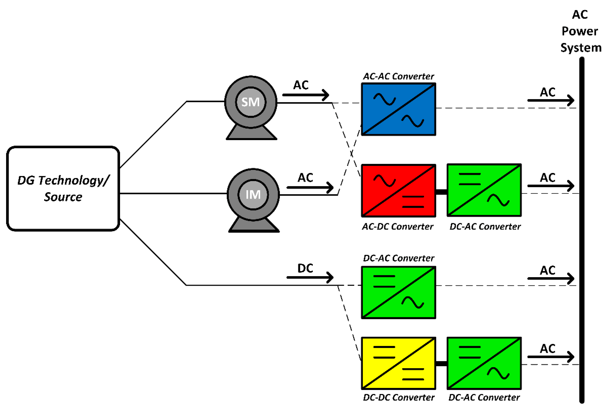
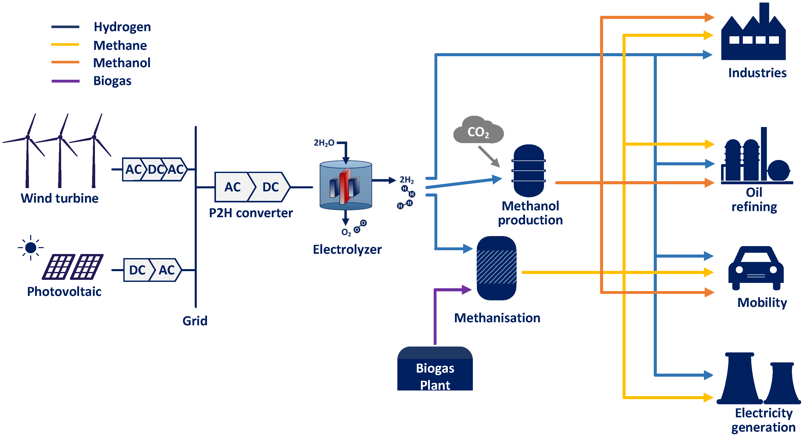
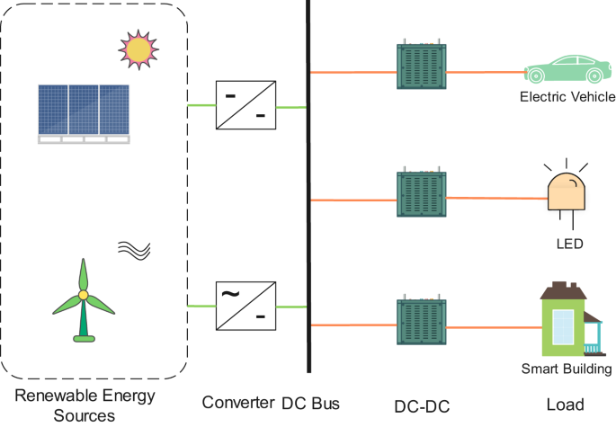

Power electronic converters are electronic circuits that efficiently convert electrical power from one form to another, enabling control and manipulation of power flow. They are essential components in various applications, including energy conversion, motor control, renewable energy systems, and electric vehicles.

## Types of Power Electronic Converters

## Rectifiers
Rectifiers convert AC to DC by allowing current flow in one direction. Single-phase and three-phase rectifiers are common. The output voltage $$V_{DC}$$ of a single-phase full-wave rectifier can be calculated using:

$$V_{DC} = \frac{2\sqrt{2}V_{rms}}{\pi}$$

## Inverters
Inverters convert DC to AC, enabling the use of DC power sources in AC applications. They can produce different waveforms like square, modified sine, or pure sine waves. The output voltage $$V_{AC}$$ of a square wave inverter is equal to the input DC voltage $$V_{DC}$$.

## DC-DC Converters
DC-DC converters regulate DC voltage levels, allowing efficient power transfer between different voltage sources. Buck, boost, and buck-boost converters are common types. The output voltage $$V_{out}$$ of a buck-boost converter is given by:

$$V_{out} = \frac{D}{1-D} \times V_{in}$$

where D is the duty cycle.

## AC-DC Converters (AC/DC power supplies)
AC-DC converters transform AC to DC, often incorporating rectification and voltage regulation stages. The output voltage $$V_{out}$$ of a voltage-regulated power supply can be calculated using:

$$V_{out} = V_{in} \times \frac{N_{2}}{N_{1}}$$

where $$N_{2}$$ and $$N_{1}$$ are the number of turns in the secondary and primary windings of the transformer, respectively

## Cycloconverters
Cycloconverters are used for direct AC to AC conversion at different frequencies. They enable variable-speed operation in motor drives and other applications. The output frequency $$f_{out}$$ of a cycloconverter is given by:

$$f_{out} = \frac{n}{N} \times f_{in}$$

where n and N are integers, and $$f_{in}$$ is the input frequency.

## Voltage Source Inverters (VSI)
VSIs convert DC to AC with a fixed voltage magnitude and frequency, making them suitable for applications requiring precise control of AC output. The output voltage $$V_{out}$$ of a VSI can be calculated using:

$$V_{out} = V_{DC} \times \sqrt{2}$$

where $$V_{DC}$$ is the input DC voltage

## Current Source Inverters (CSI)
CSIs provide a constant current output to the load, making them suitable for applications requiring precise current control. The output current $$I_{out}$$ of a CSI can be calculated using:

$$I_{out} = \frac{V_{DC}}{R_{load}}$$

where $$R_{load}$$ is the load resistance

## Examples

## Motor Drives
- In a cement factory, a 10 MW induction motor is used to drive a ball mill. A variable frequency drive (VFD) based on a PWM inverter is used to control the motor speed, enabling efficient operation and energy savings

- A steel rolling mill uses a 5 MW DC motor drive with a chopper-based converter for precise speed control during the rolling process. The converter provides a continuously variable DC voltage to the motor armature.

## Induction Heating
- An induction heating system in a forging plant uses a 2 MW cycloconverter to supply variable frequency AC power to the induction heating coil. The cycloconverter converts the fixed frequency AC supply to a variable frequency output, allowing precise control of the heating process

## Power Supplies
- A switch-mode power supply in a computer manufacturing plant converts the 230 V AC mains to the required 5 V and 12 V DC voltages for the electronic circuits. The power supply uses a high-frequency DC-DC converter with pulse-width modulation control to achieve high efficiency and power density

## Active Filters
- A 1 MVA active power filter is installed in an aluminum smelting plant to mitigate harmonics generated by the large thyristor-controlled rectifiers used for the electrolytic process. The active filter injects compensating currents to cancel the harmonic currents, improving power quality

## Renewable Energy Integration
- A 50 MW solar photovoltaic power plant uses a combination of DC-DC boost converters and a central inverter to convert the variable DC output of the solar panels to grid-compatible AC power. The converters maximize the power extraction from the PV array and ensure efficient power transfer to the utility grid

## References:

[1] https://www.researchgate.net/publication/351432747_Mathematical_Modeling_of_Power_Electronic_Converters

[2] https://www.academia.edu/60271448/Mathematical_Modeling_of_Power_Electronic_Converters

[3] http://dnxy.yzu.edu.cn/__local/1/14/C2/4BB226E6807A10F30A8244F378E_2F09DF5A_6425B.pdf?e=.pdf

[4] https://dl.acm.org/doi/10.1007/s42979-021-00637-1

[5] https://www.geeksforgeeks.org/power-electronics/

[6] https://www.slideshare.net/anasaliusmani/power-electronic-converter

[7] https://www.sciencedirect.com/topics/earth-and-planetary-sciences/power-converter