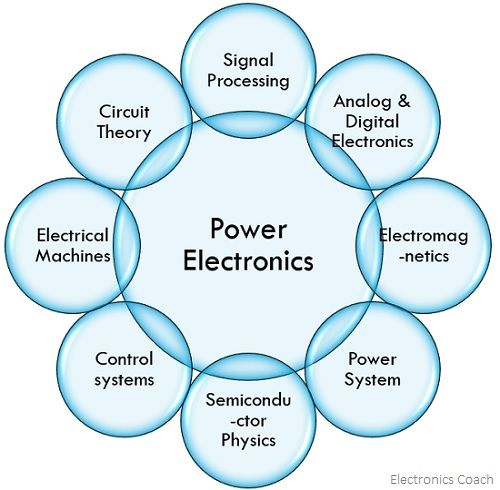
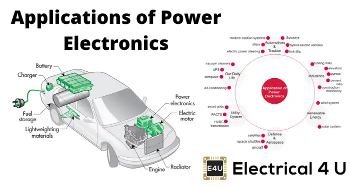

## Industrial Applications

1. **Steel Rolling Mill**:
   - A steel rolling mill uses a 10 MW DC motor drive with a chopper-based converter for precise speed control during the rolling process.
   - The converter provides a continuously variable DC voltage to the motor armature, allowing the motor speed to be adjusted from 0 to 1200 rpm.
   - Assuming a 600 V DC motor, the chopper duty cycle varies from 0 to 1 to control the motor voltage from 0 to 600 V.

2. **Cement Factory**:
   - A cement factory uses a 15 MW induction motor to drive a ball mill for grinding raw materials.
   - A variable frequency drive (VFD) based on a PWM inverter is used to control the motor speed, enabling efficient operation and energy savings.
   - The inverter converts the fixed 50 Hz, 11 kV AC supply to a variable frequency output ranging from 10 Hz to 60 Hz, allowing the motor speed to be adjusted from 600 rpm to 3600 rpm.

## Plant Applications

1. **Aluminum Smelting Plant**:
   - An aluminum smelting plant uses large thyristor-controlled rectifiers for the electrolytic process, generating significant harmonic currents.
   - A 5 MVA active power filter is installed to mitigate these harmonics and improve power quality.
   - The active filter injects compensating currents to cancel the 5th, 7th, 11th, and 13th harmonic currents, reducing the total harmonic distortion (THD) from 25% to less than 5%.

2. **Induction Heating System**:
   - An induction heating system in a forging plant uses a 3 MW cycloconverter to supply variable frequency AC power to the induction heating coil.
   - The cycloconverter converts the fixed 50 Hz, 6.6 kV AC supply to a variable frequency output ranging from 100 Hz to 500 Hz, allowing precise control of the heating process.
   - Assuming a 4-pole induction heating coil, the magnetic field frequency can be varied from 100 Hz to 500 Hz, corresponding to a speed range of 3000 rpm to 15000 rpm.

## Factory Applications

1. **Automotive Assembly Line**:
   - An automotive assembly line uses several 100 kW induction motors to drive conveyor belts and transfer systems.
   - Variable frequency drives (VFDs) based on PWM inverters are used to control the speed of these motors, enabling flexible production and energy savings.
   - The VFDs convert the fixed 400 V, 50 Hz AC supply to a variable frequency output ranging from 10 Hz to 60 Hz, allowing the conveyor belt speeds to be adjusted from 0.5 m/s to 3 m/s.

2. **Packaging Machine**:
   - A packaging machine in a food processing factory uses a 20 kW DC motor to drive the packaging film feed mechanism.
   - A chopper-based converter provides a continuously variable DC voltage to the motor armature, allowing precise control of the film feed speed.
   - Assuming a 240 V DC motor, the chopper duty cycle varies from 0 to 1 to control the motor voltage from 0 to 240 V, enabling the film feed speed to be adjusted from 0 to 60 m/min.

## Home Appliance Applications

1. **Induction Cooktop**:
   - A 3 kW induction cooktop uses a high-frequency inverter to generate a varying magnetic field in the cooking coil.
   - The inverter converts the fixed 230 V, 50 Hz AC supply to a variable frequency output ranging from 20 kHz to 50 kHz, inducing eddy currents in the cookware for efficient heating.
   - The inverter output voltage is kept constant at 230 V while the frequency is varied to control the power delivered to the cookware.

2. **Vacuum Cleaner**:
   - A 1.5 kW vacuum cleaner uses a brushless DC (BLDC) motor for the suction fan.
   - A DC-DC converter and an inverter are used to control the motor speed and torque for efficient operation.
   - The DC-DC converter steps down the 230 V DC from the rectified AC supply to a variable DC voltage ranging from 100 V to 300 V, which is then fed to the inverter.
   - The inverter converts the variable DC voltage to a variable frequency, variable voltage AC supply for the BLDC motor, allowing the suction power to be adjusted based on the cleaning requirements.

