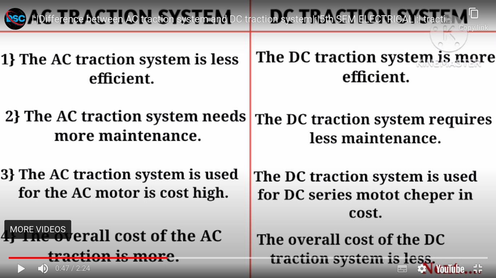

Electric traction systems refer to the use of electric power for propelling vehicles, such as trains, trams, trolleys, and electric vehicles. These systems offer several advantages over traditional internal combustion engines, including higher efficiency, lower emissions, and better controllability. 

## 1. Direct Current (DC) Traction Systems:

DC traction systems were one of the earliest forms of electric traction and are still used in some applications. In DC traction systems, the power is supplied to the locomotive through a DC overhead line or a third rail. The power is then converted and controlled to drive the traction motors.

### Working Principle:
The voltage across the traction motor terminals in a DC traction system can be approximated by the formula:

$$ V_{\text{motor}} = I_{\text{motor}} \times R_{\text{motor}} + V_{\text{back EMF}} $$

## 2. Alternating Current (AC) Traction Systems:

AC traction systems are becoming increasingly popular due to their efficiency and flexibility. In AC traction systems, the power is supplied as AC and converted to the required voltage and frequency to drive the traction motors.

### Working Principle:
The output voltage of the inverter in an AC traction system can be calculated using the formula:

$$ V_{\text{out}} = \frac{V_{\text{DC}}}{\sqrt{3}} $$

## Applications:

- **Factories and Plants:** Electric traction systems are used in factories and plants for material handling equipment such as forklifts, cranes, and automated guided vehicles (AGVs).
  
- **Industries:** In industries, electric traction systems are employed for intra-factory transportation, such as moving raw materials and finished products within the production facility.
  
- **Home Appliances:** Electric traction systems are not commonly used in household appliances, but advancements in electric vehicle technology are leading to the adoption of electric cars for personal transportation.

## Numerical Example:

Let's consider a DC traction system where a locomotive is drawing a current of 500 A from the overhead line. The resistance of the traction motor is 0.1 ohms, and the back EMF generated by the motor is 50 V. Calculate the voltage across the traction motor terminals.

$$ V_{\text{motor}} = (500 \, \text{A}) \times (0.1 \, \Omega) + 50 \, \text{V} $$
$$ V_{\text{motor}} = 50 \, \text{V} + 50 \, \text{V} = 100 \, \text{V} $$

So, the voltage across the traction motor terminals is 100 V.

This example demonstrates how the voltage across the traction motor can be calculated using the formula incorporating current, resistance, and back EMF. Similar calculations can be performed for AC traction systems considering the appropriate parameters and formulas.