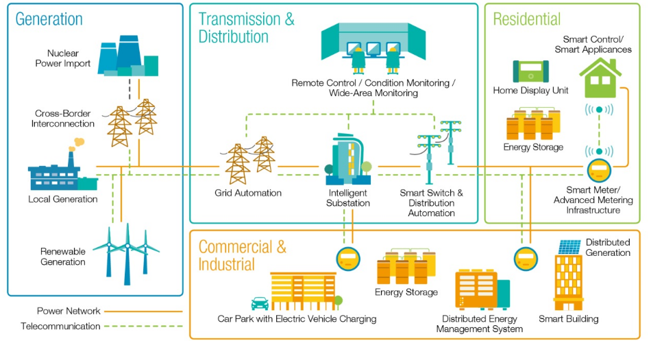

### Smart Grid Technologies: Overview and Applications

Smart grid technologies represent a significant advancement in the electrical grid system, integrating digital communication technology to enhance efficiency, reliability, and sustainability. These technologies enable two-way communication between utilities and consumers, revolutionizing the power industry. 

#### Types of Smart Grid Technologies:

1. **Advanced Metering Infrastructure (AMI):**
   - **Function:** Enables two-way flow of information between customers and utility agencies.
   - **Applications:** Remote consumption control, time-based pricing, fault detection, theft detection, and more.
   - **Example:** Implementing smart meters to monitor and control energy consumption efficiently.

2. **Demand Response:**
   - **Function:** Involves adjusting electricity consumption based on demand and supply conditions.
   - **Applications:** Peak shaving, load shifting, and voltage regulation.
   - **Example:** Consumers reducing electricity usage during peak hours to balance the grid.

3. **Electric Vehicles (EVs):**
   - **Function:** Integrating electric vehicles into the grid for efficient energy management.
   - **Applications:** Vehicle-to-grid (V2G) technology for bidirectional energy flow.
   - **Example:** Charging electric vehicles during off-peak hours to optimize grid load.

4. **Wide-Area Situational Awareness (WASA):**
   - **Function:** Enhances monitoring of the power system across large geographic areas.
   - **Applications:** Real-time monitoring and prediction of future disturbances.
   - **Example:** Using phasor measurement units for data collection over extensive grid areas.

5. **Distributed Energy Resources and Storage:**
   - **Function:** Utilizes smaller energy sources located near consumers for efficient energy generation.
   - **Applications:** Peak shaving, renewable energy integration, and voltage regulation.
   - **Example:** Implementing rooftop solar panels and battery storage systems for local energy generation.

6. **Distribution Grid Management:**
   - **Function:** Involves managing the distribution grid for efficient operation and optimization.
   - **Applications:** Real-time data collection, system analysis, and fault prevention.
   - **Example:** Utilizing smart technologies to predict and prevent grid failures.

#### Practical Numerical Example:

Consider a scenario where a smart grid system with advanced metering infrastructure detects a sudden increase in energy consumption during peak hours. The system activates demand response measures, prompting consumers to reduce their electricity usage. As a result, the grid load is balanced, and the risk of grid overload is mitigated. This real-time response showcases the effectiveness of smart grid technologies in optimizing energy distribution and ensuring grid stability.
   
References:

[1] https://www.hivepower.tech/blog/smart-grid-technology-changing-the-power-industry

[2] https://www.elprocus.com/overview-smart-grid-technology-operation-application-existing-power-system/

[3] https://www.iea.org/energy-system/electricity/smart-grids

[4] https://www.electricaltechnology.org/2015/05/what-is-a-smart-grid.html

[5] https://en.wikipedia.org/wiki/Smart_grid