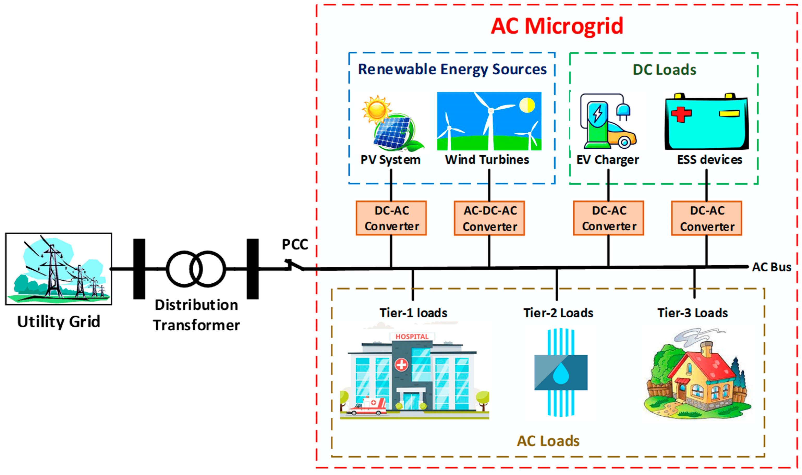
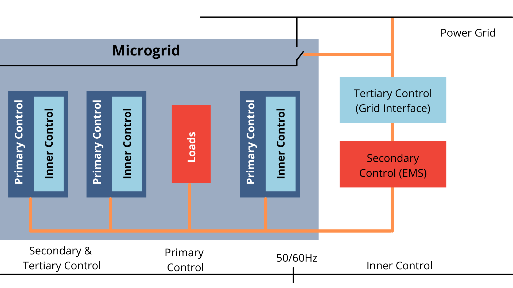

Microgrid systems are revolutionizing the energy landscape by offering localized, efficient, and resilient power solutions. 

#### Overview of Microgrid Systems:
- **Definition:** A microgrid is a localized electrical grid with defined boundaries that can operate independently or in conjunction with the main grid.
- **Functionality:** Microgrids can seamlessly transition between grid-connected and islanded modes, providing flexibility and reliability.
- **Components:** Key components of microgrids include local generation sources, consumption elements, energy storage systems, and the point of common coupling (PCC).

#### Types of Microgrid Solutions:
1. **Remote Microgrids:**
   - **Description:** Isolated from the main grid, operating independently in island mode.
   - **Applications:** Ideal for remote areas, compatible with renewable energy sources like solar and wind.

2. **Grid-Connected Microgrids:**
   - **Description:** Directly connected to the main grid, with the ability to disconnect and reconnect as needed.
   - **Applications:** Provide supplemental power to the grid, support renewable energy integration.

3. **Networked Microgrids:**
   - **Description:** Comprise multiple microgrids connected to the same main grid circuit section.
   - **Applications:** Serve large geographic areas efficiently, enhancing grid resilience.

#### Real-World Applications of Microgrid Systems:
- **Power Reliability:** Microgrids offer a reliable electricity source in areas prone to power outages or with unreliable grid infrastructure.
- **Energy Cost Savings:** By optimizing energy costs through renewable sources and energy storage, microgrids can reduce reliance on traditional fossil fuels.
- **Environmental Sustainability:** Microgrids contribute to reducing carbon footprints by generating and storing renewable energy on-site.
- **Energy Independence:** Providing energy independence by generating and storing power locally, especially beneficial in remote or off-grid locations.
- **Resilience:** Microgrids enhance resilience during natural disasters or grid disruptions, ensuring continuous power supply to critical loads.

#### Real-World Examples:
- **Remote Areas:** Microgrids are deployed in remote areas or islands where grid connection is challenging, ensuring reliable power supply.
- **Commercial and Industrial (C&I) Microgrids:** Rapidly evolving in North America and eastern Asia, offering energy resilience and cost savings for businesses and industries.

Microgrid systems are versatile solutions that cater to a wide range of applications, from remote areas to commercial and industrial settings, providing reliable, sustainable, and resilient power supply options in diverse real-world scenarios.

References:

[1] https://www.energy-pool.eu/en/what-is-a-microgrid/

[2] https://thompsonpowersystems.com/industrial/microgrids/

[3] https://www.researchgate.net/publication/356902012_Overview_of_microgrid_systems

[4] https://onlinelibrary.wiley.com/doi/full/10.1002/2050-7038.12885

[5] https://en.wikipedia.org/wiki/Microgrid