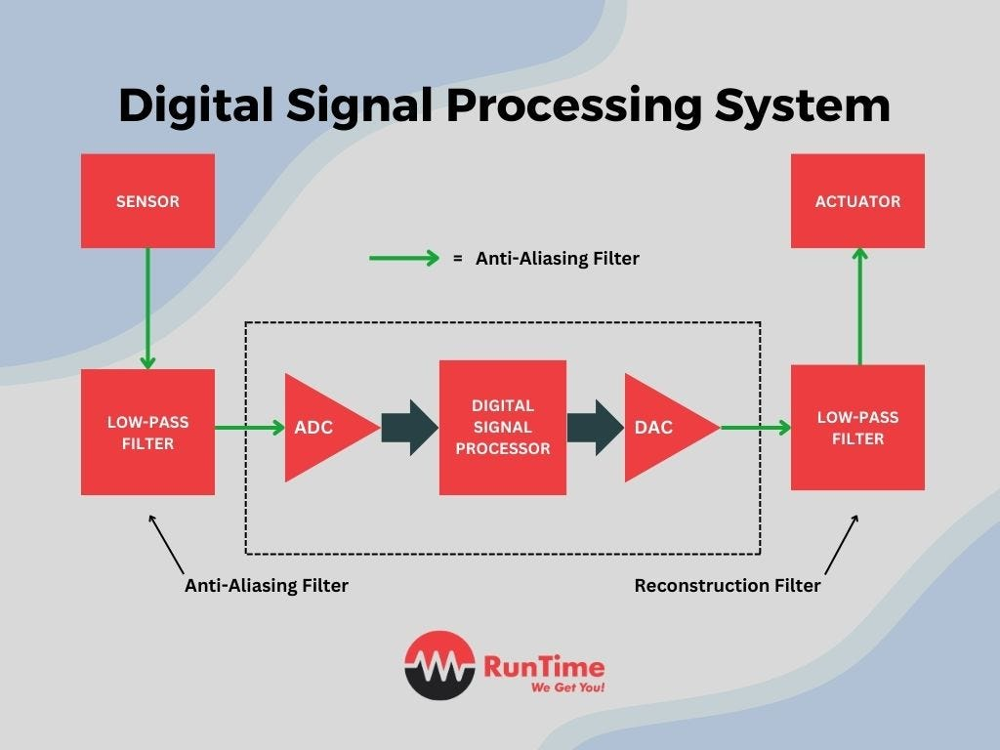
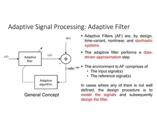
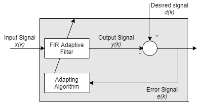
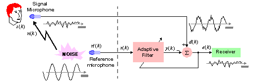

Adaptive signal processing is a powerful technique that allows signal processing systems to adapt to changing conditions and environments. It involves the use of adaptive filters, which are time-variant, nonlinear, and stochastic systems that perform data-driven approximation to minimize an objective function, such as the mean-squared error between the filter output and a desired signal

The key aspects of adaptive signal processing are:

## Mathematics and Algorithms

Adaptive filters are typically implemented using algorithms like the Least Mean Squares (LMS) algorithm or the Recursive Least Squares (RLS) algorithm. These algorithms allow the filter coefficients to be updated iteratively based on the input signal and the error between the filter output and a desired signal.

The LMS algorithm updates the filter coefficients w[n+1] = w[n] + 2μe[n]x[n], where w is the filter coefficient vector, μ is the step size, e[n] is the error signal, and x[n] is the input signal. The RLS algorithm uses a recursive approach to estimate the optimal filter coefficients.

## Examples

1. **Noise Cancellation**: Adaptive filters can be used to cancel unwanted noise from a signal, such as background noise in a telephone conversation or engine noise in an aircraft. The adaptive filter learns the characteristics of the noise signal and generates a cancellation signal that is subtracted from the input signal.

2. **Channel Equalization**: In communication systems, the channel characteristics can vary over time due to factors like multipath propagation. Adaptive filters can be used to equalize the channel and compensate for these variations, improving the quality of the received signal.

3. **System Identification**: Adaptive filters can be used to identify the characteristics of an unknown system, such as the impulse response of an acoustic environment or the transfer function of an electronic circuit. This information can be used for tasks like echo cancellation or system modeling.

4. **Beamforming**: In array signal processing, adaptive filters can be used to steer the beam of an antenna array towards a desired signal source while suppressing interference from other directions.

## Applications

Adaptive signal processing has a wide range of applications, including:

- **Audio and Speech Processing**: Noise cancellation, echo cancellation, speech enhancement, and audio compression.
- **Communications**: Channel equalization, multiuser detection, and adaptive modulation.
- **Biomedical Engineering**: Electrocardiogram (ECG) signal processing, brain-computer interfaces, and prosthetic control.
- **Control Systems**: Adaptive control, system identification, and active noise and vibration control.
- **Radar and Sonar**: Adaptive beamforming, clutter rejection, and target tracking.
- **Image and Video Processing**: Image restoration, super-resolution, and video stabilization.
- **Financial Signal Processing**: Prediction and analysis of financial time series data.

References:

[1] https://en.wikipedia.org/wiki/Signal_processing

[2] https://www.electronicsforu.com/technology-trends/learn-electronics/signal-processing

[3] https://cds.cern.ch/record/1100533/files/p10.pdf

[4] https://www.amazon.in/Adaptive-Signal-Processing-1e-WIDROW/dp/8131705323

[5] https://www.slideshare.net/VishalPusadkar1/lecture-notes-on-adaptive-signal-processing1pdf