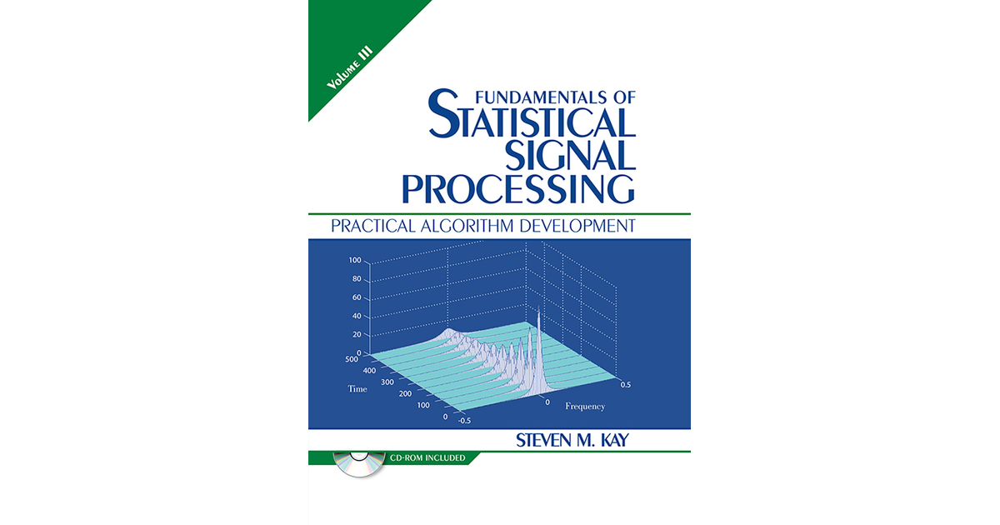

Statistical signal processing involves the analysis and manipulation of signals using statistical methods to extract valuable information from noisy or uncertain data. 

### Mathematical Models and Algorithms

Statistical signal processing relies on mathematical models and algorithms to process signals effectively. Key mathematical concepts include probability distributions, parameter estimation, and signal modeling. Algorithms like the Least Mean Squares (LMS) algorithm, Recursive Least Squares (RLS) algorithm, and Kalman filtering are commonly used in this field

1. **Probability Distributions**: Think of probability distributions as a way to describe the likelihood of different outcomes when you perform an experiment or observation. Imagine rolling a fair six-sided die: each number has a probability of 1/6 of showing up. Probability distributions help us understand and quantify uncertainty in various situations.

   - **Advantages**: They provide a structured way to understand randomness and uncertainty, which is crucial in many fields like finance, engineering, and science.
   
   - **Disadvantages**: Sometimes, real-world situations don't perfectly fit into known probability distributions, making it challenging to accurately model them.
   
   - **Applications**: They are used in various fields such as risk assessment, weather forecasting, and quality control in manufacturing.

2. **Parameter Estimation**: This is about figuring out the characteristics of a probability distribution from collected data. For example, if you're flipping a coin and want to know if it's fair, you might flip it 100 times and see how many times it comes up heads. Based on that data, you can estimate the probability of getting heads.

   - **Advantages**: It allows us to make educated guesses about unknowns based on observed data, which is crucial in making decisions and predictions.
   
   - **Disadvantages**: The accuracy of estimates depends heavily on the quality and quantity of the data collected.
   
   - **Applications**: Parameter estimation is used in fields like finance to predict stock prices, in medicine to estimate the effectiveness of treatments, and in engineering to optimize processes.

3. **Signal Modeling**: Signals are everywhere, from the sound waves in music to the voltage fluctuations in electrical circuits. Signal modeling is about understanding and representing these signals mathematically, so we can analyze and manipulate them.

   - **Advantages**: By modeling signals, we can extract useful information, remove noise, and make predictions about future behavior.
   
   - **Disadvantages**: Real-world signals can be complex and noisy, making accurate modeling challenging.
   
   - **Applications**: Signal modeling is used in audio and image processing, communication systems, radar and sonar systems, and many other areas where signals need to be analyzed or manipulated.

## Algorithms

1. **Least Mean Squares (LMS) Algorithm**: This algorithm is used for adaptive filtering, which means adjusting a filter over time to achieve a desired output. Imagine you're trying to remove noise from a signal: the LMS algorithm adjusts the filter coefficients to minimize the difference between the filtered signal and the desired signal.

2. **Recursive Least Squares (RLS) Algorithm**: Similar to LMS, RLS is used for adaptive filtering. However, RLS is more computationally intensive but can converge faster and provide better results, especially when dealing with rapidly changing signals or environments.

3. **Kalman Filtering**: This is a versatile algorithm used for state estimation in systems that have uncertain or noisy measurements. Imagine you're tracking the position of a moving object using sensors that give noisy measurements. Kalman filtering combines the predictions from a dynamic model of the system with the noisy measurements to estimate the true state of the system more accurately.

   - **Advantages**: These algorithms can adapt to changing conditions, making them suitable for real-time applications. They are also relatively simple to implement.
   
   - **Disadvantages**: They may require a lot of computational resources, especially for complex systems or large datasets.
   
   - **Applications**: These algorithms are used in a wide range of fields, including robotics, navigation systems, financial modeling, and telecommunications, to name a few. They help improve the accuracy and reliability of measurements and predictions in these systems.

### Applications

Statistical signal processing finds applications in various domains, including:

- **Communication Systems**: Signal detection, channel equalization, and modulation techniques in wireless communication systems.
- **Biomedical Engineering**: Processing biomedical signals like electrocardiograms (ECG) for diagnostic purposes.
- **Image and Video Processing**: Image restoration, super-resolution, and video compression using statistical signal processing techniques.
- **Financial Signal Processing**: Analyzing and predicting financial time series data for investment and trading strategies.
- **Radar and Sonar Systems**: Signal processing for target tracking, clutter rejection, and beamforming in radar and sonar applications.

### Real-World Examples

1. **Signal Parameter Estimation**: Statistical signal processing is used to estimate unknown parameters of signals, such as amplitudes, frequencies, and phases, in the presence of noise or uncertainties.

2. **Signal Detection**: Statistical signal processing is employed to determine the presence of a signal in noise or differentiate between different signal models. For instance, in a binary communication system, detecting whether a transmitted signal is +s or -s based on noisy measurements.

3. **Signal Estimation/Prediction**: Predicting the value of a signal based on observations is another common application. This is crucial in scenarios where future values of a signal need to be estimated based on current observations.

### Numerical Examples

- **Binary Communication System**: Consider a binary communication system where a transmitter sends a digitized waveform s. The receiver measures a noisy version of the transmitted signal, modeled as xi = θsi + ϵi, where θ is either +1 or -1, and ϵi represents errors during transmission. This scenario involves two hypotheses (H0 and H1) for the data, requiring detection and estimation algorithms to make decisions based on the observed data.

Statistical signal processing, with its mathematical foundations, diverse applications, and real-world examples, plays a crucial role in extracting meaningful information from signals in various fields, making it a fundamental tool in modern signal processing systems.

References:

[1] https://www.slideshare.net/slideshow/statistical-signal-processing1/56090851

[2] https://ee.stanford.edu/~gray/sp.pdf

[3] https://www.researchgate.net/publication/220058687_Numerical_Linear_Algebra_in_Signal_Processing_Applications

[4] https://nowak.ece.wisc.edu/ece830/ece830_fall11_lecture1.pdf

[5] https://www.ece.rice.edu/~dhj/courses/elec531/notes.pdf