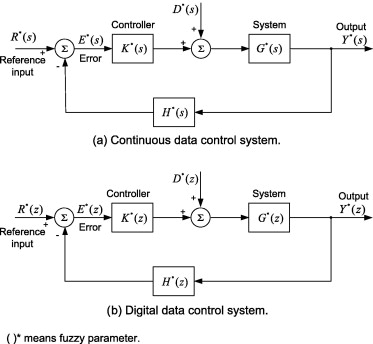
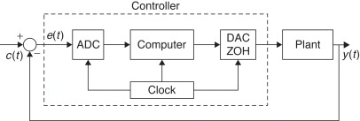

Digital control systems are a crucial aspect of modern control engineering, offering advantages like precision, flexibility, and ease of implementation. 

### Mathematical Models and Algorithms

Digital control systems are represented using difference equations in the discrete-time domain. The system dynamics are described by difference equations, and control algorithms are implemented using digital signal processing techniques. Key mathematical tools include Z-transforms, difference equations, and digital filter design methods like Finite Impulse Response (FIR) and Infinite Impulse Response (IIR) filters.

**Digital Control Systems**

In a digital control system, we're dealing with systems where signals and operations are processed in a digital (discrete) rather than analog (continuous) domain. This means that instead of handling signals as smooth, continuous functions of time, we're working with sequences of numbers representing the signal at specific points in time.

**Z-Transform**

The Z-transform is a powerful tool used to analyze discrete-time systems. It's like a super tool that takes a sequence of numbers (the signal) and transforms it into a function in the complex plane. Think of it as a way to understand how the system behaves in the frequency domain, similar to how the Fourier transform works for continuous signals.

 Imagine you have a recipe for making a cake. The Z-transform helps you understand how the ingredients (the signal) transform into the final cake (the output) when you change things like mixing time or oven temperature.

 The Z-transform of a sequence x(n) is given by the summation of x(n) * z^(-n) over all values of n. This helps us understand how the sequence behaves when transformed into the Z-domain.

**Difference Equations**

Difference equations are like the building blocks of digital control systems. They describe how the output of a system at one time step relates to the input and output at previous time steps. They're often used to represent the behavior of digital filters or discrete-time dynamical systems.

 Imagine you're playing a game where your score at each level depends on your performance in the previous levels. The difference equation tells you how your current score is calculated based on your past scores and actions.

 A simple difference equation might look like y(n) = a * x(n) + b * x(n-1), where y(n) is the output at time n, x(n) is the input at time n, and x(n-1) is the input at the previous time step. The coefficients a and b determine how much weight to give to the current and previous inputs.

**Digital Filter Design**

Digital filters are used to manipulate the frequency content of a digital signal. FIR (Finite Impulse Response) filters and IIR (Infinite Impulse Response) filters are two common types. FIR filters have a finite duration impulse response, while IIR filters have an impulse response that continues indefinitely.

 Think of digital filters like special glasses that let you see only certain colors. FIR filters are like glasses with a fixed set of color filters, while IIR filters are like glasses that adjust their filters based on what you're looking at.

 FIR filters are typically implemented using convolution, where each output sample is calculated as a weighted sum of past input samples. IIR filters, on the other hand, use feedback, where the output depends on both past input and output samples.

### Examples

1. **Digital PID Controller**: The Proportional-Integral-Derivative (PID) controller is widely used in digital control systems for regulating processes. It adjusts the control signal based on the error signal, integral of the error, and derivative of the error to achieve desired system performance.

2. **State-Space Digital Control**: State-space representation is used to model and design digital control systems. It involves representing the system dynamics in terms of state variables and designing controllers based on state feedback or observer-based control strategies.

### Applications

Digital control systems find applications in various fields, including:

- **Robotics**: Digital control systems are essential for precise motion control in robotic systems, enabling tasks like path planning, trajectory tracking, and manipulation.
- **Industrial Automation**: Digital control systems are used in manufacturing processes for tasks like temperature control, pressure regulation, and speed control in machinery.
- **Aerospace**: In aerospace applications, digital control systems are used for flight control, stability augmentation, and autopilot systems to ensure safe and efficient operation of aircraft and spacecraft.
- **Power Systems**: Digital control systems are employed in power electronics for tasks like voltage regulation, power factor correction, and grid synchronization in renewable energy systems.

### Digital Control System Design Example

Consider designing a digital PID controller for a temperature control system. The system dynamics can be represented by a difference equation, and the PID controller parameters can be tuned using methods like Ziegler-Nichols or trial-and-error to achieve the desired system response. The digital controller is implemented using a microcontroller or digital signal processor to regulate the temperature based on sensor feedback.

Digital control systems play a vital role in various industries, offering precise and efficient control over dynamic systems. Understanding the mathematical foundations, implementing algorithms, and applying digital control systems in real-world applications are essential for optimizing system performance and achieving desired control objectives.

References:

[1] https://www.tutorialspoint.com/control_systems/control_systems_mathematical_models.htm

[2] https://www.tutorialspoint.com/control_systems/index.htm

[3] https://www.cds.caltech.edu/~murray/courses/cds101/fa02/caltech/astrom-ch6.pdf

[4] https://www.geeksforgeeks.org/types-of-control-systems-overview/

[5] https://en.wikipedia.org/wiki/Control_theory