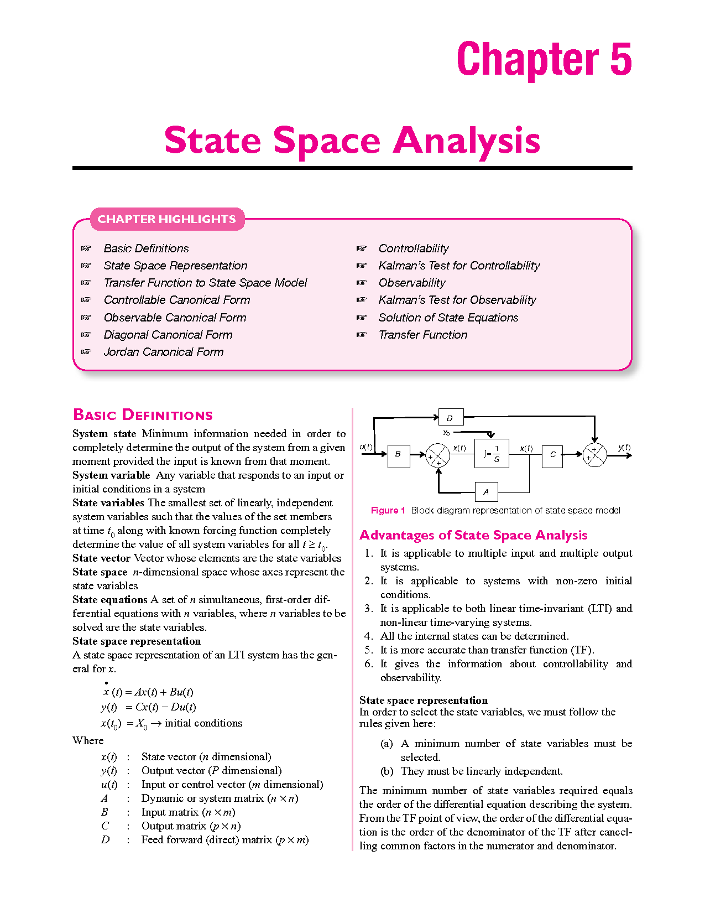
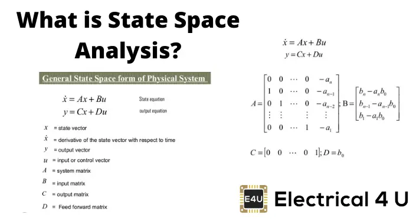

State space analysis and design are powerful techniques used in control systems engineering to model, analyze, and design complex dynamic systems.

Imagine you're trying to understand how a car moves. Instead of just looking at its position or speed at a particular moment, state space analysis lets you consider all the factors that affect its motion, like its position, velocity, and acceleration, all at the same time.




## State Space Representation

The state space representation of a system is a mathematical model that describes the system's behavior using first-order differential equations. These equations relate the system's state variables, which are the minimum set of variables needed to completely describe the system's behavior at any given time.

Think of a state as a snapshot that captures everything important about a system at a particular moment. Let's say you're playing a game where you control a character in a maze. The state of the game includes not just your character's position, but also things like how many lives you have left, how much time is left, and maybe even how many enemies are nearby.


The general state space representation for a continuous-time, linear, time-invariant system with n state variables, r inputs, and m outputs is given by:

```
dx(t)/dt = Ax(t) + Bu(t)
y(t) = Cx(t) + Du(t)
```

where:
- x(t) is the n×1 state vector
- u(t) is the r×1 input vector
- y(t) is the m×1 output vector
- A is the n×n state matrix
- B is the n×r input matrix
- C is the m×n output matrix
- D is the m×r feedforward matrix

## State Space Analysis

State space analysis involves studying the behavior of a system using the state space representation. Key aspects of state space analysis include:

1. **Stability**: Determining if the system is stable by analyzing the eigenvalues of the state matrix A.
2. **Controllability**: Determining if the system can be controlled from the inputs by checking the rank of the controllability matrix.
3. **Observability**: Determining if the system's states can be observed from the outputs by checking the rank of the observability matrix.

## State Space Design

State space design involves designing controllers and observers to achieve desired system behavior. Common design techniques include:

1. **Pole Placement**: Placing the closed-loop system's poles (eigenvalues of A-BK) at desired locations to achieve desired transient response.
2. **Linear Quadratic Regulator (LQR)**: Designing an optimal state feedback controller that minimizes a quadratic cost function involving the states and inputs.
3. **Kalman Filter**: Designing an optimal state estimator that estimates the system's states from noisy measurements.

## Real-World Examples

State space analysis is incredibly useful in real-world scenarios because it allows us to understand and control complex systems more effectively. For example:

1. **Control Systems**: In a car, state space analysis helps engineers design controllers that can stabilize the car's motion by adjusting things like the steering and brakes based on the current state of the car.

2. **Robotics**: In robotics, state space analysis helps robots navigate their environment by keeping track of their position, velocity, and other important factors. This allows them to plan their movements and avoid obstacles more efficiently.

3. **Electrical Circuits**: In electrical engineering, state space analysis helps engineers design circuits that perform specific functions, like amplifying signals or filtering out noise. By considering the state of the circuit, they can optimize its performance and reliability.

State space analysis and design offer several advantages, including the ability to handle multi-input, multi-output systems, non-linearities, and time-varying systems. 

References:

[1] https://learn.lboro.ac.uk/mod/book/view.php?chapterid=478&id=366716

[2] https://www.geeksforgeeks.org/what-is-state-space-analysis/

[3] https://lpsa.swarthmore.edu/Representations/SysRepSS.html

[4] https://en.wikipedia.org/wiki/State-space_representation

[5] https://www.javatpoint.com/control-system-state-space-model