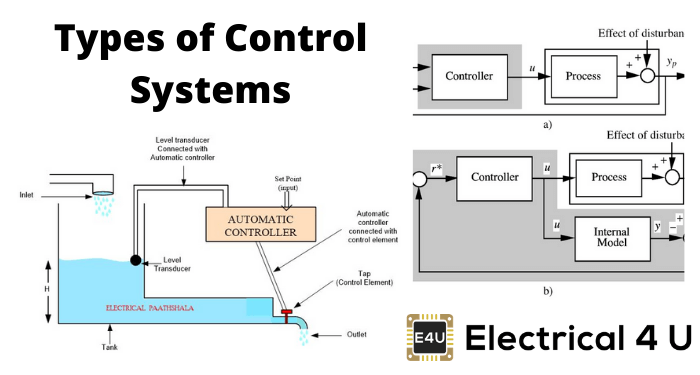
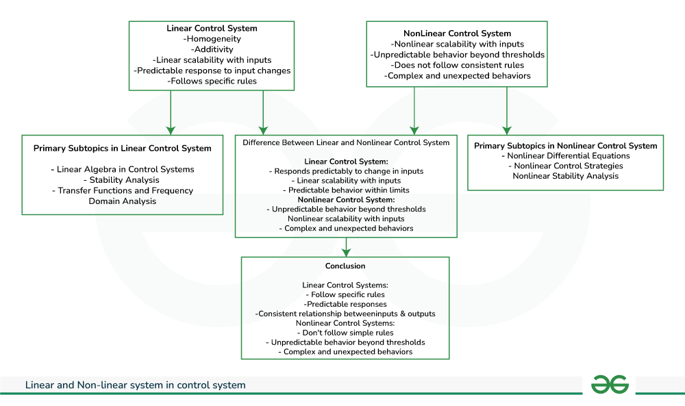
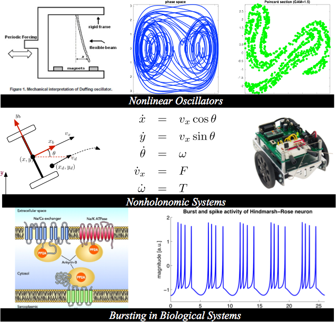
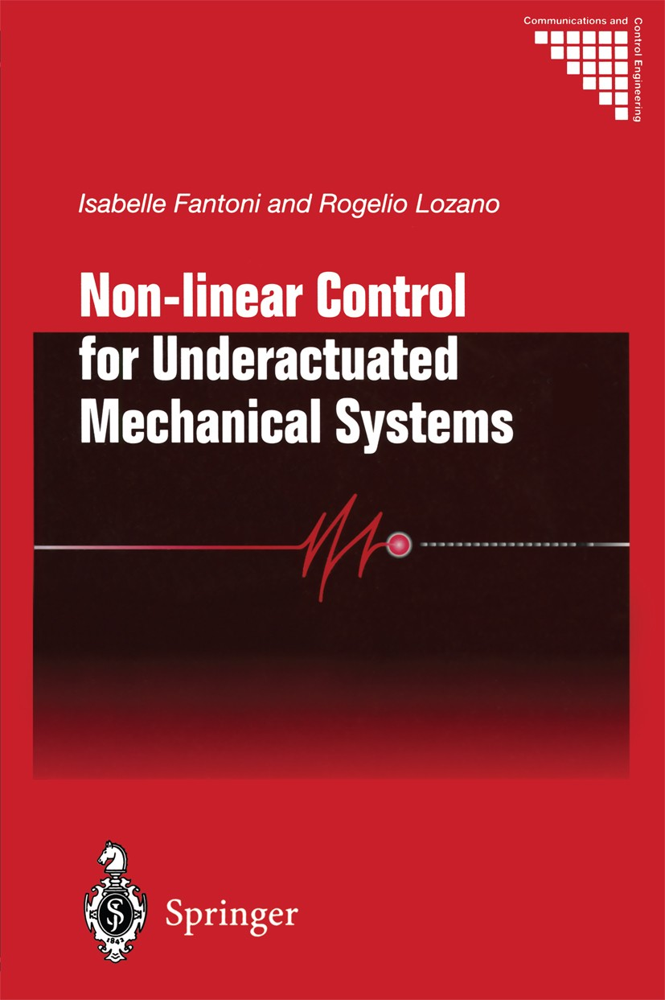

### Understanding Nonlinear Control Systems

Nonlinear control systems are described by equations that don't follow simple straight-line relationships. Instead, they involve curves, bends, or other complex shapes. These equations are often difficult to solve directly, so engineers use numerical methods or approximations to understand and design these systems.

**Applications**

1. **Robotics**: Think of a robotic arm trying to pick up an object. Nonlinear control systems help ensure it moves smoothly and accurately, adjusting for factors like weight and balance.

2. **Aerospace**: In airplanes or spacecraft, nonlinear control methods keep them stable during flight and help navigate through various conditions like turbulence or changing air pressure.

3. **Power Systems**: Imagine a renewable energy system like solar panels or wind turbines. Nonlinear control systems help manage the flow of electricity, ensuring it's distributed efficiently and reliably.

4. **Biological Systems**: Consider a population of animals in an ecosystem. Nonlinear control systems help model how factors like food availability and predator-prey interactions affect population growth.

**Real-World Examples**

1. **DC Machine Magnetization Curve**: Picture a motor turning on. Initially, the magnetic field increases smoothly with the electricity flowing through it. But as it reaches its limit, the relationship between input and output starts to curve, showing nonlinear behavior.

2. **Weather Forecasting**: Weather systems are notoriously tricky to predict accurately because they're nonlinear. Small changes in temperature, humidity, or wind speed can lead to vastly different weather outcomes, making long-term forecasts challenging.

3. **Chaos Theory**: Imagine a pendulum swinging back and forth. In a linear system, you could predict its motion precisely. But in chaotic systems like the famous Lorenz attractor, tiny changes in initial conditions lead to wildly unpredictable outcomes, highlighting the complexity of nonlinear systems.

### Handling Actuator Saturation in Nonlinear Control Systems

**Saturation Compensation**

Imagine you're driving a car and you press the gas pedal all the way down. But no matter how hard you press, the car can only go so fast because of engine limits. Saturation compensation in nonlinear control is like adjusting your driving technique to work around these limits. For example, using a neural network control system can help manage these limits, ensuring stability and smooth driving even when the car's performance is maxed out.

**Finite-Time Tracking Control**

Picture a robotic arm assembling a car. When the arm reaches its maximum speed or torque, it can't move any faster, just like a person reaching the limit of their strength. Finite-time tracking control for robots adjusts their movements to stay on track even when they hit these limits. It's like a skilled dancer adjusting their steps to stay in sync with the music, even when the tempo changes.

**Lyapunov-Based Approaches**

Think of Lyapunov theory as a way to keep a spinning top balanced. Just as you adjust the force you apply to keep the top from falling over, Lyapunov-based approaches adjust the control signals to keep nonlinear systems stable, even when they're pushed to their limits. It's like a tightrope walker making tiny adjustments to stay balanced on the rope, even when the wind blows.

**H-Infinity Methods**

Consider trying to control a kite on a windy day. If you pull too hard on the string, it might break, but if you don't pull hard enough, the kite won't fly properly. H-infinity methods help find the right balance by adjusting the control signals to keep the system stable, even when the inputs are limited. It's like adjusting the tension on the kite string to keep it flying smoothly, regardless of the wind conditions.

**Model Recovery Anti-Windup**

Imagine trying to play a piano with sticky keys. Even if you press the keys as hard as you can, the sound might not come out as expected. Model recovery anti-windup schemes in nonlinear control help "unstick" the system by adjusting the control signals to compensate for saturation, ensuring the system behaves as expected even when it's pushed to its limits.

Actuator saturation can cause problems in nonlinear control systems, but by using these techniques and other nonlinear control methods, engineers can design systems that are robust and effective, even in challenging conditions.

References:

[1] https://www.geeksforgeeks.org/linear-and-non-linear-control-system/

[2] https://archive.nptel.ac.in/courses/111/107/111107118/

[3] https://link.springer.com/book/10.1007/978-1-4757-3108-8

[4] https://en.wikipedia.org/wiki/Nonlinear_system

[5] https://www.sciencedirect.com/topics/engineering/nonlinear-system

[6 https://dl.acm.org/doi/10.5555/559246

[7] https://www.eng.newcastle.edu.au/~mf140/home/Papers/IwasakiFu.pdf