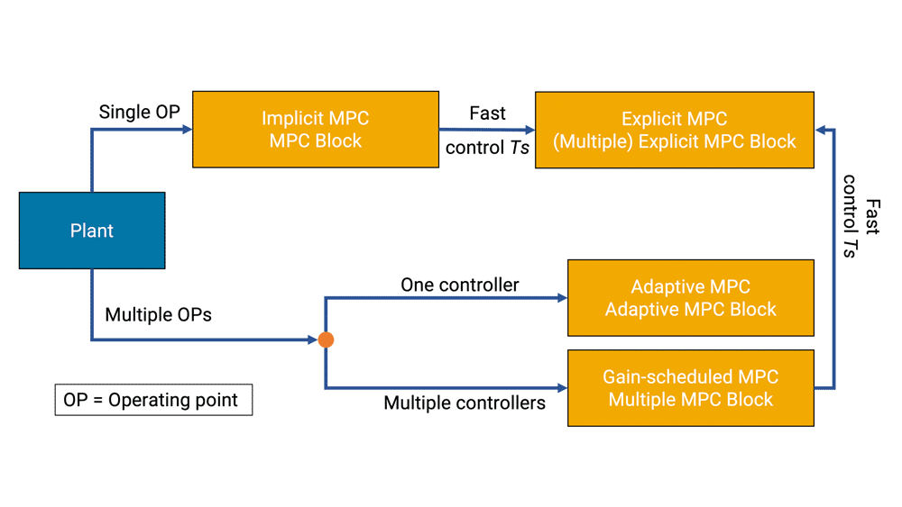
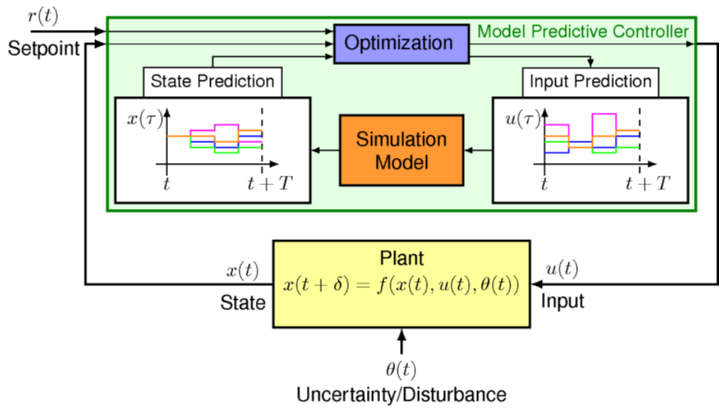

Model Predictive Control (MPC) is an advanced control technique that utilizes a process model to predict the future behavior of a controlled system. By solving an optimization problem, MPC determines the control law implicitly, making it a powerful tool in control engineering. Here is a detailed explanation of Model Predictive Control, including its applications, mathematical foundations, and real-world examples:

MPC involves solving an optimization problem at each time step to find the optimal control action that drives the predicted plant output to a desired reference. The control problem typically minimizes a cost function that considers both present and predicted system variables. The optimization problem is solved using an explicit model to predict future process outputs, making MPC a model-based control strategy

### Applications of Model Predictive Control

1. **Robotics**: MPC is used in robotics for trajectory planning and control of robotic manipulators, enabling precise and efficient motion control in various applications.

2. **Process Industries**: MPC is widely used in process industries like chemical plants, refineries, and power plants for optimizing process operations, ensuring safety, and maximizing efficiency.

3. **Automotive**: MPC is applied in automotive systems for engine control, hybrid vehicle control, and autonomous driving, where it helps in optimizing fuel efficiency and vehicle performance.

4. **Power Systems**: In power systems, MPC is used for grid control, renewable energy integration, and demand-side management to ensure grid stability and efficient energy utilization.

### Real-World Examples

1. **Autonomous Vehicles**: MPC is used in autonomous vehicles for trajectory planning and obstacle avoidance, allowing vehicles to navigate complex environments safely and efficiently.

2. **Chemical Process Control**: In chemical plants, MPC is employed for controlling chemical reactions, optimizing reactor performance, and ensuring product quality and safety.

3. **Energy Management**: MPC is utilized in energy management systems to optimize energy consumption, balance supply and demand, and integrate renewable energy sources into the grid.

4. **Building HVAC Systems**: MPC is applied in building HVAC systems for temperature control, energy efficiency, and occupant comfort by optimizing the operation of heating, ventilation, and air conditioning systems.

Model Predictive Control is a versatile control strategy that finds applications in various industries where precise control, optimization, and predictive capabilities are required. 

References:

[1] https://www.mathworks.com/help/mpc/gs/what-is-mpc.html

[2] https://www.mathworks.com/videos/series/understanding-model-predictive-control.html

[3] https://www.ist.uni-stuttgart.de/research/group-of-frank-allgoewer/model-predictive-control/

[4] https://cse.sc.edu/~gatzke/cache/npc-Chapter5-scan.pdf

[5] https://link.springer.com/article/10.1007/s00170-021-07682-3