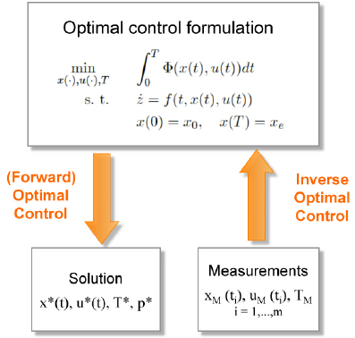

Optimal Control Theory is a branch of mathematics and engineering that deals with finding control strategies for dynamical systems in order to optimize a certain performance criterion. 

These systems can be anything from mechanical systems like robots or aircraft, to economic systems like market dynamics, or even biological systems like neural networks. The goal is to find the best control inputs over time to achieve a desired outcome while considering constraints and minimizing costs.

Given a dynamical system described by a set of differential equations:

$$ \dot{x}(t) = f(x(t), u(t), t) $$

where $$ x(t) $$ is the state of the system at time $$ t $$, $$ u(t) $$ is the control input at time $$ t $$, and $$ f $$ represents the dynamics of the system.

We want to find a control input $$ u(t) $$ that minimizes (or maximizes) a cost functional over a certain time horizon:

$$ J = \int_{t_0}^{t_f} L(x(t), u(t), t) dt $$

subject to constraints:

$$ g(x(t), u(t), t) = 0 $$
$$ h(x(t), u(t), t) \leq 0 $$

where $$ L $$ is the instantaneous cost function, and $$ g $$ and $$ h $$ represent equality and inequality constraints respectively.

The key aspects of this mathematical formulation are:

1. The state equation $$ \dot{x}(t) = f(x(t), u(t), t) $$ describes the dynamics of the system using a set of first-order differential equations.

2. The cost functional $$ J $$ is defined as an integral over the time horizon $$ [t_0, t_f] $$ of an instantaneous cost function $$ L $$.

3. Equality constraints $$ g(x(t), u(t), t) = 0 $$ and inequality constraints $$ h(x(t), u(t), t) \leq 0 $$ are imposed on the state and control variables.

The solution to this optimal control problem involves finding the optimal control $$ u^*(t) $$ that minimizes the cost functional while satisfying the system dynamics and constraints. This can be achieved using techniques like the Pontryagin's minimum principle or the Hamilton-Jacobi-Bellman equation

### Real-world Examples:

1. **Aerospace**: In aerospace engineering, optimal control theory is used to design autopilots for aircraft and spacecraft. For example, in spacecraft trajectory optimization, optimal control theory can be used to determine the optimal thrust profiles to reach a target orbit while minimizing fuel consumption.

2. **Economics**: In economics, optimal control theory is applied to problems such as optimal resource allocation, portfolio management, and production planning. For instance, in portfolio management, investors seek to maximize returns while minimizing risk, which can be formulated as an optimal control problem.

3. **Robotics**: In robotics, optimal control theory is used to design control strategies for robot motion planning and manipulation tasks. For example, in industrial robotics, optimal control techniques are employed to optimize the motion of robot arms to perform tasks such as assembly or welding efficiently.

4. **Biomedical Engineering**: In biomedical engineering, optimal control theory is applied to problems such as drug dosage optimization and medical treatment planning. For instance, in cancer treatment, optimal control techniques can be used to optimize the dosage and scheduling of chemotherapy drugs to maximize tumor reduction while minimizing side effects.

These examples illustrate how optimal control theory is a powerful tool for solving a wide range of problems in various fields by providing systematic methods for designing optimal control strategies that lead to desired system behaviors while considering constraints and minimizing costs.

## References

[1] https://www.iisertvm.ac.in/files/get_file/4c27cea8526af8cfee3be5e183ac9605

[2] http://www.scholarpedia.org/article/Optimal_control

[3] https://en.wikipedia.org/wiki/Optimal_control

[4] https://www.brynmawr.edu/sites/default/files/migrated-files/Xu.pdf

[5] https://www.esaim-cocv.org/articles/cocv/pdf/2002/02/Bermudez.pdf