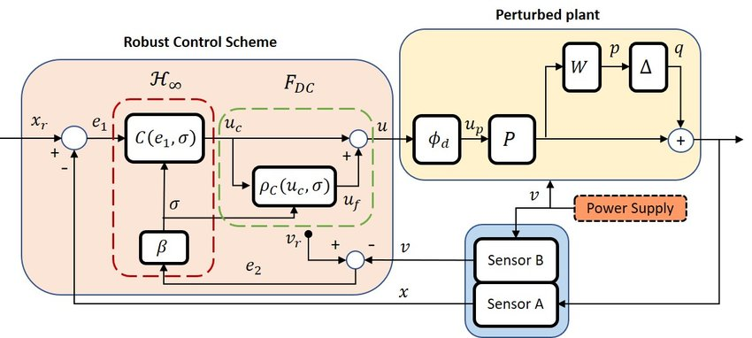

Robust control is like having a backup plan for your control system. Imagine you're driving a car, and suddenly the road gets bumpy or there's a strong gust of wind. In regular driving, you might feel a little shake, but you stay in control. That's because your brain and muscles adjust to these unexpected changes. Similarly, in a control system, robust control helps the system stay on track even when things don't go exactly as planned.

In everyday terms, robust control is about making sure that your control system can handle surprises or uncertainties without messing things up. Just like you might have a plan B in case your original plan doesn't work out, robust control provides a safety net for control systems. It ensures that they can keep working smoothly even if there are changes or disturbances in the environment or the system itself.

For example, think about a thermostat in your home. Its job is to keep the temperature comfortable. But what if the outside temperature suddenly drops or rises unexpectedly? A robust control system for the thermostat would be able to adjust and maintain the indoor temperature despite these changes, keeping you cozy without you even noticing the outside weather.

In industries like aviation, robotics, or power systems, robust control is crucial because there are always uncertainties or unexpected events that could affect performance. Robust control techniques help ensure that airplanes fly safely, robots move accurately, and power grids stay stable, even when faced with unpredictable factors like wind gusts, variations in load, or changes in operating conditions.

So, in simple terms, robust control is like having a reliable safety net for control systems, allowing them to stay on course and perform well even when things don't go exactly as planned.

The main aspects of robust control include:

1. Modeling Uncertainty:
   - Robust control methods represent system uncertainty using techniques like interval matrices, polytopic models, or stochastic descriptions.
   - This allows capturing the range of possible plant variations that the controller must be able to handle.

2. Robustness Criteria:
   - Robust control aims to achieve robust stability and robust performance in the face of the modeled uncertainty.
   - Robust stability ensures the closed-loop system remains stable for all possible plant variations.
   - Robust performance ensures acceptable performance metrics (e.g., disturbance rejection, tracking error) are maintained.

3. Design Techniques:
   - H-infinity control is a prominent robust control method that minimizes the sensitivity of the system over the frequency spectrum.
   - Mu-synthesis is another technique that designs controllers to maximize the stability margin.
   - Other approaches include sliding mode control, loop transfer recovery, and quantitative feedback theory.

4. Applications:
   - Robust control is widely used in various domains, such as power systems, aerospace, robotics, and process control.
   - It is particularly useful when the plant model is subject to significant uncertainty or when the system must operate reliably under varying conditions.

5. Advantages:
   - Robust controllers can maintain stability and performance despite modeling errors or disturbances.
   - They provide a systematic approach to designing controllers that are less sensitive to parameter variations or unmodeled dynamics.
   - Robust control can lead to more reliable and fault-tolerant control systems compared to classical control methods.

References:

[1] https://www.sciencedirect.com/topics/engineering/robust-control-system

[2] https://en.wikipedia.org/wiki/Robust_control

[3] https://link.springer.com/book/10.1007/b136490

[4] https://www.sciencedirect.com/science/article/pii/S0005109814000806